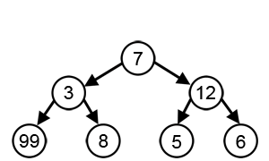

贪心算法
-------------

At each step of the jouney, choose the best expected value

通常不能得到全局最有，但是可以得到局部最优

例子：

钱币找零：先用面值最大的支付，然后用更小一点的面值

$98 = 50 + 20 + 20 + 5 + 2 + 1$

### 霍夫曼编码

一种通过用于无损数据压缩的熵编码（权编码）演算法

通过不等长的编码方法，来增加压缩效率。

- 把出现频率比较多的字符，用稍微短一些的编码

- 出现频率比较少的字符，用稍微长一些的编码

**自底向上构建树**: 带权路径长度最短的二叉树

$WPL= \sum_{i=1}^n(w_i * length(L_i)) = (W1*L1+W2*L2+W3*L3+...+Wn*Ln)$，

N個权值 $ W_i(i=1,2,...n)$ 构成一棵有**N個叶节点**的二叉树，相应的叶节点长度 $ L_i(i=1,2,...n)$。可以证明霍夫曼树的WPL是最小的。

按权值（出现频率）从小到大，依次添加：

f -> e -> d -> c -> b -> a

从根节点到叶节点的路径就是叶节点对应字符的霍夫曼编码。

