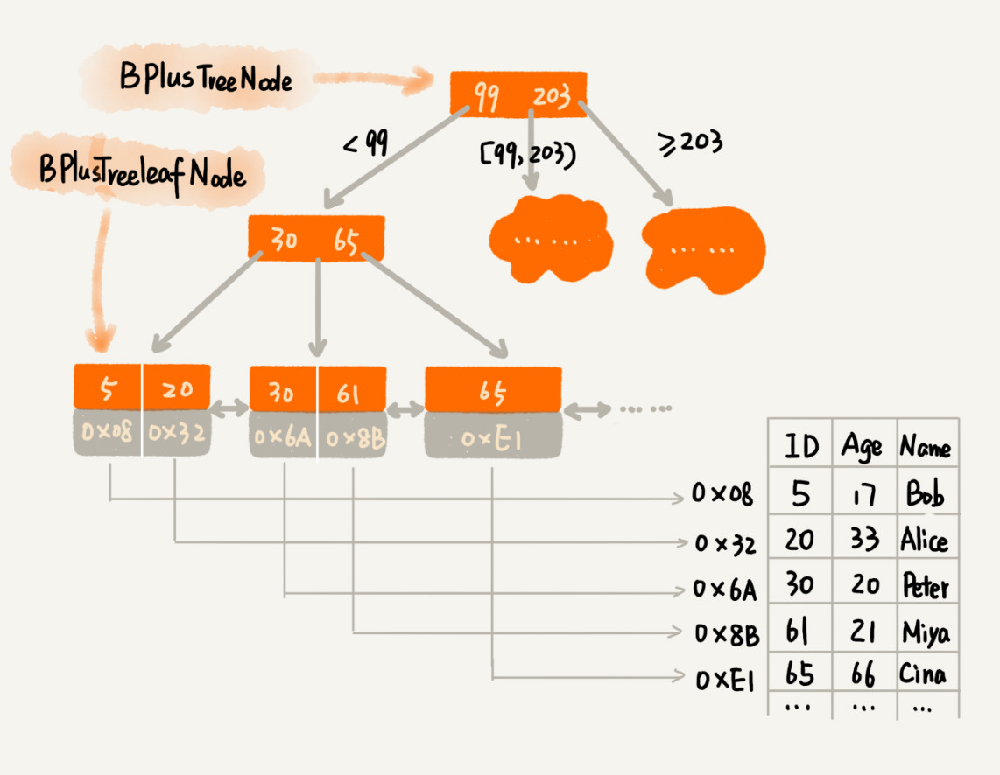
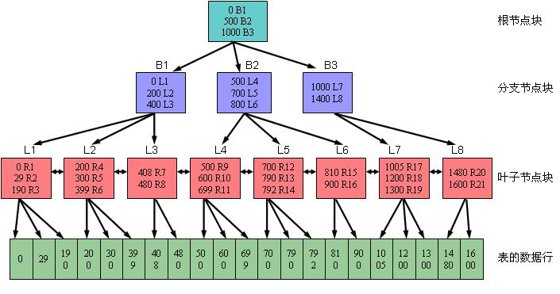
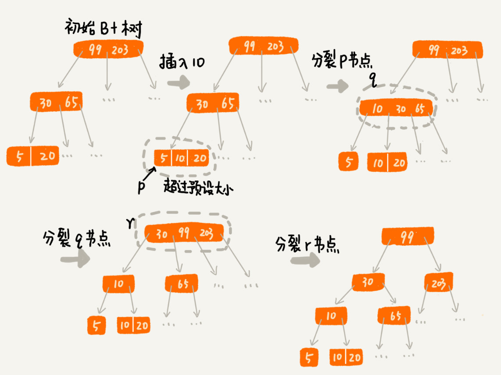

B+Tree
----------

## 数据库索引如何实现

- 查询效率高
- 支持区间查询

### m叉查找树

时间换空间：给一亿个数据构建二叉查找树索引，那索引中会包含大约 1 亿个节点，每个节点假设占用 16 个字节，那就需要大约 1GB 的内存空间。

内存(ns级)无法满足，所以把索引存储在**硬盘**(ms级)。

每个节点的读取（或者访问），都对应**一次磁盘 IO** 操作。**树的高度**($log\ {n}$)就等于每次查询数据时磁盘 IO 操作的次数。**磁盘 IO**非常耗时，所以有点在于较少磁盘IO操作，即尽量降低树的高度。所以使用m叉树。

不管是内存中的数据，还是磁盘中的数据，操作系统都是**按页读取**（一页大小通常是 4KB，这个值可以通过 getconfig PAGE_SIZE 命令查看）的，一次会读一页的数据。如果要读取的数据量超过一页的大小，就会触发多次 IO 操作。所以，我们在选择 m 大小的时候，要尽量让**每个节点的大小等于一个页的大小**。

## B树

### 插入数据

叶子节点中数据的个数超过 2 个就分裂节点；非叶子节点中，子节点的个数超过 3 个就分裂节点

### 删除数据

在 B+ 树中，设置阈值等于 m/2。

- 节点的子节点个数小于 m/2，我们就将它跟相邻的兄弟节点**合并**
- 节点的子节点个数大于 m，**分裂**节点

## B+树特点

- 每个节点中子节点的个数不能超过 m，也不能小于 m/2；
- 根节点的子节点个数可以不超过 m/2，这是一个例外；
- m 叉树**只存储索引**，并不真正存储数据，这个有点儿类似跳表；
- 通过链表将**叶子节点**串联在一起，这样可以方便按**区间查找**；(双向链表，正序反序)
- 一般情况，根节点会被存储在内存中，其他节点**存储在磁盘**中。
- B+ 树中的节点不存储数据，只是索引