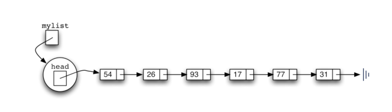
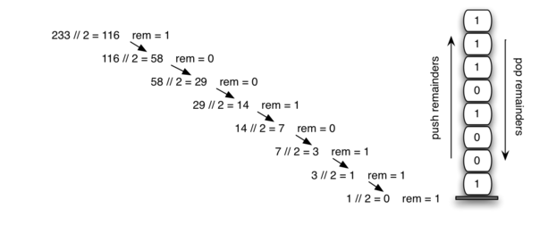
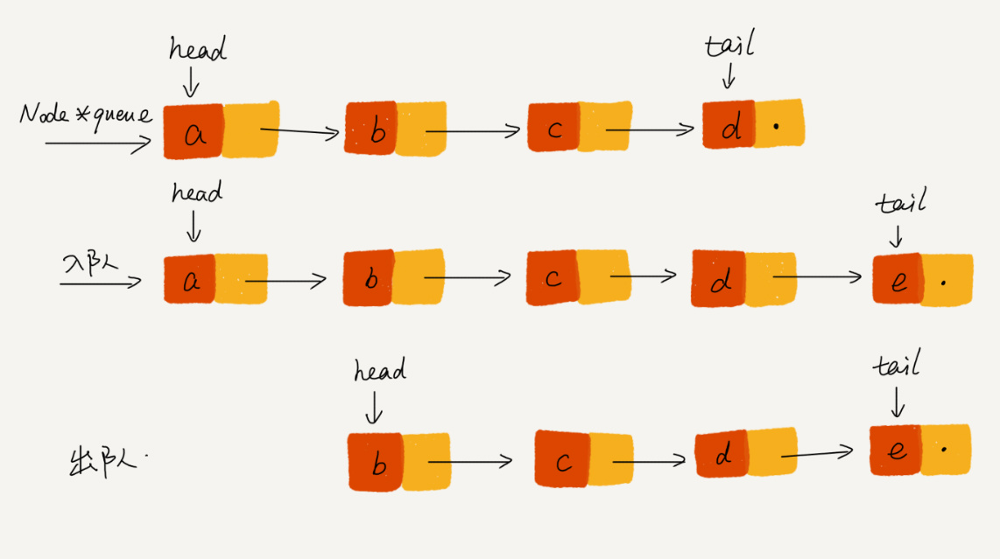
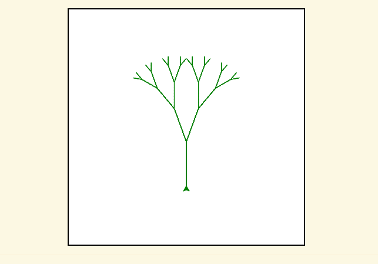
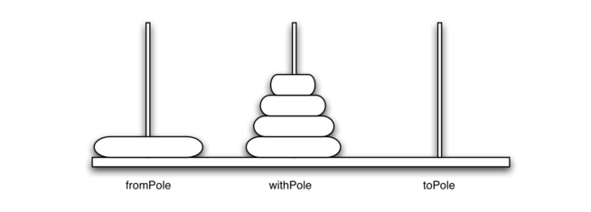

# 数据结构与算法之美 

## 数组


```py
a[i]_address = base_address + i * data_type_size

a[i][j]_address = base_address + ( i * n + j) * type_size
```


- 下标查找 O(1), 值查找 O(n)
- 添加 O(n)   # 移位，
- 删除 O(n)

优点：

使用连续空间，可以借助 CPU 缓存禁止，预读数据

缺点：

大小固定，一经声明就要占用整块连续内存空间

如果不够用，只能申请一个更大的内存空间

## 链表




- 查找 O(n)   # 遍历
- 插入 O(1)
- 删除给定指针 O(1)，删除给定值 O(n)， 首先查找  

链表本身没有大小的限制，天然地支持动态扩容


### 插入节点

**指针**： 将某个变量赋值给指针，实际上就是将这个变量的地址赋值给指针，或者反过来说，指针中存储了这个变量的内存地址，指向了这个变量，通过指针就能找到这个变量。


```sh
p->next = x;       // 将p的next指针指向x结点 (a->next = x)
x->next = p->next; // 将x的结点的next指针指向b结点 (x->next = b)
```


## 栈

### 先进后出

栈只支持两个基本操作：**入栈 push()和出栈 pop()**

### 动态扩容

当栈满了之后，我们就申请一个更大的数组，将原来的数据搬移到新数组中


### 应用

#### 函数调用栈

```python

int main() {
   int a = 1; 
   int ret = 0;
   int res = 0;
   ret = add(3, 5);
   res = a + ret;
   printf("%d", res);
   reuturn 0;
}

int add(int x, int y) {
   int sum = 0;
   sum = x + y;
   return sum;
}
```


#### 表达式求值


#### 十进制转化二进制



## 队列

### 先进先出FIFO

**入队 enqueue()** ，放一个数据到队列尾部

**出队 dequeue()**，从队列头部取一个元素




```sh
// 入队
tail->next = new_node;
tail = tail->next;
// 出队
head = head->next;
```


```sh
tail = (tail + 1) % n;
head = (head + 1) % n;
```


## 递归

写递归代码的关键就是找到如何将大问题分解为小问题的规律，并且基于此写出递推公式，然后再推敲终止条件，最后将递推公式和终止条件翻译成代码。

### 三定律

1. 递归算法必须具有基本情况
2. 递归算法必须改变其状态并向基本情况靠近
3. 递归算法必须以递归方式调用自身


1. 一个问题的解可以分解为几个**子问题**的解
2. 这个问题与分解之后的子问题，除了数据规模不同，求解**思路完全一样**
3. 存在递归**终止条件**

### 弊端

- 堆栈溢出
- 重复计算
- 调用耗时多
- 空间复杂度高（O(n)）

### 应用

#### 分形(可视化递归)



### 汉诺塔游戏



## 散列表


#### 装载因子(Load Factor)

```sh
装载因子 = 元素总数 / 散列表的长度
```

#### Hash Value

Example:  单词 word 转换为散列值

```sh
hash("nice")=(("n" - "a") * 26*26*26 + ("i" - "a")*26*26 + ("c" - "a")*26+ ("e"-"a")) / 78978
```

#### JAVA Hash Map

- 初始大小16
- 最大装载因子0.75
- 底层采用链表。而当链表长度太长（默认超过 8）时，链表就转换为红黑树；当红黑树结点个数少于 8 个的时候，又会将红黑树转化为链表。

#### 散列函数

```java
int hash(Object key) {
    int h = key.hashCode()；
    return (h ^ (h >>> 16)) & (capicity -1); //capicity表示散列表的大小
}

// hashcode ^ (hashcode >>> 16) 混合原始哈希的高位和地位
// A % B = A & (B - 1)          除余，保证index分布均匀
```

#### 如何实现工业级散列表？

- 设计一个合适的**散列函数**
- 定义**装载因子**阈值
- 并且设计**动态扩容**策略
- 选择合适的**散列冲突**解决方法

## 哈希算法

很难根据哈希值反向推导出原始数据，散列冲突的概率要很小。

- 安全加密，MD5,SHA,DES,AES

- 唯一标识，对大数据做信息摘要

- 数据校验，校验数据的完整性和正确性，大文件校验

- 安全加密，越是复杂哈希算法越难破解，但同样计算时间也就越长

  * 引入“盐salt"和密码组合，增加密码复杂度

- 散列函数

- 负载均衡，计算 Client IP/Session ID 的哈希值，哈希值映射到对应服务器IP/ID（哈希算法替代映射表）

- 数据分片

  * 多台机器上统计关键字出现的次数，MapReduce

  * 判断图片是否在图库中，即给每个图片取唯一标识（或者信息摘要），然后构建散列表。

- 分布式存储

  