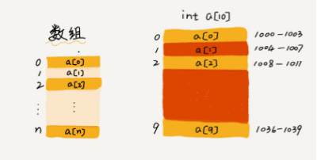

# 数据结构与算法之美 

## 数组



```py
a[i]_address = base_address + i * data_type_size

a[i][j]_address = base_address + ( i * n + j) * type_size
```


- 下标查找 O(1), 值查找 O(n)
- 添加 O(n)   # 移位，
- 删除 O(n)

优点：

使用连续空间，可以借助 CPU 缓存禁止，预读数据

缺点：

大小固定，一经声明就要占用整块连续内存空间

如果不够用，只能申请一个更大的内存空间

## 链表


- 查找 O(n)   # 遍历
- 插入 O(1)
- 删除给定指针 O(1)，删除给定值 O(n), 首先查找  

链表本身没有大小的限制，天然地支持动态扩容

