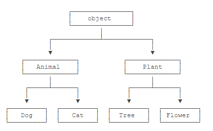

## 多态 polymorphism

简单来说，所谓多态意指相同的消息给予**不同的对象会引发不同的动作**。

多态也可定义为“一种将不同的特殊行为和单个泛化记号相关联的能力”。

静态多态：

- 函数重载
- 运算符重载
- 



```python
class Animal(object):
    def run(self):
        print('Animal is running...')
        
class Dog(Animal):

    def run(self):
        print('Dog is running...')

class Cat(Animal):

    def run(self):
        print('Cat is running...')
```

多态真正的威力：调用方只管调用，不管细节，而当我们新增一种`Animal`的子类时，只要确保`run()`方法编写正确，不用管原来的代码是如何调用的。这就是著名的“开闭”原则。


## 开闭原则

“*软件中的对象（类，模块，函数等等）应该对于扩展是开放的，但是对于修改是封闭的*”

## 鸭子类型

一个对象只要“看起来像鸭子，走起路来像鸭子”，那它就可以被看做是鸭子。

e.g. 有 `__iter__` 方法就是可以被遍历

## 垃圾回收

python采用的是**引用计数**机制为主，**标记-清除**和**分代收集**两种机制为辅的策略。

### 引用计数机制

当引用计数为0时，该对象生命就结束了。

**标记清除**

在标记-清除算法中，有两个记录表，一个是 **root链表(root object)**，另外一个是 **unreachable链表**。

现在的 unreachable 可能存在于被 root 链表中的对象直接或间接引用的对象，这些对象是不能被回收的，一旦在标记的过程中，发现这样的对象，就将其从 unreachable 链表中移到 root 链表中；当完成标记后，unreachable链表中剩下的所有对象就是名副其实的垃圾对象了，接下来的垃圾回收只需限制在 unreachable 链表中即可。

**分代回收**

分代回收思想将对象分为三代（generation 0,1,2），0代表幼年对象，1代表青年对象，2代表老年对象。**根据弱代假说（越年轻的对象越容易死掉，老的对象通常会存活更久。）** 新生的对象被放入0代，如果该对象在第0代的一次gc垃圾回收中活了下来，那么它就被放到第1代里面（它就升级了）。如果第1代里面的对象在第1代的一次gc垃圾回收中活了下来，它就被放到第2代里面。

gc.set_threshold(threshold0[,threshold1[,threshold2]])设置gc每一代垃圾回收所触发的阈值。**从上一次第0代gc后，如果分配对象的个数减去释放对象的个数大于threshold0，那么就会对第0代中的对象进行gc垃圾回收检查。** 从上一次第1代gc后，如过第0代被gc垃圾回收的次数大于threshold1，那么就会对第1代中的对象进行gc垃圾回收检查。同样，从上一次第2代gc后，如过第1代被gc垃圾回收的次数大于threshold2，那么就会对第2代中的对象进行gc垃圾回收检查。