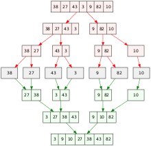

分治算法
---------

**分而治之 **

- 分解：将原问题分解成一系列相似的**子问题**；
- 解决：**递归**地求解各个子问题，若子问题足够小，则直接求解；
- 合并：将子问题的结果**合并**成原问题

分治算法是一个解决复杂问题的好工具，它可以把问题分解成若干个子问题，把子问题逐个解决，再组合到一起形成大问题的答案。

例子：

- MapReduce
- 归并排序

