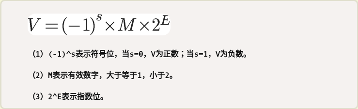

## 浮点数

## 结构

IEEE 754规定，对于32位的浮点数，最高的1位是符号位s，接着的8位是指数E，剩下的23位为有效数字M。

对于64位的浮点数，最高的1位是符号位S，接着的11位是指数E，剩下的52位为有效数字M。

科学计数法中的E是可以出现负数的, 所以E的真实值必须再减去一个中间数，对于8位的E，这个中间数是127；对于11位的E，这个中间数是1023。

Ｅ的三种情况：

- Ｅ 不全为０或不全为１：0~255　E-127(E-1023)得到真实值
- Ｅ全为０：有效数字M不再加上第一位的1，而是还原为0.xxxxxx的小数。这样做是为了表示±0，以及接近于0的很小的数字
- E全为1：如果有效数字M全为0，表示±无穷大（正负取决于符号位s）；如果有效数字M不全为0，表示这个数不是一个数（NaN）

$9.0 = 1.001*2^3$, $二进制1001.0$，　

浮点数 s(0)    E(3+127)     M(1.001) => .001

  $0\ \ \ 100000010\ \ \ 001\ 0000\ 0000\ 0000\ 0000\ 0000$

## 浮点数是离散的，但不是等距的

- 64-bit integers may not fit into a `double`. Unless you know only 53 bits are used

<http://www.volkerschatz.com/science/float.html>