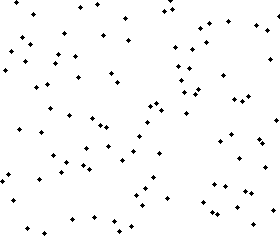

# 冒泡排序

### 图解


**一轮“冒”一个MAX，相邻数据交换**

### 代码

```java
public static void bubbleSort(int[] a, int n) {
    if (n <= 1) return;

    for (int i = 0; i < n - 1; i++) {
        boolean flag = false;

        for (int j = 0; j < n - i - 1; j++) {
            if (a[j+1] < a[j]) {
                int temp = a[j+1];     // 缺点，交换次数较多
                a[j+1] = a[j];
                a[j] = temp;
                flag = true; // 有数据交换
            }
        }
        if (!flag) return;  // 没有数据交换，提前退出
    }
}
```

### 复杂度

- 空间复杂度 O(1)，原地排序算法
- 时间复杂度 $O(n^2)$
	* best O(n)，已经有序, 一次冒泡
	* worst $O(n^2)$, n次冒泡
### “有序度”和“逆序度“
```sh
有序元素对：a[i] <= a[j], 如果i < j。
```


- 有序度  **比较**和**交换**。每交换一次，有序度就加 1
	* worst，初始状态的有序度是 0，所以要进行 $n*(n-1)/2$ 次**交换**
	* bset 最好情况下，初始状态的有序度是 $n*(n-1)/2$，就不需要进行**交换**
	* 取中间值 $n*(n-1)/4$
- 逆序度  
	* 逆序度 = 满有序度 - 有序度
	* 满有序度：$n*(n-1)/2$

# 插入排序

### 图解




**每次取出元素i插入之前有序序列**

### 代码

```java
public static void insertionSort(int[] a, int n) {
    if (n <= 1) return;

    for (int i = 1; i < n - 1; ++i) {
        int value = a[i];
        int j = i - 1;
        for (; j >= 0; --j) {
            if (a[j] > value) {
                a[j+1] = a[j];
            } else {
                break;
            }
        }
        a[j+1] = value;
    }
}
```

### 复杂度

- 空间复杂度$O(1)$，原地排序算法
- 时间复杂度$O(n^2)$
  * best, $O(n)$
  * worst, $O(n^2)$
  
- 稳定排序算法，对于值相同的元素，我们可以选择将后面出现的元素，插入到前面出现元素的后面

# 选择排序

### 图解				


**每次从剩余元素中寻找最小（大），放到已排序序列的末尾**

### 代码

```java
public static void selectionSort(int[] a, int n) {
    if (n <= 1) return;

    for (int i = 0; i < n - 1; ++i) {
        int minIndex = i;
        for (int j = i + 1; j < n; ++j) {
            if (a[j] < a[minIndex]) {
                minIndex = j;  // 寻找未排序序列最小元素
            }
        }

        int temp = a[i];      // 与当前元素交换
        a[i] = a[minIndex];
        a[minIndex] = temp;
    }
}
```

### 复杂度

- 空间复杂度$O(1)$，原地排序算法

- 时间复杂度
  * best，worst, mean, 均为$O(n^2)$

- 不是稳定算法，比如 5，8，5，2，9 这样一组数据，使用选择排序算法来排序的话，第一次找到最小元素 2，与第一个 5 交换位置，那第一个 5 和中间的 5 顺序就变了，所以就不稳定了

# 希尔排序

希尔排序，也称递减增量排序算法，是插入排序的一种更高效的改进版本。

希尔排序的基本思想是：先将整个待排序的记录序列分割成为若干子序列分别进行直接插入排序，待整个序列中的记录“基本有序”时，再对全体记录进行依次直接插入排序。

### 图解


### 代码

```java
public static void sort(int[] sArray) {
    int[] arr = Arrays.copyOf(sArray, sArray.length);
    
    int gap = 1;
    while (gap < arr.length / 3) {
        gap = gap * 3 + 1;
    }
    
    while (gap < 0) {
        for (int i = gap; i < arr.length; i++) {
            int tmp = arr[i];
            int j = i - gap;
            wihle (j >= 0 && arr[j] > tmp) {
                arr[j + gap] = arr[j];
                j -= gap;
            }
            arr[j + gap] = tmp;
        }
        gap = (int) Math.floor(gap / 3);
    }
    return arr;
}
```


# 归并排序

**分治思想**。分治，顾名思义，就是分而治之，将一个大问题分解成小的子问题来解决

### 图解


**递归二分大序列为小序列，小序列后在依次合并排序**

## 代码

```java
public class MergeSort {
    public static void mergeSort(int[] a, int n) {
        mergeSortInternally(a, 0, n-1);
    }

    private static void mergeSortInternally(int[] a, int p, int r) {
        if (p >= r) return;

        int q = p + (r - p) / 2;
        mergeSortInternally(a, p, q);    // left half   a[p...q]
        mergeSortInternally(a, q+1, r);  // right half  a[q+1...r]

        // merge a[p...q] and a[q+1...r] as a[p...r]
        merge(a, p, q, r);
    }

    private static void merge(int[] a, int p, int q, int r) {
        int i = p;                      // left half   a[p...q]
        int j = q + 1;                  // right half  a[q+1...r]
        int k = 0;

        // temp arr: a[p...r]
        int[] tmp = new int[r-p+1];
        while (i<=q && j<=r) {
            if (a[i] <= a[j]) {
                tmp[k++] = a[i++];
            } else {
                tmp[k++] = a[j++];
            }
        }

        // 判断哪个子数组有剩余数据
        int start = i;
        int end = q;
        if (j <= r) {
            start = j;
            end = r;
        }

        // 将剩余数据拷贝到 temp arr
        while (start <= end) {
            tmp[k++] = a[start++];
        }

        // 将 tmp 中的数组拷贝会 a[p...r]
        for (i = 0; i <= r-p; ++i) {
            a[p+i] = tmp[i];
        }
    }
}
```

### 复杂度

- 空间复杂度 $ O(n)$
- 时间复杂度 $O(n\log {n})$
  * best, worst, mean

```sh
T(n) = 2*T(n/2) + n 
     = 2*(2*T(n/4) + n/2) + n 
     = 4*T(n/4) + 2*n = 4*(2*T(n/8) + n/4) + 2*n 
     = 8*T(n/8) + 3*n = 8*(2*T(n/16) + n/8) + 3*n 
     = 16*T(n/16) + 4*n 
     ...... 
     = 2^k * T(n/2^k) + k * n
```

当 $T(n/2^k)=T(1)$ 时，得到 $n = 2^k$，$k=\log_2{n}$

则：$T(n) = Cn + n \log_2 {n}$

可得时间复杂度：$n * \log_2 n$
- $n$，序列长度
- $\log_2 n$ ，二分深度


## 快速排序

在冒泡排序基础上的递归分治法。

### 图解


**在区间中随机挑选一个元素作基准，将小于基准的元素放在基准之前，大于基准的元素放在基准之后，再分别对小数区与大数区进行排序**

1. 随机选择一个元素为"基准"（pivot)
2. 分区（partition），重新排列数列，所有比基准小的元素放在基准前面，所有比基准大的放在基准后面，该基准就处于序列的中间位置
3. 递归地（recursive）对小于基准元素的子数列和大于基准值的子数列排序

### 代码

```java
public class QuickSort {
    public static void quickSort(int[] arr, int n) {
        quickSortInternally(arr, 0, n - 1);
    }

    /**
     * 递归函数
     */
    public static void quickSortInternally(int[] arr, int leftmark, int rightmark) {
        if (p >= rightmark) return;

        int pivot = partition(arr, leftmark, rightmark);  // 获得区分点
        quickSortInternally(arr, leftmark, pivot-1);      // left half
        quickSortInternally(arr, pivot+1, rightmark);     // right half
    }

    private static int partition(int[] arr, int leftmark, int rightmark) {
        int pivot = arr[r];                            // pivot
        int i = leftmark;                              // i leftmark
        for (int j = leftmark; j < rightmark; ++j) {   // j 遍历 index
            if (arr[j] < pivot) {
                if (i == j) {
                    ++i;                               // 当前值小于 pivot, leftmart 右移1个位置
                } else {
                    int tmp = arr[i];                  // 当前值不小于 pivot, 交换
                    arr[i++] = arr[j];
                    arr[j] = tmp;
                }
            }
        }

        int tmp = arr[i];                              // 把基准值放到正确的位置
        arr[i] = arr[r];
        arr[r] = tmp;

        System.out.println("i=" + i + "     " + Arrays.toString(arr));
        return i;
    }
}
```

### 复杂度

- 空间复杂度$ O(1) $，原地排序
- 时间复杂度$O(n\log{n})$ ~ $O(n^2)$ ，取决于分区平衡度
  * best，$O(n\log{n})$，每次分区操作，我们选择的 pivot 都很合适，正好能将大区间对等地一分为二
  * worst， $O(n^2)$， 有序数列 1，3，5，6，8。如果我们每次选择最后一个元素作为 pivot，那每次分区得到的两个区间都是不均等的

```sh
T(1) = C； n=1时，只需要常量级的执行时间，所以表示为C。
T(n) = 2*T(n/2) + n； n>1          Best
```

## 桶排序


## 计数排序

