[TOC]


## NMT with attention

<details>
<summary>Model Code with Trax</summary>

``` python
def NMTAttn(input_vocab_size=33300,
            target_vocab_size=33300,
            d_model=1024,
            n_encoder_layers=2,
            n_decoder_layers=2,
            n_attention_heads=4,
            attention_dropout=0.0,
            mode='train'):
    """Returns an LSTM sequence-to-sequence model with attention.

    The input to the model is a pair (input tokens, target tokens), e.g.,
    an English sentence (tokenized) and its translation into German (tokenized).

    Args:
    input_vocab_size: int: vocab size of the input
    target_vocab_size: int: vocab size of the target
    d_model: int:  depth of embedding (n_units in the LSTM cell)
    n_encoder_layers: int: number of LSTM layers in the encoder
    n_decoder_layers: int: number of LSTM layers in the decoder after attention
    n_attention_heads: int: number of attention heads
    attention_dropout: float, dropout for the attention layer
    mode: str: 'train', 'eval' or 'predict', predict mode is for fast inference

    Returns:
    A LSTM sequence-to-sequence model with attention.
    """

    ### START CODE HERE (REPLACE INSTANCES OF `None` WITH YOUR CODE) ###

    # Step 0: call the helper function to create layers for the input encoder
    input_encoder = input_encoder_fn(input_vocab_size, d_model, n_encoder_layers)

    # Step 0: call the helper function to create layers for the pre-attention decoder
    pre_attention_decoder = pre_attention_decoder_fn(mode, target_vocab_size, d_model)

    # Step 1: create a serial network
    model = tl.Serial( 

    # Step 2: copy input tokens and target tokens as they will be needed later.
    tl.Select([0, 1, 0, 1]),

    # Step 3: run input encoder on the input and pre-attention decoder the target.
    tl.Parallel(input_encoder, pre_attention_decoder),

    # Step 4: prepare queries, keys, values and mask for attention.
    tl.Fn('PrepareAttentionInput', prepare_attention_input, n_out=4),

    # Step 5: run the AttentionQKV layer
    # nest it inside a Residual layer to add to the pre-attention decoder activations(i.e. queries)
    tl.Residual(tl.AttentionQKV(d_feature=d_model, n_heads=n_attention_heads, dropout=attention_dropout, mode=mode)),

    # Step 6: drop attention mask (i.e. index = None
    tl.Select([0, 2]),

    # Step 7: run the rest of the RNN decoder
    [tl.LSTM(d_model) for _ in range(n_encoder_layers)],

    # Step 8: prepare output by making it the right size
    tl.Dense(target_vocab_size),

    # Step 9: Log-softmax for output
    tl.LogSoftmax(axis=-1)
    )

	### END CODE HERE

	return model
```

</details>

## Dot-Product Attention

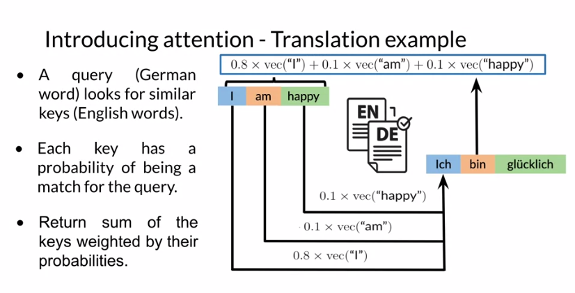

### Queries, Keys, Values


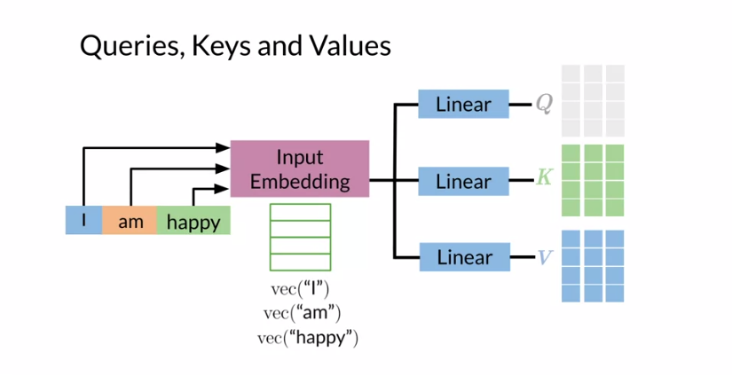

input -> representation(a column vector)

Q, K, V 中每一列表示一个单词

计算得到 attention(a weighted sequence)

Attention weights: $W_A = Q K^T$ 

Result: $score = softmax(Q K^T) * V$

相似的向量 Q, K 在 dot product 后会得到更大的 score，通过 softmax 可以将点乘的结果转化为概率 probability

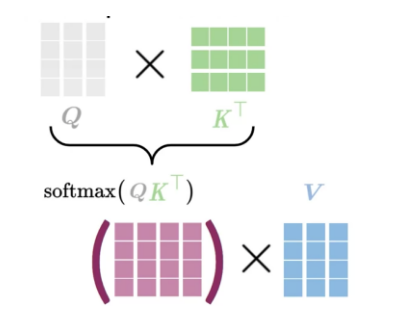


A softmax function makes attention more focused on best keys.

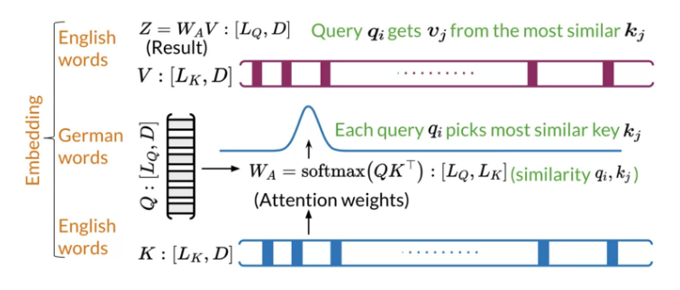

- K: [$L_K$, D], English words
- Q: [$L_Q$, D], German words, each query $q_i$ picks the most similar key $k_j$
- V: [$L_K$, D],   $Z = W_A*V$, attention weights multiply V to get weighted combination of the input

**Each query $q_i$ picks the most similar key $k_j$ to get $v_j$, and return a weighted sequence of words(attention * words)**

## Causal Attention

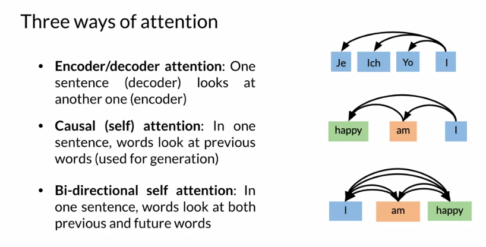

- Encoder/decoder attention: a sequence(German, decoder) attend to another one(English, encoder), translation
- Causal (self) attention: words attend to words in the past of the same sentence, text sumaries
- Bi-directional self-attention: words in the same sentence look both at previous and future words

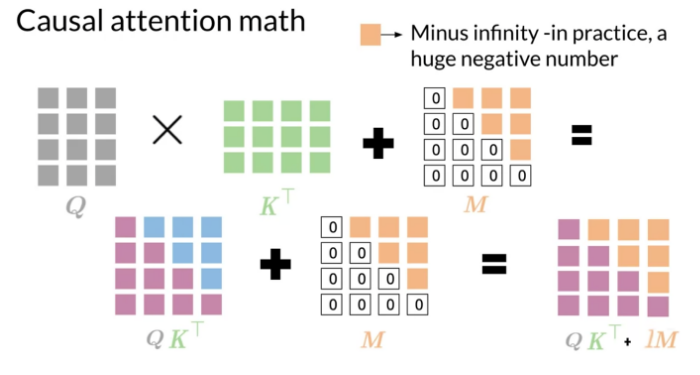

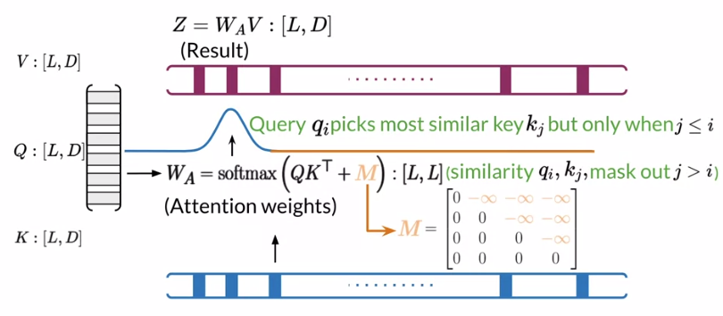

- K: [L, D]
- Q: [L, D], same sentence with K, each query $q_i$ picks the most similar key $k_j$ but only when $j <= i$ (attend to previous words only)
- V: [L, D]

**Each query $q_i$ picks the most similar key $k_j$ in the same sentence to get $v_j$, and return a weighted sequence of previous words(attention * previous words)**

## Multi-head attention

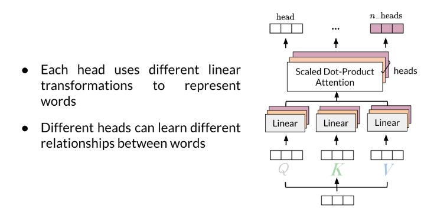

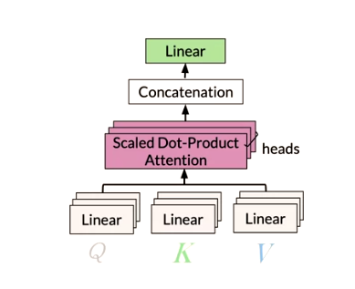

### head

Normalization: divide by $\sqrt{d_k}$ to prevent the gradients to be extremely small when large values of D sub K

D: embedding dimension, K: words sequence length

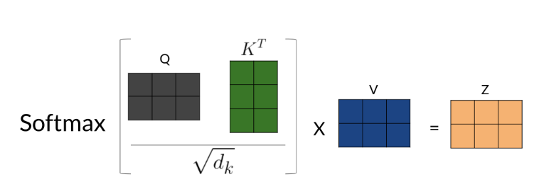

### multi-head Concatenation


### Scaled Dot-Product Attention

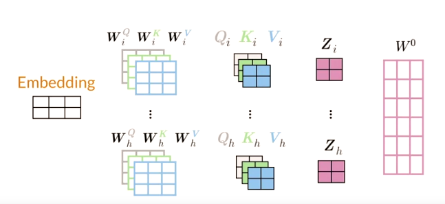

### Multi-head attention formula

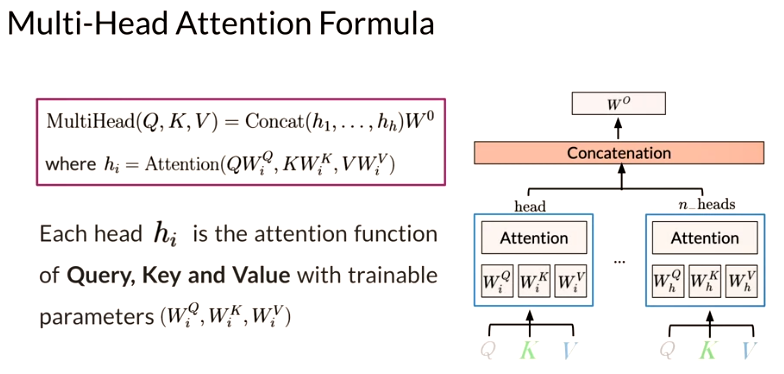

## LSH Attention

Attention is used to try which query (q) and key (k) are the most similar.

$A(Q,K,V) = softmax(QK^T)V A(Q,K,V)=softmax(QKT)V$


- hash q and the keys
- put similar vectors in the same bucket
- planes to separate the buckets (sign={0,1})
- compute standard attention on the bins that you have created
- repeat the same process several times to increase the probability of having the same key in the same bin as the query. 


- Given the sequence of queries and keys, hash them into buckets
- split the buckets into chunks (for parallel computing)
- compute the attention within the same bucket of the chunk you are looking at and the previous chunk