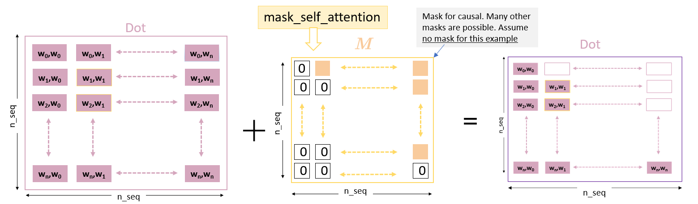
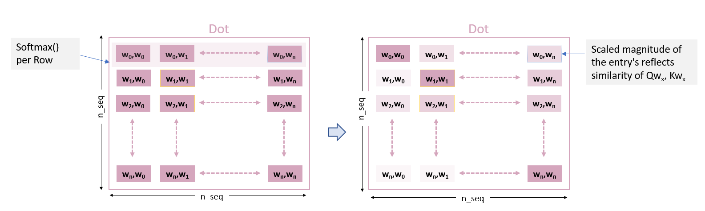
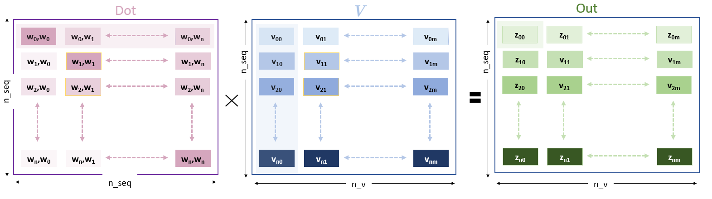

## dot-product of Query and Key

The *attend* function receives *Query* and *Key*.

- n_seq: input words sequence length
- n_q: size of query and key

$QK^{T}$ similarity of Q and K

the resulting dot-product (*Dot*) entries describe a complete (n_seq,n_seq) map of the similarity of all entries of q vs all entries of k.

## Masking

to exclude results that occur later in time (causal) or to mask padding or other inputs.

## Softmax

$$softmax(x_i)=\frac{\exp(x_i)}{\sum_j \exp(x_j)}\tag{1}$$

## applying attention to V

The purpose of the dot-product is to 'focus attention' on some of the inputs. Dot now has entries appropriately scaled to enhance some values and reduce others

𝑉V is of size (n_seq,n_v)

$Z_{00} = W[0, :] * V[:, 0]$

