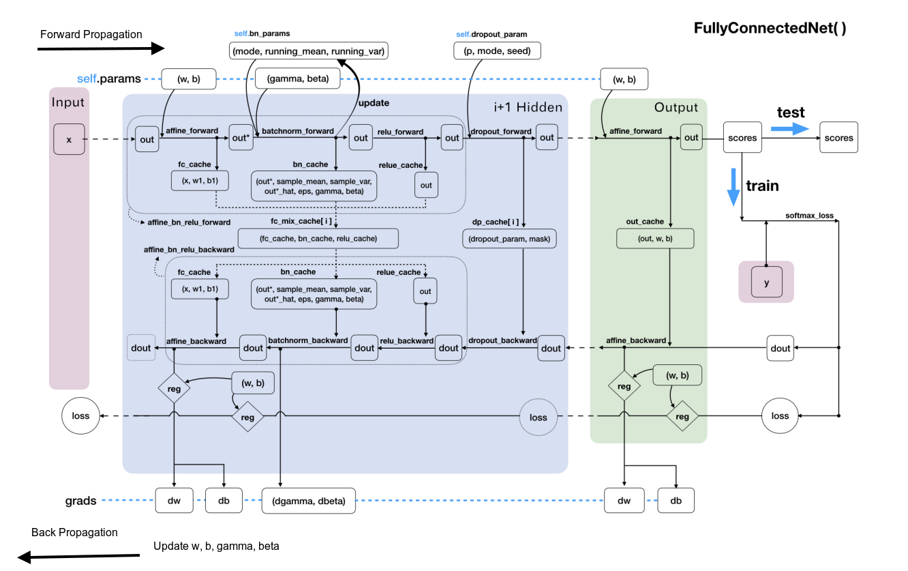

## Backpropagation

Reference: [Understanding the backward pass through Batch Normalization Layer](<https://kratzert.github.io/2016/02/12/understanding-the-gradient-flow-through-the-batch-normalization-layer.html>)

#### 全连接网络数据指示图

$$w = w - \eta dw$$

