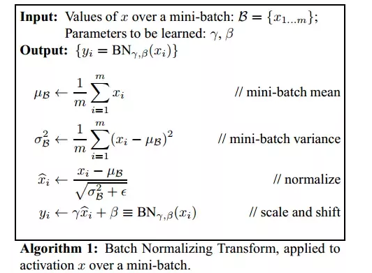

## Batch Normalization

批量归一化可以理解为在网络的每一层之前都做预处理，减少之前网络权重对数据的影响，保持每一层输出数据的分布（均值和标准差），使输出适应下一层网络，也使得每一层数据相对独立。


## Internal Co-variate Shift

Reference: [Batch Normalization原理与实战](<https://zhuanlan.zhihu.com/p/34879333>)

随着训练的进行，网络中的参数也随着梯度下降在不停更新。一方面，当底层网络中参数发生微弱变化时，由于每一层中的线性变换与非线性激活映射，这些微弱变化随着网络层数的加深而被放大（类似蝴蝶效应）；另一方面，参数的变化导致每一层的输入分布会发生改变，进而下一层的网络需要不停地去适应这些分布变化，使得我们的模型训练变得困难。上述这一现象叫做Internal Covariate Shift。

原作定义：在深层网络训练的过程中，由于网络中参数变化而引起内部结点数据分布发生变化的这一过程被称作Internal Covariate Shift。

随着梯度下降的进行，每一层的参数$W^{[l]}$与$b^{[l]}$都会被更新，那么$Z^{[l]}$的分布也就发生了改变，进而$A^{[l]}$也同样出现分布的改变。而$A^{[l]}$作为第 $l+1$ 层的输入，意味着 $l+1$ 层需要去不停适应这种数据分布的变化，这一过程叫做 Interval Covariate Shift.

### 带来的问题：

1. 上层网络需要不停调整来适应输入数据分布的变化，导致网络学习速度的降低
2. 网络的训练过程容易陷入梯度饱和区，减缓网络收敛速度（sigmoid, tanh）。 $Z^{[l]}$会逐渐更新并变大，陷入梯度饱和区。可以通过Normalization 使得激活函数输入分布在一个稳定的空间来避免他们陷入梯度饱和区。

### 如何减缓 Interval Covariate Shift

1. 白化。成本高，改变了网络每一层分布导致数据表达的特征信息丢失

   - 使得输入特征分布具有相同的均值与方差。其中PCA白化保证了所有特征分布均值为0，方差为1
   - 去除特征之间的相关性

2. Batch Normalization   简化加改进版的白化

   - 简化。让每个特征都有均值为0，方差为1的分布就OK。
   - 白化操作减弱了网络中每一层输入数据表达能力，那我就再加个线性变换操作，让这些数据再能够尽可能恢复本身的表达能力就好了。


##　算法

   

BN 引入了两个可学习的参数 $\gamma$ 和 $\beta$（**变换重构**）。这两个参数的引入是为了恢复数据本身的表达能力，对规范后的数据进行线性变换，即**$y_i = \gamma \hat{x_i} + \beta_i$**。 特别的，当 $\gamma^2=\sigma ^2$（方差）, $\beta = \mu$ （均值）时，可以实现等价变换并且保留原始输入特征的分布信息。

### Batch Normalization 的作用

1. 使得网络中每层输入数据的分布相对稳定，加快模型学习速度

2. 使得模型对参数不那么敏感，减小初始化参数对模型学习的影响，可以选择更大的初始化值，学习率选择范围更大

   当学习率设置太高时，会使得参数更新步伐过大，容易出现震荡和不收敛。但是使用BN的网络将不会受到参数数值大小的影响。BN抑制了参数微小变化随着网络层数加深被放大的问题，使得网络对参数大小的适应能力更强

3. 缓解梯度消失的问题

4. 正则化效果，mini-batch 的mean/variance 作为总体样本的抽样估计，引入随机噪声

**BN通过将每一层网络的输入进行normalization，保证输入分布的均值与方差固定在一定范围内，减少了网络中的Internal Covariate Shift问题，并在一定程度上缓解了梯度消失，加速了模型收敛；并且BN使得网络对参数、激活函数更加具有鲁棒性，降低了神经网络模型训练和调参的复杂度；最后BN训练过程中由于使用mini-batch的mean/variance作为总体样本统计量估计，引入了随机噪声，在一定程度上对模型起到了正则化的效果。**

### 前向传播

``` python

def batchnorm_forward(x, gamma, beta, bn_param):
    """
    Forward pass for batch normalization.

    running_mean = momentum * running_mean + (1 - momentum) * sample_mean
    running_var = momentum * running_var + (1 - momentum) * sample_var

    Input:
    - x: Data of shape (N, D)
    - gamma: Scale parameter of shape (D,)
    - beta: Shift paremeter of shape (D,)
    - bn_param: Dictionary with the following keys:
      - mode: 'train' or 'test'; required
      - eps: Constant for numeric stability
      - momentum: Constant for running mean / variance.
      - running_mean: Array of shape (D,) giving running mean of features
      - running_var Array of shape (D,) giving running variance of features

    Returns a tuple of:
    - out: of shape (N, D)
    - cache: A tuple of values needed in the backward pass
    """
    mode = bn_param['mode']
    eps = bn_param.get('eps', 1e-5)
    momentum = bn_param.get('momentum', 0.9)

    N, D = x.shape
    running_mean = bn_param.get('running_mean', np.zeros(D, dtype=x.dtype))
    running_var = bn_param.get('running_var', np.zeros(D, dtype=x.dtype))

    out, cache = None, None
    if mode == 'train':
        ##########################################
        mu = np.mean(x, axis=0)
        var = np.var(x, axis=0)
        x_norm = (x - mu) / np.sqrt(var + eps)
        out = gamma * x_norm + beta
        ##########################################

        cache = (x, mu, var, eps, x_norm, gamma, beta, out)

        running_mean = momentum * running_mean + (1 - momentum) * mu
        running_var  = momentum * running_var  + (1 - momentum) * var
    elif mode == 'test':
        x_norm = (x - running_mean) / np.sqrt(running_var + eps)

    	# 训练超参数 gamma/beta，重构数据分布
    	out = gamma * x_norm + beta
    else:
        raise ValueError('Invalid forward batchnorm mode "%s"' % mode)

    # Store the updated running means back into bn_param
    bn_param['running_mean'] = running_mean
    bn_param['running_var'] = running_var

    return out, cache
```


#### 反向传播指示图


损失函数对$y_i$的梯度为 $\frac{\partial L}{\partial y_i}$，由　$y_i = \gamma \hat{x_i} + \beta$ 得到：

$$\frac{\partial L}{\partial \beta} = \sum_{i=1}^{N} \frac{\partial L}{\partial y_i}$$

$$\frac{\partial L}{\partial \gamma} = \sum_{i=1}^{N} \frac{\partial L}{\partial y_i} \hat{x_i}$$

$$\frac{\partial L}{\partial \hat{x_i}} = \frac{\partial L}{\partial y_i} \gamma$$


$$\frac{\partial L}{\partial \mu} = \frac{\partial L}{\partial \hat{x_i}} \frac{\partial \hat{x_i}}{\partial \mu} +  \frac{\partial L}{\partial \sigma^2} \frac{\partial {\sigma^2}}{\partial \mu}  \\  =  -\frac{\partial L}{\partial \hat{x_i}} \frac{1}{\sqrt{\sigma^2 + \epsilon}} + \frac{\partial L}{\partial \sigma^2} (- \frac{2}{N} \sum_{i=1}^{N} (x_i-\mu)) $$

$$\frac{\partial L}{\partial \sigma^2} =  \frac{\partial L}{\partial \hat{x_i}} \frac{\partial \hat{x_i}}{\partial \sigma^2} \\  = \frac{\partial L}{\partial \hat{x_i}} (-\frac{1}{2} )({\sigma^2+\epsilon})^{-\frac{3}{2}}$$

$$\frac{\partial L}{\partial x_i} =  \frac{\partial L}{\partial \hat{x_i}} \frac{\partial \hat{x_i}}{\partial {x_i}} +   \frac{\partial L}{\partial \sigma^2} \frac{\partial \sigma^2}{\partial {x_i}} + \frac{\partial L}{\partial \mu}\frac{\partial \mu}{\partial x_i} \\ = \frac{\partial L}{\partial \hat{x_i}} \frac{1}{\sqrt{\sigma^2 + \epsilon}} + \frac{\partial L}{\partial \sigma^2} \frac{2(x_i - \mu)}{N}  + \frac{\partial L}{\partial \mu} \frac{1}{N} $$

``` python
def batchnorm_backward_alt(dout, cache):
    """
    Alternative backward pass for batch normalization.
    """
    (x, mu, var, eps, x_norm, gamma, beta, out) = cache
    N,D = dout.shape

    dx_norm = dout * gamma
    dgamma = np.sum(dout * x_norm, axis=0)
    dbeta  = np.sum(dout, axis=0)

    dvar = np.sum(dx_norm * (x - mu) * (-0.5) * np.power(var + eps, -3/2), axis=0)
    dmu = -np.sum(dx_norm / np.sqrt(var + eps), axis=0) + dvar * (-2) * np.sum(x - mu, axis=0) / N
    dx  =  dx_norm / np.sqrt(var + eps) + dvar * 2 * (x - mu) / N  + dmu / N

    return dx, dgamma, dbeta
```


分步计算损失函数梯度的方法参考 Reference 2


Refereces:

1. <https://www.adityaagrawal.net/blog/deep_learning/bprop_batch_norm>
2. <https://kratzert.github.io/2016/02/12/understanding-the-gradient-flow-through-the-batch-normalization-layer.html>