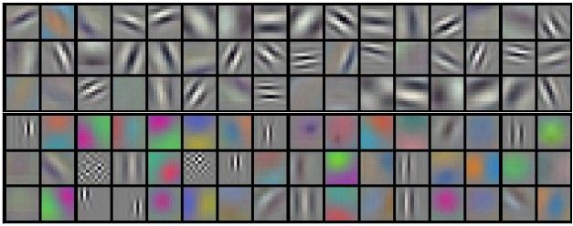
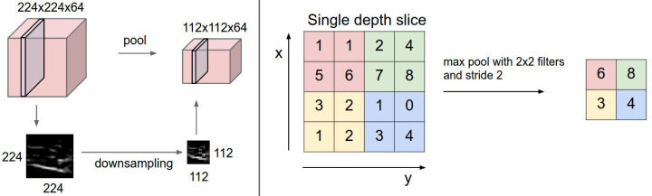

Covolution Neuro Network
------------------------------------------


## 卷积
卷积运算，源于信号处理

#### 感受野，接受域


只受３个输入单元影响，接受域为３，忽略接受域外权重（无限强先验）

#### 优点

- 稀疏交互

- 参数共享，在不同输入位置上使用相同的参数。普通神经网络权重与神经元绑定，需要 $N_l * N_{l+1}$ 个参数；卷积神经网络每个权重参数不变，只需要 $k*k$ 个参数。
- 平移不变性，只包含局部连接关系（接受域）



96个[11x11x3]滤波器，如果在图像某些地方探测到一个水平的边界是很重要，那么在其他一些地方也会同样是有用的，这是因为图像结构具有平移不变性。

有的滤波器学习到了条纹，有些学到了色彩差别

#### CNN

输出尺寸：$\frac{W-F+2P}{S} + 1$

- F: fiter, 卷积核/滤波器/感受野的尺寸，常用3x3, 5x5
- P: padding, 零填充的数量. SAME(输出与输入保持一直，p=F-1/S)，VALID(不填充，输出尺寸减少, p=F/S)
- S: stride, 步长

#### code

``` python
# forward
def conv_forward_naive(x, w, b, conv_param):
    # input x: N data points, C channels, height H, width W
    N, C, H, W = x.shape
    # filter w: (F, C, HH, WW)
    F, _, HH, WW = w.shape

    stride, pad = conv_param['stride'], conv_param['pad']
    H_out = 1 + (H + 2 * pad - HH) // stride
    W_out = 1 + (W + 2 * pad - WW) // stride
    out = np.zeros((N, F, H_out, W_out))

    # ０填充
    x_pad = np.pad(x, ((0,), (0,), (pad,), (pad,)), mode='constant', constant_values=0)

    # out: (N, F, H', W')  F filters
    # N个输入格式一致，直接在矩阵中操作
    # 遍历输出点高度和宽度(h_out, w_out)
    # 输出点从上到下，从左到右移动
    for h_out in range(H_out):
        for w_out in range(W_out):
            # 获得当前卷积核对应的输入块（HH,WW）
            x_pad_block = x_pad[:, :, h_out*stride:h_out*stride+HH, w_out*stride:w_out*stride+WW]
            # 计算每个卷积核（滤波器 f）得到的输出，对应点（h_out, w_out)
            for f in range(F):
                out[:, f, h_out, w_out] = np.sum(x_pad_block * w[f, :, :, :], axis=(1,2,3)) + b[f]

    cache = (x, w, b, conv_param)
    return out, cache

# backward
def conv_backward_naive(dout, cache):
    x, w, b, conv_param = cache
    N, C, H, W = x.shape
    F, _, HH, WW = w.shape
    _, _, H_out, W_out = dout.shape
    stride, pad = conv_param['stride'], conv_param['pad']

    # 0填充　padding
    x_pad = np.pad(x, ((0,), (0,), (pad,), (pad,)), mode='constant', constant_values=0)

    dx_pad = np.zeros_like(x_pad)
    dw = np.zeros_like(w)
    db = np.zeros_like(b)

    # 遍历数据输入n
    for n in range(N):
        # 遍历 filter f
        for f in range(F):
            # db (N,F)
            db[f] += np.sum(dout[n, f])
            # 遍历输出点高度和宽度　[h,w]
            for h_out in range(H_out):
                for w_out in range(W_out):
                    # 获得当前卷积核f对应的输入块（HH,WW）
                    x_pad_block = x_pad[n, :, h_out*stride:h_out*stride+HH, w_out*stride:w_out*stride+WW]
                    # dw (F,)
                    dw[f, :, :, :] += x_pad_block * dout[n, f, h_out, w_out]
                    dx_pad[n, :, h_out*stride:h_out*stride+HH, w_out*stride:w_out*stride+WW] += \
                        w[f, :, :, :] * dout[n, f, h_out, w_out]

    dx = dx_pad[:, :, pad:pad+H, pad:pad+W]

    # return Gradients: dx, dw, db
    return dx, dw, db


```

*卷积层是如何解决不同大小输入的问题 ???*


## 池化

#### 特点

- 局部平移不变性：关心某个特征是否出现，不关心出现的具体位置　（无限强先验）
- 降采样：下一层少了 k 倍输入
- 综合池化区域(pool)的 k*k 个像素的统计特征
- 处理不同大小的输入，输出相同数量的统计特征


最大池化 pool (2, 2)，步长 stride 2，输出大小减半



``` python

def max_pool_forward_naive(x, pool_param):
    # input x: (N, C, H, W)
    N, C, H, W = x.shape
    # pool region: (heigth, width), stride
    pool_height = pool_param['pool_height']
    pool_width = pool_param['pool_width']
    stride = pool_param['stride']
    # output: (N, C, H', W')
    H_out = 1 + (H - pool_height) // stride
    W_out = 1 + (W - pool_width) // stride
    out = np.zeros((N, C, H_out, W_out))

    # 遍历输出点高度和宽度 [h,w]
    for h in range(H_out):
        for w in range(W_out):
            # pool对应的输入块
            x_pad_block = x[:, :, h*stride:h*stride+pool_height, w*stride:w*stride+pool_width]
            # 最大池化，输出到　[:, :, h, w]
            out[:, :, h, w] = np.max(x_pad_block, axis=(-1, -2))

    cache = (x, pool_param)
    return out, cache


def max_pool_backward_naive(dout, cache):
    x, pool_param = cache
    N, C, H, W = x.shape
    # pool region: (heigth, width), stride
    pool_height = pool_param['pool_height']
    pool_width = pool_param['pool_width']
    stride = pool_param['stride']
    # output: (N, C, H', W')
    H_out = 1 + (H - pool_height) // stride
    W_out = 1 + (W - pool_width) // stride
    # 初始化梯度　dx
    dx = np.zeros_like(x)

    # 遍历输入 n
    for n in range(N):
        # 遍历filter c
        for c in range(C):
            # 遍历输出点高度和宽度 [h, w]
            for h in range(H_out):
                for w in range(W_out):
                    # 当前输出点对应的 pool 输入块
                    x_pad_block = x[n, c, h*stride:h*stride+pool_height, w*stride:w*stride+pool_width]
                    # Find the index (row, col) of the max value
                    # grads on the max value is exists, else is 0
                    index = np.unravel_index(np.argmax(x_pad_block, axis=None), (pool_height, pool_width))
                    # pool对应的输入块各点的梯度
                    # 只有pool输入块中最大值对应的点(索引index)存在梯度，等于dout[n, c, h, w]，其余点梯度为0
                    dx[n, c, h*stride:h*stride+pool_height, w*stride:w*stride+pool_width][index] = dout[n, c, h, w]

    return dx
```
