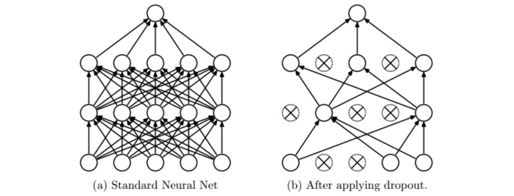

Dropout
-------------



1.  Bagging 集成模型，随机抽样神经网络的子集。很多个**共享参数**的子网络组成。
2.  增强单个神经元**独立学习特征的能力**，减少神经元之间的依赖（避免学习某些固定组合才产生的特征，有意识的让神经网络去学习一些普遍的共性）
3.  加性噪声

## Code

#### 前向传播

```python
def dropout_forward(X, mode):
    """
	反向随机失活: 推荐实现方式。
	确保某单元的期望输出与没有dropout时期望输出大致相同
	在训练的时候drop和调整数值范围，测试时不做任何事.
	"""
    p = 0.5 	# 激活神经元的概率. p值更高 = 随机失活更弱
    
  	# 神经元以p的概率失活 [0, 1]随机分布 P(rand(x)) < p = p
  	# 第一个随机失活掩码. 注意/p! inverted dropout, 保持当前层输出期望一致
  	if mode == 'train':
    	mask = (np.random.rand(*H1.shape) < p) / p
  		out = x * mask
    elif mode == 'test':
        out = x
    
    return out, mask
```

#### 反向传播

```python
def dropout_backward(dout, mode, mask):    
    if mode == 'train':
        dx = dout * mask
    elif mode == 'test':
        dx = dout
        
    return dx
```

