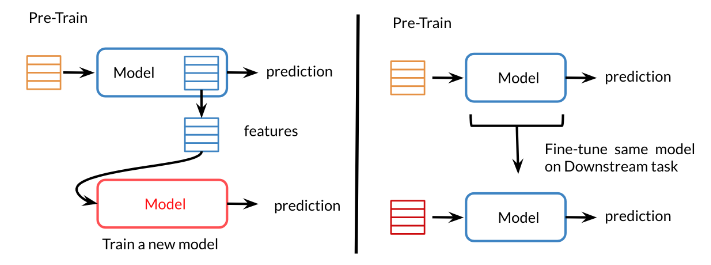
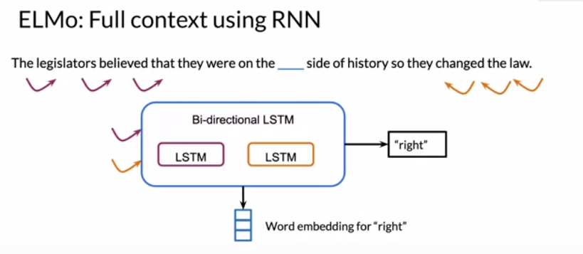
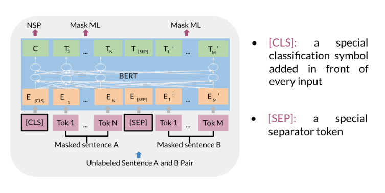

[TOC]

## Transfer Learning in NLP

### Transfer Learning

- Feature based: word vector
- Fine tuning: add new layer of unfreeze last layers, predict words by context

### Models

#### CBOW

- Context windows
- Feed forward neural network

#### ELMo

- Full sentenceTransfer Learning in NLP
  Transfer Learning
  Feature based: word vector

  Fine tuning: add new layer of unfreeze last layers, predict words by context

  

  Models
  CBOW
  Context windows

  Feed forward neural network

  ELMo
  Full sentence

- Transfer Learning in NLP
  Transfer Learning
  Feature based: word vector

  Fine tuning: add new layer of unfreeze last layers, predict words by context

  

  Models
  CBOW
  Context windows

  Feed forward neural network

  ELMo
  Full sentenceBi-directional context

- LSTM

#### GPT

- Transformer **Decoder**
- **Uni-directional** context

#### BERT

Bi-derectional Encoder Representation from Transformers

- Transformer **Encoder**
- **Bi-derectional** context
- multi-mask, **msked** language modeling, mask 15% words for prediction
- **next sentence** prediction

Two steps:

- pre-training
- fine-tuning: choose 15% tokens at random, mask them 80% of the time

#### T5

- Transfromer Encoder-Decoder
- Bi-directional context
- multi-task
- **masking**

