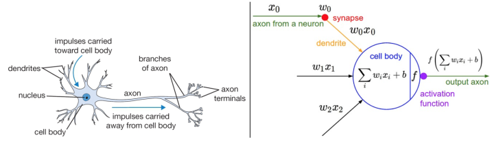
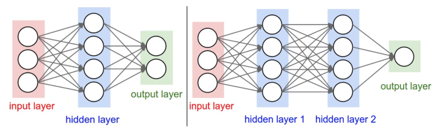
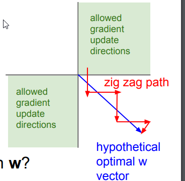
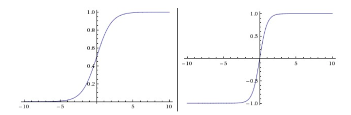
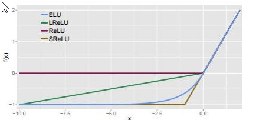
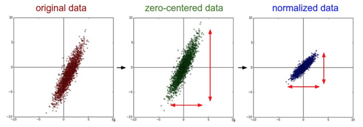
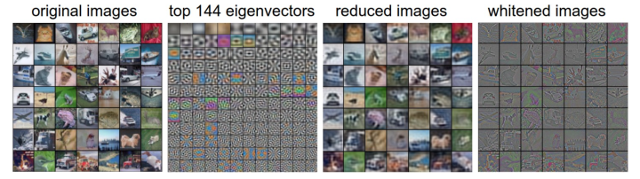
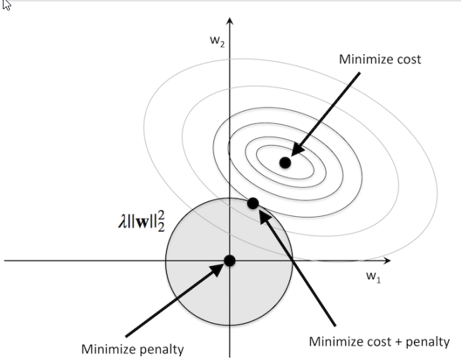

深度学习和神经网络(CS231n Note)
---------------------------

- [深度学习和神经网络(CS231n Note)](#%E6%B7%B1%E5%BA%A6%E5%AD%A6%E4%B9%A0%E5%92%8C%E7%A5%9E%E7%BB%8F%E7%BD%91%E7%BB%9CCS231n-Note)
- [1. 神经元模型与数学模型（Neuron Network Unit）](#1-%E7%A5%9E%E7%BB%8F%E5%85%83%E6%A8%A1%E5%9E%8B%E4%B8%8E%E6%95%B0%E5%AD%A6%E6%A8%A1%E5%9E%8BNeuron-Network-Unit)
- [2. 常用激活函数](#2-%E5%B8%B8%E7%94%A8%E6%BF%80%E6%B4%BB%E5%87%BD%E6%95%B0)
    - [sigmoid](#sigmoid)
    - [tanh](#tanh)
    - [relu](#relu)
    - [Leaky Relu](#Leaky-Relu)
    - [ELU](#ELU)
    - [Maxout](#Maxout)
- [3. 数据预处理](#3-%E6%95%B0%E6%8D%AE%E9%A2%84%E5%A4%84%E7%90%86)
  - [归一化 Normalization](#%E5%BD%92%E4%B8%80%E5%8C%96-Normalization)
  - [PCA 白化（很少在深度学习中使用）](#PCA-%E7%99%BD%E5%8C%96%E5%BE%88%E5%B0%91%E5%9C%A8%E6%B7%B1%E5%BA%A6%E5%AD%A6%E4%B9%A0%E4%B8%AD%E4%BD%BF%E7%94%A8)
  - [CIFAR 数据PCA](#CIFAR-%E6%95%B0%E6%8D%AEPCA)
- [4. 权重初始化](#4-%E6%9D%83%E9%87%8D%E5%88%9D%E5%A7%8B%E5%8C%96)
    - [小随机数初始化](#%E5%B0%8F%E9%9A%8F%E6%9C%BA%E6%95%B0%E5%88%9D%E5%A7%8B%E5%8C%96)
    - [使用$\frac{1}{\sqrt{n}} $校准方差](#%E4%BD%BF%E7%94%A8frac1sqrtn-%E6%A0%A1%E5%87%86%E6%96%B9%E5%B7%AE)
    - [He Normal](#He-Normal)
    - [偏置初始化 biases](#%E5%81%8F%E7%BD%AE%E5%88%9D%E5%A7%8B%E5%8C%96-biases)
- [5. 正则化](#5-%E6%AD%A3%E5%88%99%E5%8C%96)
    - [L1 正则](#L1-%E6%AD%A3%E5%88%99)
    - [L2正则](#L2%E6%AD%A3%E5%88%99)

## 1. 神经元模型与数学模型（Neuron Network Unit）

大脑的基本计算单位是神经元（neuron**）**。人类的神经系统中大约有860亿个神经元，它们被大约$10^{14}-10^{15}$个**突触（synapses）**连接起来。下面图表的左边展示了一个生物学的神经元，右边展示了一个常用的数学模型。每个神经元都从它的**树突**获得输入信号，然后沿着它唯一的**轴突（axon）**产生输出信号。轴突在末端会逐渐分枝，通过突触和其他神经元的树突相连。



神经元（Neuron）通过树突（Dendrites）接收输入信号，沿着轴突（axon）产生输出信号。轴突在末端分叉，通过突触和其他神经元的树突相连。

输入信号（$x_0,x_1,...,x_n$）传递到其他神经元的树突，基于突触的突触强度相乘（$w_0x_0,w_1x_1,...,w_nx_n$）。突触的强度（权重$w$）可以控制一个神经元对另一个神经元的影响强度，使其兴奋（正权重）或抑制（负权重）。输出信号如果高于阈值，则神经元激活（对应于激活函数$f(\sum_{i}w_ix_i+b)$）。

1. 1 多层感知机

   输入层  -> 隐藏层 -> 输出层

   

## 2. 常用激活函数

|         | 函数                                    | 值域          | 导数 | 备注 |
| ------- | --------------------------------------- | ------------- | ---- | ---- |
| sigmoid | $ \sigma(x)=\frac{1}{1+e^{-x}} $     | [0,1]         | [0, 0.25]   $\sigma'(x)=\sigma(x)(1-\sigma(x))$ | 分类概率 |
| tanh    | $tanh(x)=\frac{e^x-e^{-x}}{e^x+e^{-x}}$ | [-1,1]        | [0, 1]  $tanh'(x)=1-(tan(x))^2$ |      |
| relu    | $relu(x)=max(0, x)$                    | $[0,+\infty]$ |$f'_x=\begin{cases}0, x<0 \\ 1, x>0 \\ undefinded, x=0 \end{cases}$| |
#### sigmoid

优点：

1. 分类概率

缺点

1. 梯度容易饱和而丢失，激活函数在接近0,1时会饱和，如果权重过大，很容易失去梯度
2. 函数不经过0，不以0点对称，在中间点0.5附近的的梯度较小（0.25），梯度总体较小，不利于梯度传播
3. 激活值永远全为正（负），下一神经元的输入总是正数（负数），则反向传播过程中梯度更新呈z字型
4. exp指数函数计算复杂



#### tanh

$tanh(x)=2\sigma(2x)-1$

优点：

1. 范围更大 [0, 1]
2. 以 0 为中心点
3. 中间部分梯度更大，有利于梯度传播

缺点：

1. 梯度饱和而丢失的情况仍然存在

#### relu

优点

1. 收敛速度更快（e.g. 6x than sigmoid/tanh)
2. 计算简单
3. 梯度不会饱和

缺点

1. 可能导致部分神经元“死掉”，永远不会被激活。输出值始终为负，激活值为0，梯度为0，反向传播不更新此神经元的梯度。降低学习率来降低神经元“死掉”的概率。





#### Leaky Relu

解决Relu死亡的问题

$$f(x)=\begin{cases}x, x>0\\\alpha x, x<0\end{cases}$$, $\alpha=0.01​$

#### ELU

$$f(x)=\begin{cases} x, x>0\\ \alpha(e^x-1), x\leq0\end{cases}$$



#### Maxout

$$max(w_{1}^Tx+b_1, w_{2}^Tx+b_2)$$


## 3. 数据预处理

### 归一化 Normalization

```
# 数据归一化
X = X / np.std(X, axis=0)
# 维度归一化
X = X / np.std(X, axis=1)
```



### PCA 白化（很少在深度学习中使用）

PCA/白化。**左边**是二维的原始数据。**中间**：经过PCA操作的数据。可以看出数据首先是零中心的，然后变换到了数据协方差矩阵的基准轴上。这样就对数据进行了解相关（协方差矩阵变成对角阵）。**右边**：每个维度都被特征值调整数值范围，将数据协方差矩阵变为单位矩阵。从几何上看，就是对数据在各个方向上拉伸压缩，使之变成服从高斯分布的一个数据点分布。


### CIFAR 数据PCA

nx3072 维向量（图片32x32x3）,协方差矩阵：3072x3072



1: 49张图片。2: 3072个特征值向量中的前144个。3: 49张PCA降维的图片（U.transpose()[:144,:]）。4: 白化后的数据。144个维度的方差都压缩到相同的数值范围（U.transpose()[:144,:]）。现在较低的频率（代表了大多数方差）可以忽略不计了，较高的频率（代表相对少的方差）就被夸大了。

## 4. 权重初始化

#### 小随机数初始化

基于均值为0，标准差为1的高斯分布

```
W = 0.01 * np.random.randn(N, D)
```

#### 使用$\frac{1}{\sqrt{n}} $校准方差

数据量增大，随机初始化的神经元输出数据分布的方差也增大

``` python
W = np.random.randn(N, D) / np.sqrt(N)
```

#### He Normal

网络中神经元的方差应该是$\frac{2}{n}$

当前的推荐是使用ReLU激活函数，并且使用**w = np.random.randn(n) \* sqrt(2.0/n)**来进行权重初始化

``` python
W = np.random.randn(n) * sqrt(2.0/n)
```

#### 偏置初始化 biases

```
b = np.zeros(n,)
```

## 5. 正则化

#### L1 正则


#### L2正则




References:

1. [cs231n课程笔记中文翻译](<https://zhuanlan.zhihu.com/p/21930884>)
2. [cs231n Assignments 解答 - 大数据文摘](<https://github.com/theBigDataDigest/Stanford-CS231n-assignments-in-Chinese>)
3.
