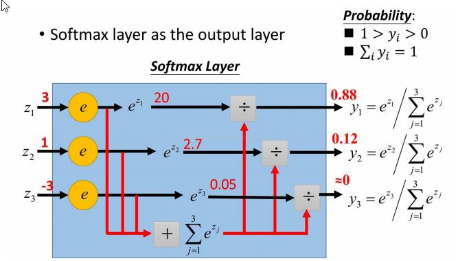
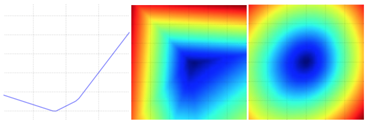
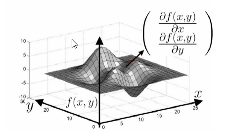
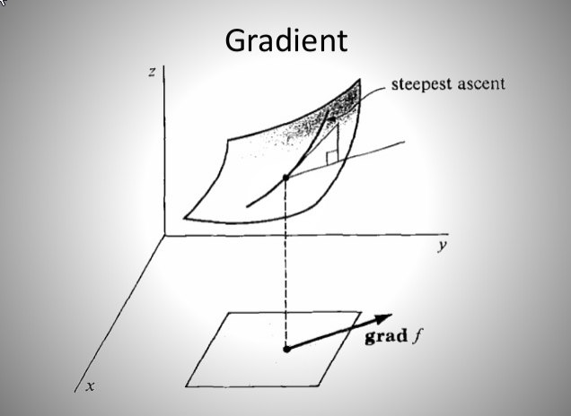
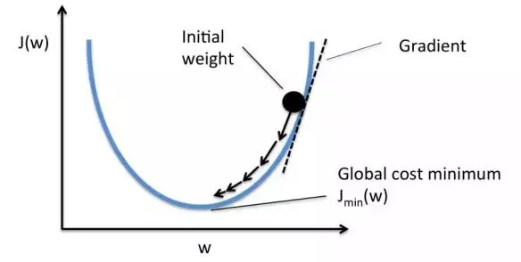
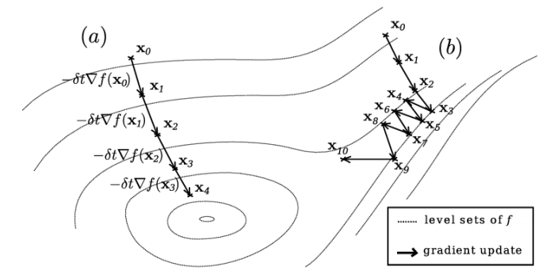
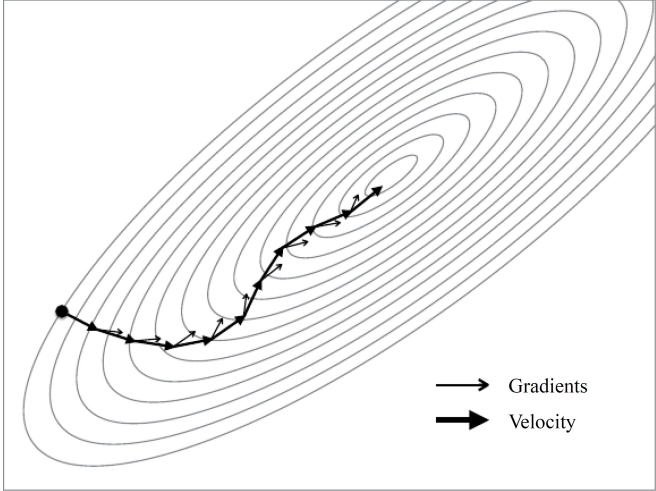
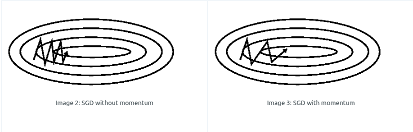
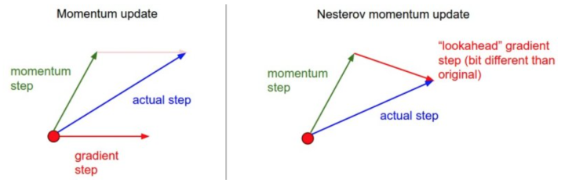

Optimization
-------------

- [Optimization](#Optimization)
- [损失函数](#%E6%8D%9F%E5%A4%B1%E5%87%BD%E6%95%B0)
    - [损失函数 Loss function / 代价函数 Cost function](#%E6%8D%9F%E5%A4%B1%E5%87%BD%E6%95%B0-Loss-function--%E4%BB%A3%E4%BB%B7%E5%87%BD%E6%95%B0-Cost-function)
    - [均方损失](#%E5%9D%87%E6%96%B9%E6%8D%9F%E5%A4%B1)
    - [交叉熵损失（cross-entropy loss)](#%E4%BA%A4%E5%8F%89%E7%86%B5%E6%8D%9F%E5%A4%B1cross-entropy-loss)
    - [Softmax 函数](#Softmax-%E5%87%BD%E6%95%B0)
    - [损失函数可视化](#%E6%8D%9F%E5%A4%B1%E5%87%BD%E6%95%B0%E5%8F%AF%E8%A7%86%E5%8C%96)
- [梯度下降](#%E6%A2%AF%E5%BA%A6%E4%B8%8B%E9%99%8D)
    - [全局梯度下降　Batch Gradient Descent](#%E5%85%A8%E5%B1%80%E6%A2%AF%E5%BA%A6%E4%B8%8B%E9%99%8D-Batch-Gradient-Descent)
    - [随机梯度下降SGD　Stochastic Gradient Descent](#%E9%9A%8F%E6%9C%BA%E6%A2%AF%E5%BA%A6%E4%B8%8B%E9%99%8DSGD-Stochastic-Gradient-Descent)
    - [小批量梯度下降　Ｍini-batch Gradient Descent](#%E5%B0%8F%E6%89%B9%E9%87%8F%E6%A2%AF%E5%BA%A6%E4%B8%8B%E9%99%8D-%EF%BC%ADini-batch-Gradient-Descent)
    - [Challange](#Challange)
- [优化算法](#%E4%BC%98%E5%8C%96%E7%AE%97%E6%B3%95)
    - [牛顿法](#%E7%89%9B%E9%A1%BF%E6%B3%95)
    - [BFGS, L-BFGS](#BFGS-L-BFGS)
    - [梯度衰减(模拟退火)](#%E6%A2%AF%E5%BA%A6%E8%A1%B0%E5%87%8F%E6%A8%A1%E6%8B%9F%E9%80%80%E7%81%AB)
    - [Ｍomentum](#%EF%BC%ADomentum)
    - [NAG Neterov Accelerated Gradient](#NAG-Neterov-Accelerated-Gradient)
    - [Adagrad](#Adagrad)
    - [Adadelta](#Adadelta)
    - [RMSProp](#RMSProp)
    - [Adam](#Adam)
    - [Nadam](#Nadam)
  - [各种优化方法动态图](#%E5%90%84%E7%A7%8D%E4%BC%98%E5%8C%96%E6%96%B9%E6%B3%95%E5%8A%A8%E6%80%81%E5%9B%BE)


## 损失函数

#### 损失函数 Loss function / 代价函数 Cost function


#### 均方损失

$$L(x)=\sum_{i}(y_i - y_j)^2$$

#### 交叉熵损失（cross-entropy loss)

$$L(x)=\sum_{i}p_i\log \frac{1}{q_i}$$

交叉熵作为代价函数可以避免均方代价函数带来的学习减速(nelson)

#### Softmax 函数



$$y_i=\frac{e^{z_i}}{\sum_{i}{e^{z_i}}}$$

Softmax 分类器为每一个分类都提供了“可能性（概率）”

输出值$z_i$ => 概率$y_i$

**决策函数**：$$\hat{y}=argmax_{i}(y=y_i|Z)$$  (y所属类别$\hat{y}$)

#### 损失函数可视化

颜色越深，损失函数越小





## 梯度下降

损失函数 L 的 3D 图：



Gradient: 损失函数 L 在某一点的梯度（斜率，一阶导数）





梯度下降法：某一点沿着斜坡在当前点梯度最大的方向($f'(x)$, 下降最快的方向)移动一个步长(learning rate)，在下一次更新中就会更接近最小点。

$$w = w - \eta dw$$


白箭头为（负梯度方向），是损失函数下降最陡峭的方向。沿着梯度方向逐步下降更新参数，就是深度学习中的梯度下降学习方法。




#### 全局梯度下降　Batch Gradient Descent

$$\theta = \theta-\eta \nabla_{\theta} J(\theta)$$

优点：保证每次更新梯度都朝着正确的方向进行，保证收敛到局部最小点

缺点：每次需计算整个训练集数据，成本比较高

#### 随机梯度下降SGD　Stochastic Gradient Descent

$$\theta = \theta-\eta \nabla_{\theta} J(\theta;x_i,y_i)$$

优点：每次只选择一个样本来学习，成本低，可以进行在线更新; 不容易陷入某个局部

缺点：优化过程中波动较大，收敛速度慢；可能在沟壑两边持续震荡，停留在一个局部最优点

#### 小批量梯度下降　Ｍini-batch Gradient Descent

$$\theta = \theta-\eta \nabla_{\theta} J(\theta;x_{i:i+n},y_{i,i+n})$$

n的大小通常为50-256

优点：相对于随机梯度下降(SGD)，降低收敛波动性（降低参数更新的方差），使得收敛过程更加稳定。相对于全量梯度下降，提高了每次学习的速度。

#### Challange

- **学习速率**的选择，过小则收敛很慢，过大则在极值点附近震荡
- 学习速率调整（模拟退火）一般使用事先设定的策略或者每次迭代中衰减一个阈值。都需要事先固定设置，无法**自适应**数据集的特点
- 所有的**参数每次更新都使用相同的学习速率**。如果数据特征稀疏或者取值空间分布不同，就不应该使用同样的学习速率，对于很少出现的特征应该使用一个较大的学习速率
- 对于非凸损失函数，容易陷入局部最小点，更严重的问题在于**鞍点**，附近点的梯度在所有维度上都接近于０

## 优化算法

#### 牛顿法

$x = x -[Hf(x)]^{-1}\nabla f(x)$

$Hf(x)$: Hessian 矩阵，描述损失函数的局部曲率

$[Hf(x)]^{-1}$让最优化过程在曲率小的时候大步前进，在曲率大的时候小步前进

而且，没有学习率这个超参数

但是，Hessian矩阵计算成本很高

#### BFGS, L-BFGS


#### 梯度衰减(模拟退火)

- 随步数减半：没５个周期减半，每20个周期减少到之前0.1

- 指数衰减：$\alpha=\alpha_{0}e^{-kt}$
- 1/t衰减：$\alpha=\frac{\alpha_0}{1+kt}$

#### Ｍomentum

累积之前的下降方向，并略微偏向当前时刻的下降方向



引入动量，**累积之前的动量(梯度的指数衰减)**，速度越来越快。

$$v_t = \gamma v_{t-1} + \eta \nabla_\theta J(\theta)$$

$$\theta = \theta - v_t$$

$$\gamma$$通常使用0.9


加上动量后，就像从山顶往下滚的球。更新过程中，与上一次梯度方向相同的参数更新加强，在这个方向下降更快；与上一次梯度方向不同的参数更新减弱，在这个方向下降减慢。因此获得更快的收敛速度并减少震荡。



#### NAG Neterov Accelerated Gradient

往标准动量方法添加一个修正因子(当前梯度衰减$\eta v_{t-1}$)，阻止过快更新

$$v_t = \gamma v_{t-1} + \eta \nabla_\theta J(\theta-\gamma v_{t-1})$$

$$\theta = \theta - v_t$$


核心思路：

当参数向量位于某个位置ｘ时，动量部分衰减$\gamma v_{t-1}$，向前一步$\theta-\gamma v_{t-1}$得到下一步要到达的位置，**向前看**在**下一步**的位置计算梯度。

```python
x_ahead = x + mu * v
# 计算dx_ahead(在x_ahead处的梯度，而不是在x处的梯度)
v = mu * v - learning_rate * dx_ahead
x += v
```

**通过上面的两种方法，可以做到每次学习过程中能够根据损失函数的斜率做到自适应更新来加速SGD的收敛**。

接下来引入二阶动量，希望同时解决**不同参数应该使用不同学习速率的问题**。对于经常更新的参数，我们已经积累了大量关于它的知识，不希望被单个样本影响太大，希望学习速率慢一些；对于偶尔更新的参数，我们了解的信息太少，希望能从每个偶然出现的样本身上多学一些，即学习速率大一些。

怎么样去度量历史更新频率呢？

那就是二阶动量——该维度上，迄今为止所有梯度值的平方和：

$$V_t=\sum_{\tau=1}^{t} g_{\tau}^2$$

#### Adagrad

**累积平方梯度**

$$g_{t} = \nabla_{\theta} J(\theta)$$

$$r=r + g \odot g$$

$$\theta_{t+1}=\theta_{t}-\frac{\eta}{\sqrt{r+\epsilon}}\odot g$$

优点：

- 适合处理稀疏梯度。自适应不同的学习速率，对稀疏特征，得到更大的学习更新；对非稀疏特征，得到更小的学习更新　　特征出现越多，累积平方梯度ｒ越大，分母$\sqrt{r+\epsilon}$越大，更新越慢

- 前期$g_t$较小，校正因子较大，能够放大梯度，累积势越小，更新越快

- 后期$g_t$较大，校正因子较大，能够约束梯度，累积势越大，更新越慢

缺点：

- 依赖学习速率
- 学习速率$\eta$不能过大，否则导致对梯度调节过大
- 单调的学习率被证明通常**过于激进且过早停止学习**。后期如果梯度的平方累积($r$)过大，导致更新很小，接近于０，使得训练提前结束

由于AdaGrad单调递减的学习率变化过于激进，我们考虑一个改变二阶动量计算方法的策略：不累积全部历史梯度，而只关注过去一段时间窗口的下降梯度。这也就是AdaDelta名称中Delta的来历。

引入指数移动平均值：

$$r_t=\gamma r_{t-1}+(1-\gamma)g_{t}^2$$

#### Adadelta

对Adagrad的扩展

$$g_{t} = \nabla_{\theta} J(\theta)$$

$$r=\gamma r + (1-\gamma) g \odot g$$

$$g'_t=\sqrt{\frac{\Delta x_{t-1} +\epsilon}{r+\epsilon}}\odot g$$                   # 使用**状态变量$\Delta x_{t-1}$替代学习速率$\eta$**

$$\theta_{t+1}=\theta_{t}-g'_t$$

$$\Delta x_t=\gamma \Delta x_{t-1}+(1-\gamma)g'_t\odot g'_t $$   # 使用$\Delta x_{t-1}$记录自变量变化量$g′_t$按元素平方的指数加权移动平均

优点：

- 不再依赖学习率，使用梯度平方的指数加权累积得到状态变量$\Delta x_{t-1}$替代学习速率$\eta$
- 训练初中期，加速效果好
- 训练后期，反复在局部最小值附近抖动

#### RMSProp

**累积指数加权的平方梯度**

$$E[g^2]_t=\gamma E[g^2]_{t-1}+(1-\gamma)g_t^2$$          # 梯度平方的滑动平均

$$\theta_{t-1}=\theta_{t} - \frac{\eta}{\sqrt{E[g^2]_t+\epsilon}}\odot g_t$$

$\gamma=0.9, \eta=0.001$


- RMSProp 是 Adagrad 的一种发展，和 Adadelta 的变体，效果趋于二者之间，**降低了 Adagrad 中学习速率衰减过快**的问题
- 适合处理非平稳目标（RNN）

接下来，整合前面所有方法，就得到 Adam。SGD-Momentum 在 SGD 的基础上增加了一阶动量，AdaGrad 和 AdaDelta 在 SGD 的基础上增加了二阶动量。结合一阶动量和二阶动量，就是 Adam (Adaptive+Momentum). 再加上 Neterov，就是 Nadam。

#### Adam

Adaptive Moment Estimation(Adam)

**累积指数加权的梯度和平方梯度**

$$m_t=\beta_1 m_{t-1} + (1-\beta_1)g_t$$   # 一阶累积

$$r_t = \beta_2 r_{t-1} + (1-\beta_2)g_{t}^2$$　　# 二阶累积

$$\hat{m_t}=\frac{m_t}{1-\beta_1^t}$$　　　　　　　　　# 校正因子，$m_t$接近与０(初始0, $\beta$ 接近１)

$$\hat{v_t}=\frac{v_t}{1-\beta_2^t}$$

$$\theta_{t+1}=\theta_t - \eta\frac{\hat{m_t}}{\sqrt{\hat{v_t} + \epsilon}}$$

$\beta_1=0.9,\beta_2=0.999,\epsilon=10^{-8}$

#### Nadam

$$g_t=\nabla_{\theta_t} J(\theta_t - m_t)$$


优点：

- 结合 Adagrad 善于处理稀疏梯度和 RMSProp 善于处理非平稳目标的问题
- 适用于大数据集和高维空间

缺点：

- 二阶动量是固定时间窗口内的累积，随着时间窗口的变化，遇到的数据可能发生巨变，使得 ![[公式]](optimization/equation.svg) 可能会时大时小，不是单调变化。这就可能在训练后期引起学习率的震荡，导致模型无法收敛。
- 可能错过全局最优解


*cs231n: The two recommended updates to use are either SGD+Nesterov Momentum or Adam*

### 各种优化方法动态图


 Adagrad、Adadelta与RMSprop在损失曲面上能够立即转移到正确的移动方向上达到快速的收敛。而Momentum 与NAG会导致偏离(off-track)。同时NAG能够在偏离之后快速修正其路线，因为其根据梯度修正来提高响应性


从上图可以看出，在鞍点（saddle points）处(即某些维度上梯度为零，某些维度上梯度不为零)，SGD、Momentum与NAG一直在鞍点梯度为零的方向上振荡，很难打破鞍点位置的对称性；Adagrad、RMSprop与Adadelta能够很快地向梯度不为零的方向上转移。
   从上面两幅图可以看出，自适应学习速率方法(Adagrad、Adadelta、RMSprop与Adam)在这些场景下具有更好的收敛速度与收敛性。


References:

1. [An overview of gradient descent optimization algorithms](<http://ruder.io/optimizing-gradient-descent/index.html>)
2. [梯度下降优化算法综述(1的翻译)](<https://blog.csdn.net/heyongluoyao8/article/details/52478715>)
3. [一个框架看懂优化算法之异同 SGD/AdaGrad/Adam - Juliuszh的文章 - 知乎](
   https://zhuanlan.zhihu.com/p/32230623)

