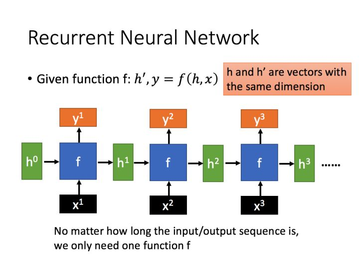
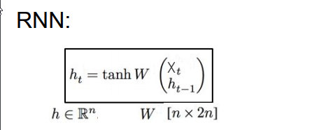
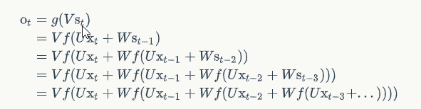
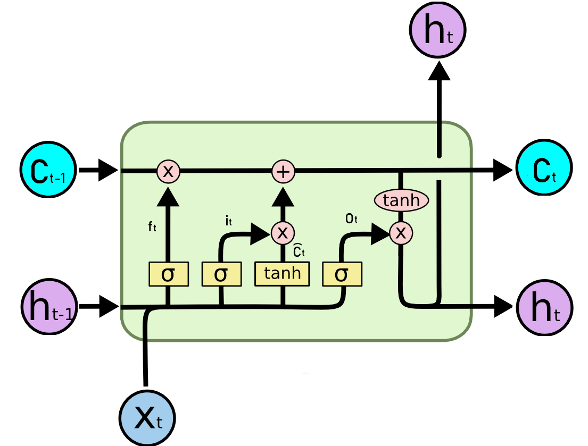
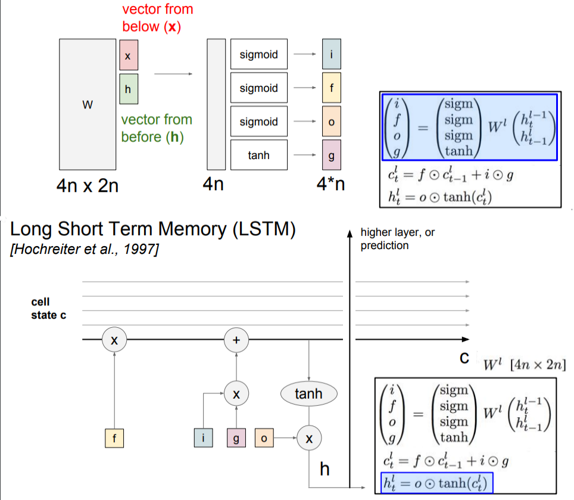

Recurrent Neuro Network
------------------------------------

**循环神经网络**可以更好地处理序列信息（如一句话），允许记忆信息（在时序上传递输入的有效信息），可以解决长期依赖的问题（Long-term Dependencies）

## RNN结构

$$O_t = g(VS_t)$$                     # 在时间点 t 的输出

$$S_t = f(UX_t + WS_{t-1})$$     # 在时间点 t 的状态

W,V,U: 权重

g,f: 激活函数

#### 循环

输出值 $O_t$ 受前面历次输入值 $x_t, x_{t-1}, x_{t-2}...$ 的影响，相当于一定程度上记忆之前任意时间段的有效信息，从而在时序上累积输入 $X_t$，解决长期依赖问题。

*疑问： S作为一个固定大小的矩阵如何记忆有效信息？*

## BPTT

损失函数对权重 $W$ 的梯度是各个时刻梯度之和：

$$\nabla_W L = \sum_{i=1}^{t} \nabla_{W_i} L$$

## LSTM

$$f_t = \sigma(W_f[h_{t-1}, x_t] + b_f) $$                       # forget 遗忘门

$$i_t = \sigma(W_i[h_{t-1}, x_t] + b_i)$$                         # input 输入门

$$\widetilde{C}_t = tanh(W_c[h_{t-1}, x_t]  + b_c)$$                 # 特征输入

<<<<<<< HEAD

=======
>>>>>>> 66f037c2f6c4b40611583b218ec6441bb47385a7

$$C_t = f_t \odot C_{t-1} + i_t \odot \widetilde{C}_t$$                          # 选择性遗忘，选择性更新 

$$h_t = o \odot tanh(C_t)$$                                   # output 输出门 

## GRU

合并遗忘门和输入门，使用$z_t$

References:

1. [Understanding-LSTMs colah](https://colah.github.io/posts/2015-08-Understanding-LSTMs/)
2. [理解LSTM（1的翻译）](https://www.jianshu.com/p/9dc9f41f0b29)
3. [零基础入门深度学习(5) - 循环神经网络](https://zybuluo.com/hanbingtao/note/541458)
4. 