Transformer
---------

## Attention

### Feature-based attention: The Key, Value, and Query

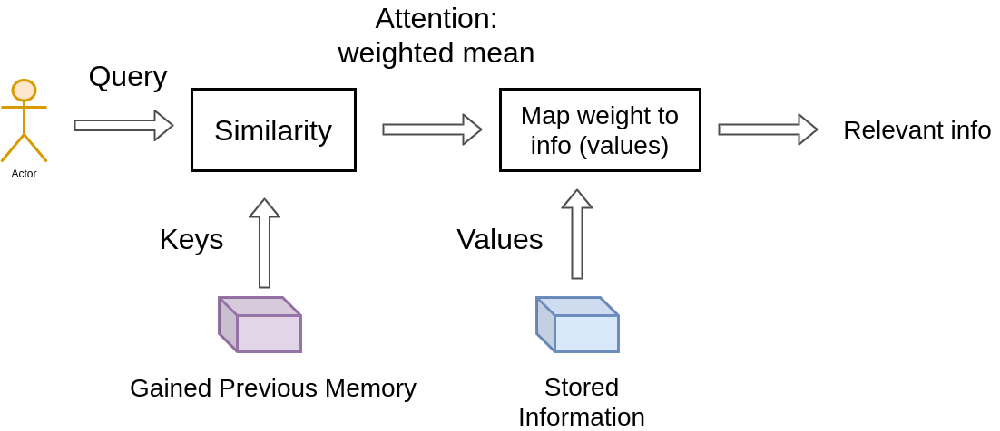

When you search (**query**) for a particular video, the search engine will map your **query** against a set of **keys** (video title, description, etc.) associated with possible stored videos. Then the algorithm will present you the best-matched videos (**values**). This is the foundation of content/**feature-based lookup**.

 In the single video retrieval, the attention is the choice of the video with a maximum relevance score. 

> We use the **keys** to define the **attention weights** to look at the data and the **values** as the **information** that we will actually get. 

#### Vector similarity in high dimensional spaces

In geometry, the **inner vector product** is interpreted as a vector projection.  

$sim(\textbf{a},\textbf{b}) = cos(\textbf{a},\textbf{b})=\frac{\textbf{a b}}{ |\textbf{a}| |\textbf{b}|  } = \frac{1}{s  } * \textbf{a b}$

## Self-Attention: The Transformer encoder

> “Self-attention, sometimes called intra-attention, is an attention mechanism relating different positions of a single sequence in order to compute a representation of the sequence.” ~ Ashish Vaswani et al. [2] from Google Brain. 

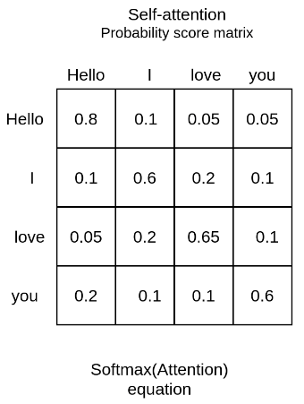

- input： $\textbf{X} \in  R^{N \times d_{k} }$
- weight metrices:  $\textbf{W}^{K} , \textbf{W}^{Q} \in R^{d_{k} \times  d_{model}}$, $\textbf{W}_V  \in  R^{ d_{k} \times d_{model}}$

Map the independent set of **Key, Query, Value** matrices into different lower dimensional spaces and compute the attention there (the output is called a “**head**”) 

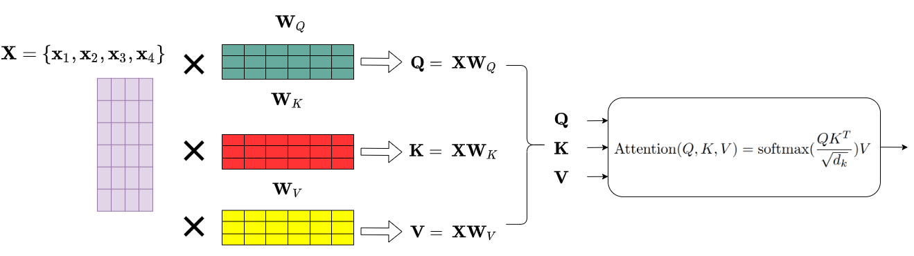

$\operatorname{Attention}(\textbf{Q}, \textbf{K}, \textbf{V})=\operatorname{softmax}\left(\frac{\textbf{Q} \textbf{K}^{T}}{\sqrt{d_{k}}}\right) \textbf{V}$

**dot product attention** -> **probability distribution**

$d_k$: matrix size

> think of the attention matrix as **where** to look and the Value matrix as **what** I actually want to get. 

### Short residual skip connections

>  skip connections give a transformer a tiny ability to allow the representations of **different levels** of processing to **interact**

### Layer Normalization

>  the mean and variance are **computed across channels and spatial dimensions** 

$\mu_{n}=\frac{1}{K} \sum_{k=1}^{K} x_{nk}$

$\sigma_{n}^{2}=\frac{1}{K}\sum_{k=1}^{K}\left(x_{nk}-\mu_{n}\right)^{2}$

$\hat{x}_{nk}= \frac{x_{nk}-\mu_{n}}{\sqrt{\sigma_{n}^{2}+\epsilon}}, \hat{x}_{nk} \in R$

$\mathrm{LN}_{\gamma, \beta}\left(x_{n}\right) =\gamma \hat{x}_{n}+\beta ,x_{n} \in R^{K}$

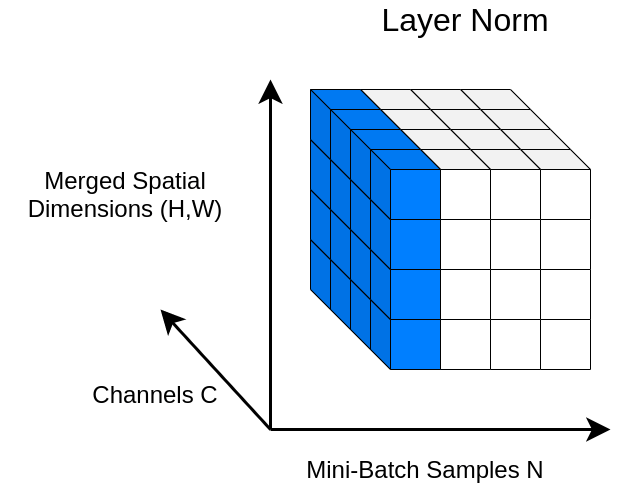

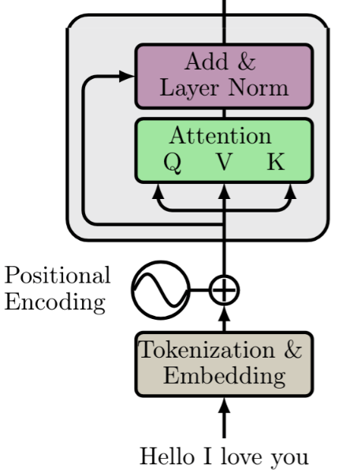

### linear layer

linear layer (PyTorch), dense layer (Keras), feed-forward layer (old ML books), fully connected layer. 

$\textbf{y} = \textbf{x} \textbf{W}^{T} + \textbf{b}$

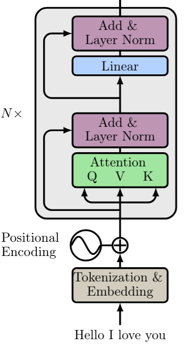

### The core building block: Multi-head attention and parallel implementation

> In essence, **we run through the attention mechanism several times**. 

$\begin{aligned} \text { MultiHead }(\textbf{Q}, \textbf{K}, \textbf{V}) &=\text { Concat (head }_{1}, \ldots, \text { head }   \left.{\mathrm{h}}\right) \textbf{W}^{O}    \text { where head }_{\mathrm{i}} &= \text {Attention }  \left(\textbf{Q} \textbf{W}_{i}^{Q}, \textbf{K} \textbf{W}_{i}^{K},\textbf{V} \textbf{W}_{i}^{V}\right) \end{aligned}$

$h = \frac{d_{model}}{d_{k}}=\frac{512}{64}=8$

**8 heads parallel**

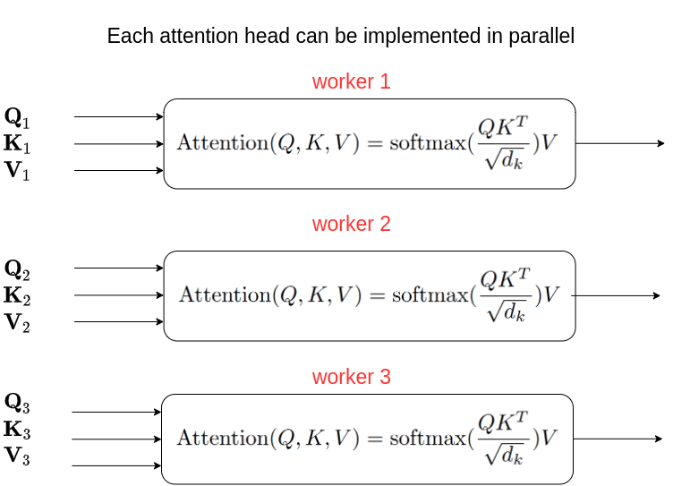

> “Multi-head attention allows the model to **jointly** attend to information from different representation subspaces at different positions. With a single attention head, averaging inhibits this.” 

The intuition behind multi-head attention is that it **allows us to attend to different parts of the sequence differently** each time. This practically means that:

- The model can better capture **positional information** because each head will attend to different segments of the input. The combination of them will give us a more robust representation.
- Each head will capture different contextual information as well, by correlating words in a unique manner.

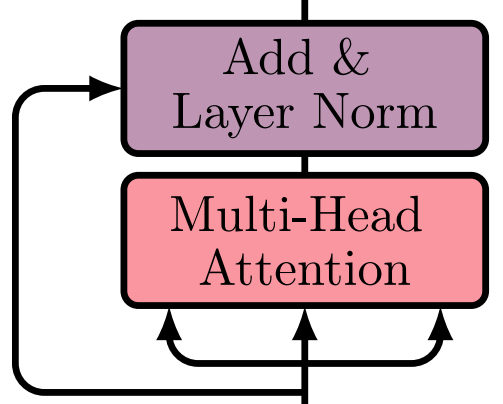

## Sum up: the Transformer encoder

### Preprocess

- **Tokenization**
- **Word embeddings**
- **Positional Encodings**: applied to each embedding resulting in word vectors that also include positional information. 

### Encoder blocks 

- A **multi-head self-attention** layer to find correlations between each word
- A **normalization** layer
- A **residual connection** around the previous two sublayers
- A **linear layer**
- A **second normalization layer**
- A **second residual connection**

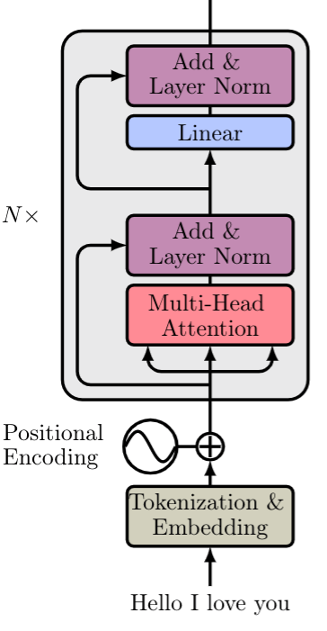

## Transformer decoder

### Preprocess

- Input: **output sequence**

- **word embedding**
- **Positional encoding** 

### Each decoder block includes:

- A **Masked** **multi-head self-attention** layer
- A **normalization layer** followed by a **residual connection**
- A **second multi-head attention layer** (known as **Encoder-Decoder attention**)
- A **second normalization layer** and a **residual connection**
- A **linear layer** and a **third residual connection**

### Output

Ouput: The output **probabilities** predict the next token in the output sentence. 

In essence, we assign a probability to each word in the French language and we simply keep the one with the highest score. 

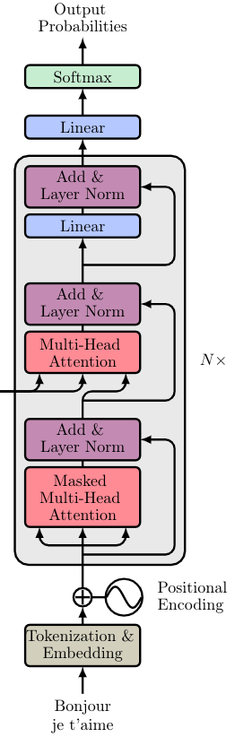

### Masked Multi-head attention

The self-attention layer needs to be modified in order to consider only the output sentence that has **been generated** so far. (**attention with previous words only**)

We don’t know the whole sentence because it hasn’t been produced yet. That’s why we need to disregard the unknown words. 

> Mask the next word embeddings (by setting them to $−inf$). 

$\operatorname{MaskedAttention}(\textbf{Q}, \textbf{K}, \textbf{V})=\operatorname{softmax}\left(\frac{\textbf{Q} \textbf{K}^{T} + \textbf{M} }{\sqrt{d_{k}}}\right) \textbf{V}$

### Encoder-Decoder attention: where the magic happens

The attention matrix generated by the encoder is passed to another attention layer alongside the result of the previous Masked Multi-head attention block. 

The intuition behind the encoder-decoder attention layer is to **combine** the input and output sentence. The **encoder’s output** encapsulates the final embedding of the input sentence. It is like our **database**. So **we will use the encoder output to produce the Key and Value matrices**. On the other hand, the **output of the Masked Multi-head attention block contains the so far generated new sentence and is represented as the Query matrix** in the attention layer. Again, it is the **“search” in the database**. 

> The encoder-decoder attention is trained to associate the input sentence with the corresponding output word. 

It will eventually determine how related each English word is with respect to the French words. This is essentially where the mapping between English and French is happening. 

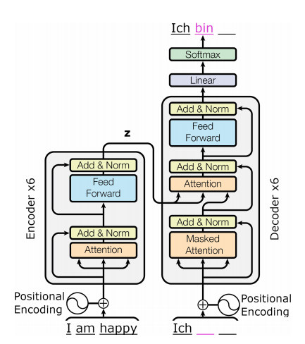

## Intuitions on why transformers work so damn well

1. **Distributed and independent representations at each block**: Each transformer block has h=8 contextualized representations. Intuitively, you can think of it as the **multiple feature maps of a convolution layer that capture different features from the image** . The difference with convolutions is that here we have **multiple views (linear reprojections) to other spaces**. This is of course possible by initially representing words as vectors in a euclidean space (and **not** as discrete symbols).
2. **The meaning heavily depends on the context**: This is exactly what self-attention is all about! We **associate relationships between word representation expressed by the attention weights**. There is no notion of locality since we naturally let the model make global associations.
3. **Multiple encoder and decoder blocks**: With more layers, the model makes more abstract representations. Similar to stacking recurrent or convolution blocks we can stack multiple transformer blocks. The first block associates word-vector pairs, the second pairs of pairs, the third of pairs of pairs of pairs, and so on. In parallel, the multiple heads focus on different segments of the pairs. This is analogous to the [receptive field](https://theaisummer.com/receptive-field/) but **in terms of pairs** of distributed representations.
4. **Combination of high and low-level information**: with [skip-connections](https://theaisummer.com/skip-connections/) of course! They enable **top-down understanding** to flow back with the multiple gradient paths that flow backward.

### Self-attention VS linear layers VS convolutions

What is the difference between attention and a feedforward layer? Don’t linear layers do exactly the same operations to an input vector as attention?

Good question! The answer is **no** if you delve deep into the concepts.

You see the values of the self-attention weights are computed **on the fly**. They are **data-dependent dynamic weights** because they change dynamically in response to the data (**fast weights**).

For example, each word in the translated sequence (Bonjour, je t’aime) will attend differently with respect to the input.

On the other hand, the **weights of a feedforward (linear) layer** change very **slowly** with stochastic gradient descent. In convolutions, we further constrict the (slow) weight to have a fixed size, namely the **kernel size**

## References

1. https://thaisummer.com/transformer
2. https://theaisummer.com/attention/
3. https://twitter.com/FelixHill84