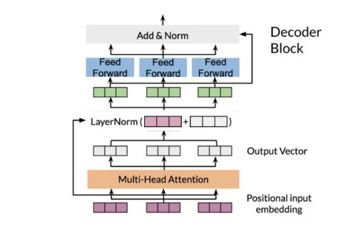

# Transformer

## Structure


## LSTM Seq2Seq of NMT 


<details>
<summary>Model Code with Trax</summary>

``` python
def NMTAttn(input_vocab_size=33300,
    target_vocab_size=33300,
    d_model=1024,
    n_encoder_layers=2,
    n_decoder_layers=2,
    n_attention_heads=4,
    attention_dropout=0.0,
    mode='train'):
    """Returns an LSTM sequence-to-sequence model with attention.

    The input to the model is a pair (input tokens, target tokens), e.g.,
    an English sentence (tokenized) and its translation into German (tokenized).

    Args:
    input_vocab_size: int: vocab size of the input
    target_vocab_size: int: vocab size of the target
    d_model: int:  depth of embedding (n_units in the LSTM cell)
    n_encoder_layers: int: number of LSTM layers in the encoder
    n_decoder_layers: int: number of LSTM layers in the decoder after attention
    n_attention_heads: int: number of attention heads
    attention_dropout: float, dropout for the attention layer
    mode: str: 'train', 'eval' or 'predict', predict mode is for fast inference

    Returns:
    A LSTM sequence-to-sequence model with attention.
    """

    ### START CODE HERE (REPLACE INSTANCES OF `None` WITH YOUR CODE) ###

    # Step 0: call the helper function to create layers for the input encoder
    input_encoder = input_encoder_fn(input_vocab_size, d_model, n_encoder_layers)

    # Step 0: call the helper function to create layers for the pre-attention decoder
    pre_attention_decoder = pre_attention_decoder_fn(mode, target_vocab_size, d_model)

    # Step 1: create a serial network
    model = tl.Serial( 

    # Step 2: copy input tokens and target tokens as they will be needed later.
    tl.Select([0, 1, 0, 1]),

    # Step 3: run input encoder on the input and pre-attention decoder the target.
    tl.Parallel(input_encoder, pre_attention_decoder),

    # Step 4: prepare queries, keys, values and mask for attention.
    tl.Fn('PrepareAttentionInput', prepare_attention_input, n_out=4),

    # Step 5: run the AttentionQKV layer
    # nest it inside a Residual layer to add to the pre-attention decoder activations(i.e. queries)
    tl.Residual(tl.AttentionQKV(d_feature=d_model, n_heads=n_attention_heads, dropout=attention_dropout, mode=mode)),

    # Step 6: drop attention mask (i.e. index = None
    tl.Select([0, 2]),

    # Step 7: run the rest of the RNN decoder
    [tl.LSTM(d_model) for _ in range(n_encoder_layers)],

    # Step 8: prepare output by making it the right size
    tl.Dense(target_vocab_size),

    # Step 9: Log-softmax for output
    tl.LogSoftmax(axis=-1)
    )

	### END CODE HERE

	return model
```

</details>

## Attention

### Dot-Product Attention


#### Queries, Keys, Values


input -> representation(a column vector)

Q, K, V 中每一列表示一个单词

计算得到 attention(a weighted sequence)

Attention weights: $W_A = Q K^T$ 

Result: $score = softmax(Q K^T) * V $

相似的向量 Q, K 在 dot product 后会得到更大的 score，通过 softmax 可以将点乘的结果转化为概率 probability


A softmax function makes attention more focused on best keys.


- K: [$L_K$, D], English words
- Q: [$L_Q$, D], German words, each query $q_i$ picks the most similar key $k_j$
- V: [$L_K$, D],   $Z = W_A*V$, attention weights multiply V to get weighted combination of the input

**Each query $q_i$ picks the most similar key $k_j$ to get $v_j$, and return a weighted sequence of words(attention * words)**

### Causal Attention


- Encoder/decoder attention: a sequence(German, decoder) attend to another one(English, encoder), translation
- Causal (self) attention: words attend to words in the past of the same sentence, text sumaries
- Bi-directional self-attention: words in the same sentence look both at previous and future words


- K: [L, D]
- Q: [L, D], same sentence with K, each query $q_i$ picks the most similar key $k_j$ but only when $j <= i$ (attend to previous words only)
- V: [L, D]

**Each query $q_i$ picks the most similar key $k_j$ in the same sentence to get $v_j$, and return a weighted sequence of previous words(attention * previous words)**

### Multi-head attention


#### head

Normalization: divide by $\sqrt{d_k}$ to prevent the gradients to be extremely small when large values of D sub K

D: embedding dimension, K: words sequence length


#### multi-head Concatenation


****

#### Scaled Dot-Product Attention


#### Multi-head attention formula


## Transformer Decoder


### Feed forward layer


``` python
def FeedForward(d_model, d_ff, dropout, mode, ff_activation):
    """Returns a list of layers that implements a feed-forward block.

    The input is an activation tensor.

    Args:
        d_model (int):  depth of embedding.
        d_ff (int): depth of feed-forward layer.
        dropout (float): dropout rate (how much to drop out).
        mode (str): 'train' or 'eval'.
        ff_activation (function): the non-linearity in feed-forward layer.

    Returns:
        list: list of trax.layers.combinators.Serial that maps an activation tensor to an activation tensor.
    """
    
    # Create feed-forward block (list) with two dense layers with dropout and input normalized
    return [ 
        # Normalize layer inputs
        tl.LayerNorm(), 
        # Add first feed forward (dense) layer (don't forget to set the correct value for n_units)
        tl.Dense(d_ff), 
        # Add activation function passed in as a parameter (you need to call it!)
        ff_activation(),  # Generally ReLU
        # Add dropout with rate and mode specified (i.e., don't use dropout during evaluation)
        tl.Dropout(rate=dropout, mode=mode), 
        # Add second feed forward layer (don't forget to set the correct value for n_units)
        tl.Dense(d_model), 
        # Add dropout with rate and mode specified (i.e., don't use dropout during evaluation)
        tl.Dropout(rate=dropout, mode=mode) 
    ]
```

repeat feed forward and dropout two times.

### Decoder Block Layer



<details>
<summary>Code</summary>

``` python
def DecoderBlock(d_model, d_ff, n_heads,
                 dropout, mode, ff_activation):
    """Returns a list of layers that implements a Transformer decoder block.

    The input is an activation tensor.

    Args:
        d_model (int):  depth of embedding.
        d_ff (int): depth of feed-forward layer.
        n_heads (int): number of attention heads.
        dropout (float): dropout rate (how much to drop out).
        mode (str): 'train' or 'eval'.
        ff_activation (function): the non-linearity in feed-forward layer.

    Returns:
        list: list of trax.layers.combinators.Serial that maps an activation tensor to an activation tensor.
    """
        
    # Add list of two Residual blocks: the attention with normalization and dropout and feed-forward blocks
    return [
      tl.Residual(
          # Normalize layer input
          tl.LayerNorm(), 
          # Add causal attention 
          tl.CausalAttention(d_model, n_heads=n_heads, dropout=dropout, mode=mode) 
        ),
      tl.Residual(
          # Add feed-forward block
          # We don't need to normalize the layer inputs here. The feed-forward block takes care of that for us.
          FeedForward(d_model, d_ff, dropout, mode, ff_activation)
        ),
      ]
```

</details>

### Transformer Decoder

repeat N times, dense layer and softmax for output

<details>
<summary>Code</summary>

``` python
def TransformerLM(vocab_size=33300,
                  d_model=512,
                  d_ff=2048,
                  n_layers=6,
                  n_heads=8,
                  dropout=0.1,
                  max_len=4096,
                  mode='train',
                  ff_activation=tl.Relu):
    """Returns a Transformer language model.

    The input to the model is a tensor of tokens. (This model uses only the
    decoder part of the overall Transformer.)

    Args:
        vocab_size (int): vocab size.
        d_model (int):  depth of embedding.
        d_ff (int): depth of feed-forward layer.
        n_layers (int): number of decoder layers.
        n_heads (int): number of attention heads.
        dropout (float): dropout rate (how much to drop out).
        max_len (int): maximum symbol length for positional encoding.
        mode (str): 'train', 'eval' or 'predict', predict mode is for fast inference.
        ff_activation (function): the non-linearity in feed-forward layer.

    Returns:
        trax.layers.combinators.Serial: A Transformer language model as a layer that maps from a tensor of tokens
        to activations over a vocab set.
    """
    
    # Create stack (list) of decoder blocks with n_layers with necessary parameters
    decoder_blocks = [ 
        DecoderBlock(d_model, d_ff, n_heads, dropout, mode, ff_activation) for _ in range(n_layers)] 

    # Create the complete model as written in the figure
    return tl.Serial(
        # Use teacher forcing (feed output of previous step to current step)
        tl.ShiftRight(mode=mode), 
        # Add embedding inputs and positional encoder
        PositionalEncoder(vocab_size, d_model, dropout, max_len, mode),
        # Add decoder blocks
        decoder_blocks, 
        # Normalize layer
        tl.LayerNorm(), 

        # Add dense layer of vocab_size (since need to select a word to translate to)
        # (a.k.a., logits layer. Note: activation already set by ff_activation)
        tl.Dense(vocab_size), 
        # Get probabilities with Logsoftmax
        tl.LogSoftmax() 
    )
```

</details>