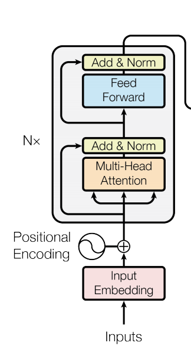

Transformer
---------

[TOC]


## Architecture


### Decoder


### Encoder


## Transformer Decoder


### Causal Attention Function


<details>
<summary>Code</summary>

``` python
def CausalAttention(d_feature, 
                    n_heads, 
                    compute_attention_heads_closure=compute_attention_heads_closure,
                    dot_product_self_attention=dot_product_self_attention,
                    compute_attention_output_closure=compute_attention_output_closure,
                    mode='train'):
    """Transformer-style multi-headed causal attention.

    Args:
        d_feature (int):  dimensionality of feature embedding.
        n_heads (int): number of attention heads.
        compute_attention_heads_closure (function): Closure around compute_attention heads.
        dot_product_self_attention (function): dot_product_self_attention function. 
        compute_attention_output_closure (function): Closure around compute_attention_output. 
        mode (str): 'train' or 'eval'.

    Returns:
        trax.layers.combinators.Serial: Multi-headed self-attention model.
    """
    
    assert d_feature % n_heads == 0
    d_head = d_feature // n_heads

    ### START CODE HERE (REPLACE INSTANCES OF 'None' with your code) ###
    
    # HINT: The second argument to tl.Fn() is an uncalled function (without the parentheses)
    # Since you are dealing with closures you might need to call the outer 
    # function with the correct parameters to get the actual uncalled function.
    ComputeAttentionHeads = tl.Fn('AttnHeads', 
                                  compute_attention_heads_closure(n_heads, d_head), 
                                  n_out=1)
        

    return tl.Serial(
        tl.Branch( # creates three towers for one input, takes activations and creates queries keys and values
            [tl.Dense(d_feature), ComputeAttentionHeads], # queries
            [tl.Dense(d_feature), ComputeAttentionHeads], # keys
            [tl.Dense(d_feature), ComputeAttentionHeads], # values
        ),
        
        tl.Fn('DotProductAttn', dot_product_self_attention, n_out=1), # takes QKV
        # HINT: The second argument to tl.Fn() is an uncalled function
        # Since you are dealing with closures you might need to call the outer 
        # function with the correct parameters to get the actual uncalled function.
        tl.Fn('AttnOutput', compute_attention_output_closure(n_heads, d_head), n_out=1), # to allow for parallel
        tl.Dense(d_feature) # Final dense layer
    )
```

</details>


### Decoder Block Layer


<details>
<summary>Code</summary>

``` python
def DecoderBlock(d_model, d_ff, n_heads,
                 dropout, mode, ff_activation):
    """Returns a list of layers that implements a Transformer decoder block.

    The input is an activation tensor.

    Args:
        d_model (int):  depth of embedding.
        d_ff (int): depth of feed-forward layer.
        n_heads (int): number of attention heads.
        dropout (float): dropout rate (how much to drop out).
        mode (str): 'train' or 'eval'.
        ff_activation (function): the non-linearity in feed-forward layer.

    Returns:
        list: list of trax.layers.combinators.Serial that maps an activation tensor to an activation tensor.
    """
    
    ### START CODE HERE (REPLACE INSTANCES OF 'None' with your code) ###
    
    # Create masked multi-head attention block using CausalAttention function
    causal_attention = CausalAttention( 
                        d_model,
                        n_heads=n_heads,
                        mode=mode
                        )

    # Create feed-forward block (list) with two dense layers with dropout and input normalized
    feed_forward = [ 
        # Normalize layer inputs
        tl.LayerNorm(),
        # Add first feed forward (dense) layer (don't forget to set the correct value for n_units)
        tl.Dense(d_ff),
        # Add activation function passed in as a parameter (you need to call it!)
        ff_activation(), # Generally ReLU
        # Add dropout with rate and mode specified (i.e., don't use dropout during evaluation)
        tl.Dropout(rate=dropout, mode=mode),
        # Add second feed forward layer (don't forget to set the correct value for n_units)
        tl.Dense(d_model),
        # Add dropout with rate and mode specified (i.e., don't use dropout during evaluation)
        tl.Dropout(rate=dropout, mode=mode)
    ]

    # Add list of two Residual blocks: the attention with normalization and dropout and feed-forward blocks
    return [
      tl.Residual(
          # Normalize layer input
          tl.LayerNorm(),
          # Add causal attention block previously defined (without parentheses)
          causal_attention,
          # Add dropout with rate and mode specified
          tl.Dropout(rate=dropout, mode=mode)
        ),
      tl.Residual(
          # Add feed forward block (without parentheses)
          feed_forward
        ),
      ]
```

</details>


### Transformer Language Model


Aka, repeat N times, dense layer and softmax for output. Predict the output probabilty of the next word.

<details>
<summary>Code</summary>

``` python
def TransformerLM(vocab_size=33300,
                  d_model=512,
                  d_ff=2048,
                  n_layers=6,
                  n_heads=8,
                  dropout=0.1,
                  max_len=4096,
                  mode='train',
                  ff_activation=tl.Relu):
    """Returns a Transformer language model.

    The input to the model is a tensor of tokens. (This model uses only the
    decoder part of the overall Transformer.)

    Args:
        vocab_size (int): vocab size.
        d_model (int):  depth of embedding.
        d_ff (int): depth of feed-forward layer.
        n_layers (int): number of decoder layers.
        n_heads (int): number of attention heads.
        dropout (float): dropout rate (how much to drop out).
        max_len (int): maximum symbol length for positional encoding.
        mode (str): 'train', 'eval' or 'predict', predict mode is for fast inference.
        ff_activation (function): the non-linearity in feed-forward layer.

    Returns:
        trax.layers.combinators.Serial: A Transformer language model as a layer that maps from a tensor of tokens
        to activations over a vocab set.
    """
    # Embedding inputs and positional encoder
    positional_encoder = [ 
        # Add embedding layer of dimension (vocab_size, d_model)
        tl.Embedding(vocab_size, d_model),
        # Use dropout with rate and mode specified
        tl.Dropout(rate=dropout, mode=mode),
        # Add positional encoding layer with maximum input length and mode specified
        tl.PositionalEncoding(max_len=max_len, mode=mode)]
    
    # Create stack (list) of decoder blocks with n_layers with necessary parameters
    decoder_blocks = [ 
        DecoderBlock(d_model, d_ff, n_heads, dropout, mode, ff_activation) for _ in range(n_layers)] 

    # Create the complete model as written in the figure
    return tl.Serial(
        # Use teacher forcing (feed output of previous step to current step)
        tl.ShiftRight(mode=mode), 
        # Add embedding inputs and positional encoder
        PositionalEncoder(vocab_size, d_model, dropout, max_len, mode),
        # Add decoder blocks
        decoder_blocks, 
        # Normalize layer
        tl.LayerNorm(), 

        # Add dense layer of vocab_size (since need to select a word to translate to)
        # (a.k.a., logits layer. Note: activation already set by ff_activation)
        tl.Dense(vocab_size), 
        # Get probabilities with Logsoftmax
        tl.LogSoftmax() 
    )
```

</details>

## Encoder



<details>
    <summary>FeedForwardBlock</summary>

``` python
def FeedForwardBlock(d_model, d_ff, dropout, dropout_shared_axes, mode, activation):
    """Returns a list of layers implementing a feed-forward block.
    Args:
        d_model: int:  depth of embedding
        d_ff: int: depth of feed-forward layer
        dropout: float: dropout rate (how much to drop out)
        dropout_shared_axes: list of integers, axes to share dropout mask
        mode: str: 'train' or 'eval'
        activation: the non-linearity in feed-forward layer
    Returns:
        A list of layers which maps vectors to vectors.
    """
    
    dropout_middle = tl.Dropout(rate=dropout,
                                shared_axes=dropout_shared_axes, 
                                mode=mode)
  
    dropout_final = tl.Dropout(rate=dropout, 
                               shared_axes=dropout_shared_axes, 
                               mode=mode)

    ### START CODE HERE (REPLACE INSTANCES OF 'None' WITH YOUR CODE) ###
    
    ff_block = [ 
        # trax Layer normalization 
        tl.LayerNorm(),
        # trax Dense layer using `d_ff`
        tl.Dense(n_units=d_ff),
        # activation() layer - you need to call (use parentheses) this func!
        activation(),
        # dropout middle layer
        dropout_middle,
        # trax Dense layer using `d_model`
        tl.Dense(d_model),
        # dropout final layer
        dropout_final,
    ]
    
    ### END CODE HERE ###
    
    return ff_block
```
</details>

<details>
<summary>EncoderBlock</summary>

``` python
def EncoderBlock(d_model, d_ff, n_heads, dropout, dropout_shared_axes,
                  mode, ff_activation, FeedForwardBlock=FeedForwardBlock):
    """
    Returns a list of layers that implements a Transformer encoder block.
    The input to the layer is a pair, (activations, mask), where the mask was
    created from the original source tokens to prevent attending to the padding
    part of the input.
    
    Args:
        d_model (int): depth of embedding.
        d_ff (int): depth of feed-forward layer.
        n_heads (int): number of attention heads.
        dropout (float): dropout rate (how much to drop out).
        dropout_shared_axes (int): axes on which to share dropout mask.
        mode (str): 'train' or 'eval'.
        ff_activation (function): the non-linearity in feed-forward layer.
        FeedForwardBlock (function): A function that returns the feed forward block.
    Returns:
        list: A list of layers that maps (activations, mask) to (activations, mask).
        
    """
    
    ### START CODE HERE (REPLACE INSTANCES OF 'None' WITH YOUR CODE) ###
    
    # Attention block
    attention = tl.Attention( 
        # Use dimension of the model
        d_feature=d_model,
        # Set it equal to number of attention heads
        n_heads=n_heads,
        # Set it equal `dropout`
        dropout=dropout,
        # Set it equal `mode`
        mode=mode
    )
    
    # Call the function `FeedForwardBlock` (implemented before) and pass in the parameters
    feed_forward = FeedForwardBlock( 
        d_model,
        d_ff,
        dropout,
        dropout_shared_axes,
        mode,
        ff_activation
    )
    
    # Dropout block
    dropout_ = tl.Dropout( 
        # set it equal to `dropout`
        rate=dropout,
        # set it equal to the axes on which to share dropout mask
        shared_axes=dropout_shared_axes,
        # set it equal to `mode`
        mode=mode
    )
    
    encoder_block = [ 
        # add `Residual` layer
        tl.Residual(
            # add norm layer
            tl.LayerNorm(),
            # add attention
            attention,
            # add dropout
            dropout_,
        ),
        # add another `Residual` layer
        tl.Residual(
            # add feed forward
            feed_forward,
        ),
    ]
    
    ### END CODE HERE ###
    
    return encoder_block
```

</details>

### Transformer Encoder


<details>
<summary>TransformerEncoder</summary>

``` python
def TransformerEncoder(vocab_size=vocab_size,
                       n_classes=10,
                       d_model=512,
                       d_ff=2048,
                       n_layers=6,
                       n_heads=8,
                       dropout=0.1,
                       dropout_shared_axes=None,
                       max_len=2048,
                       mode='train',
                       ff_activation=tl.Relu,
                      EncoderBlock=EncoderBlock):
    
    """
    Returns a Transformer encoder model.
    The input to the model is a tensor of tokens.
  
    Args:
        vocab_size (int): vocab size. Defaults to vocab_size.
        n_classes (int): how many classes on output. Defaults to 10.
        d_model (int): depth of embedding. Defaults to 512.
        d_ff (int): depth of feed-forward layer. Defaults to 2048.
        n_layers (int): number of encoder/decoder layers. Defaults to 6.
        n_heads (int): number of attention heads. Defaults to 8.
        dropout (float): dropout rate (how much to drop out). Defaults to 0.1.
        dropout_shared_axes (int): axes on which to share dropout mask. Defaults to None.
        max_len (int): maximum symbol length for positional encoding. Defaults to 2048.
        mode (str): 'train' or 'eval'. Defaults to 'train'.
        ff_activation (function): the non-linearity in feed-forward layer. Defaults to tl.Relu.
        EncoderBlock (function): Returns the encoder block. Defaults to EncoderBlock.
  
    Returns:
        trax.layers.combinators.Serial: A Transformer model as a layer that maps
        from a tensor of tokens to activations over a set of output classes.
    """
    
    positional_encoder = [
        tl.Embedding(vocab_size, d_model),
        tl.Dropout(rate=dropout, shared_axes=dropout_shared_axes, mode=mode),
        tl.PositionalEncoding(max_len=max_len)
    ]
    
    ### START CODE HERE (REPLACE INSTANCES OF 'None' WITH YOUR CODE) ###
    
    # Use the function `EncoderBlock` (implemented above) and pass in the parameters over `n_layers`
    encoder_blocks = [EncoderBlock(d_model, d_ff, n_heads, dropout, dropout_shared_axes, 
                                   mode, ff_activation)
                      for _ in range(n_layers)]

    # Assemble and return the model.
    return tl.Serial(
        # Encode
        tl.Branch(
            # Use `positional_encoder`
            positional_encoder,
            # Use trax padding mask
            tl.PaddingMask(pad=0),
        ),
        # Use `encoder_blocks`
        encoder_blocks,
        # Use select layer
        tl.Select([0], n_in=2),
        # Use trax layer normalization
        tl.LayerNorm(),
        # Map to output categories.
        # Use trax mean. set axis to 1
        tl.Mean(axis=1),
        # Use trax Dense using `n_classes`
        tl.Dense(n_classes),
        # Use trax log softmax
        tl.LogSoftmax(),
    )

```
</details>


## BERT Pre-Training Objective


```sh
Inputs: 

 <Z> BBQ Class Taking Place in Missoul <Y> Do you want to get better at making <X>? You will have the opportunity, put <W> your calendar now. Thursday, September 22 <V> World Class BBQ Champion, Tony Balay <U>onestar Smoke Rangers. He <T> teaching a beginner level class for everyone<S> to get better with their culinary skills.<R> teach you everything you need to know to <Q> a KCBS BBQ competition,<P>, recipes, timelines, meat selection <O>, plus smoker and fire information. The<N> be in the class is $35 per person <M> for spectators it is free. Include <L> the cost will be either a  <K>shirt or apron and you <J> tasting samples of each meat that is prepared <I>

Targets: 

 <Z> Beginners <Y>a! <X> delicious BBQ <W> this on <V>nd join <U> from L <T> will be<S> who wants<R> He will <Q> compete in<P> including techniques <O> and trimming<N> cost to <M>, and <L>d in <K>t- <J> will be <I>.
```

