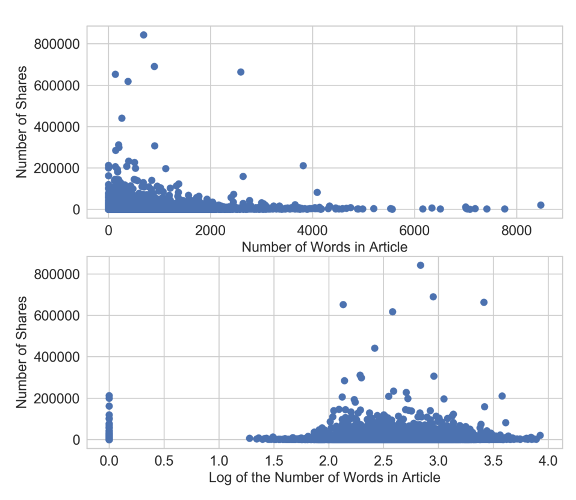
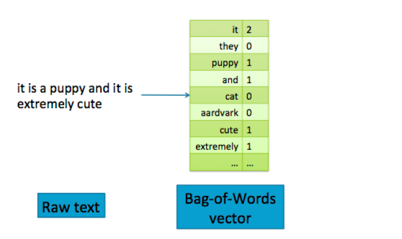

Feature Engineering
-------------------------------

## Charpter 2 简单数字的奇特技巧

### 二值化　０，１

### 量化或装箱　　

``` python
>>> small_counts
array([30, 64, 49, 26, 69, 23, 56, 7, 69, 67, 87, 14, 67, 33, 88, 77, 75, 47, 44, 93])
### Map to evenly spaced bins 0-9 by division
>>> np.floor_divide(small_counts, 10)
array([3, 6, 4, 2, 6, 2, 5, 0, 6, 6, 8, 1, 6, 3, 8, 7, 7, 4, 4, 9], dtype=int32)

>>> large_counts = [296, 8286, 64011, 80, 3, 725, 867, 2215, 7689, 11495, 91897, 44, 28, 7971, 926, 122, 22222]
### Map to exponential-width bins via the log function
>>> np.floor(np.log10(large_counts))
array([ 2., 3., 4., 1., 0., 2., 2., 3., 3., 4., 4., 1., 1., 3., 2., 2., 4.])
```

### 分位数装箱

``` python
### Map the counts to quartiles
>>> pd.qcut(large_counts, 4, labels=False)
array([1, 2, 3, 0, 0, 1, 1, 2, 2, 3, 3, 0, 0, 2, 1, 0, 3], dtype=int64)
>>> large_counts_series.quantile([0.25, 0.5, 0.75])
0.25 122.0
0.50 926.0
0.75 8286.0
dtype: float64
```

### 对数转换

线性回归模型的训练过程假定预测误差分布得像高斯，对数变换，这是一种功率变换，将变量的分布接近高斯。

对数变换是处理具有重尾分布的正数的有力工具。（重尾分布在尾部范围内的概率比高斯分布的概率大）


使用$R^2$评分来评估，好的模型有较高的 R 方分数。一个完美的模型得到最高分1， 一个坏的模型可以得到一个任意低的负评分。

``` python
scores_log = cross_val_score(m_log, biz_df[['log_review_count']], biz_df['stars'], cv=10)
scores_log.mean()  # R^2
```



对数变换将较大的离群值压缩到一个更小的范围内

### Box-Cox transformation

???

概率图(probplot)是一种直观地比较数据分布与理论分布的简单方法。

### 特征缩放(Scaling)或归一化(Normalization)

平衡数据的规模或者尺度

#### minmaxscaler　

$x'=\frac{x-min}{max-min}$

Min-max缩放压缩（或拉伸）所有特征值到[0, 1 ]的范围内


#### Standardization

$x'=\frac{x-\overline{x}}{\sigma}$

缩放后的特征的平均值为0, 方差为1。如果原始特征具有高斯分布, 则缩放特征为标准高斯


最小最大缩放和标准化都从原始特征值中减去一个数量，将稀疏特征的向量转换为一个稠密的向量。

#### L2 Normalization

$x'=\frac{x}{\sqrt{\sum_{j} x_j^2}}$, L2缩放


``` python
from sklearn.preprocessing import minmax_scale, StandardScaler, normalize

df['minmax'] = minmax_scale(df[['n_tokens_content']])
df['standardized'] = StandardScaler().fit_transform(df[['n_tokens_content']])
df['l2_normalized'] = normalize(df[['n_tokens_content']], axis=0)
```

### 交互特征

$y = w_1X_1 + w_2X_2 + ... +  w_nX_n$

$y = w_1X_1 + w_2X_2 + ... +   w_nX_n + w_{1,2}X_1X_2 + ...$

以$x_1x_2$组合新的特征。缺点：复杂的增加

手工制作的复杂特征可以具有足够的表现力

### $R^2$

``` python
model = linear_model.LinearRegression().fit(X_train, y_train)
r_score = model.score(X_test, y_test)
```

### 特征选择

特征选择技术会删除非有用的特征，以降低最终模型的复杂性。最终目标是快速计算的简约模型，预测准确性降低很小或不会降低。

- Filter, 过滤，预处理可以删除那些不太可能对模型有用的相关信息低于阈值的特征
- Wrapper methods, 包装，
- Embedded methods, 嵌入式方法，L1 正则(lasso,模型稀疏约束)，决策树(选择分裂特征，熵增益,　gini)

## Charpter 3,4 词袋(BOW)和TF-IDF



- 停用词，去除无意义的常用词
- 高频词，专业停用词、有意义的高频词（good, great, etc)
- 稀有词，不会带来额外收益，应该修剪
- 词干分析，flowers -> flower
- n-gram 短语，短语检测的搭配获取，保留最有意义的短语
- 分块，词性标注

bow(w, d) = #times word w appears in document d

tf-idf(w ,d) = bow(w, d) * N / (#documents in which word w appears)

N代表数据集中所有文档的数量

tf-idf, 逆文档频率

如果一个单词出现在许多文档中，则其逆文档频率接近1。如果单词出现在较少文档中，则逆文档频率要高得多。

**tf-idf使罕见的单词更加突出，并有效地忽略了常见单词。**tf-idf可以“拉伸”以及“压缩”数据矩阵的列空间。

正确的特征缩放(L2, tf-idf)可以有助于分类。 正确的缩放突出了信息性词语，并降低了常见单词的权重。 它还可以改善数据矩阵的条件数。

``` python
# Represent the review text as a bag-of-words
bow_transform = text.CountVectorizer()
X_tr_bow = bow_transform.fit_transform(training_data['text'])
X_te_bow = bow_transform.transform(test_data['text'])
len(bow_transform.vocabulary_)
# 46924
y_tr = training_data['target']
y_te = test_data['target']
# Create the tf-idf representation using the bag-of-words matrix
tfidf_trfm = text.TfidfTransformer(norm=None)
X_tr_tfidf = tfidf_trfm.fit_transform(X_tr_bow)
X_te_tfidf = tfidf_trfm.transform(X_te_bow)
# Just for kicks, l2-normalize the bag-of-words representation
X_tr_l2 = preproc.normalize(X_tr_bow, axis=0)
X_te_l2 = preproc.normalize(X_te_bow, axis=0)
```

## Chapter 6 PCA

PCA 需要记住的两件事是其机制（线性投影）和目标（最大化方差预计数据）


最大化投影数据的方差

$max_w\sum_{i=1}^{n}(x_i^Tw)^2, where w^Tw=1$

PCA 可以看做一种消除线性相关的方法

``` python
# Fit a PCA transformer to the dataset.
# The number of components is automatically chosen to account for
# at least 80% of the total variance.
>>> pca_transformer = PCA(n_components=0.8)
>>> pca_images = pca_transformer.fit_transform(image_data)
>>> pca_transformer.explained_variance_ratio_
array([ 0.14890594, 0.13618771, 0.11794594, 0.08409979, 0.05782415,
        0.0491691 , 0.04315987, 0.03661373, 0.03353248, 0.03078806
,
        0.02372341, 0.02272697, 0.01821863])
>>> pca_transformer.explained_variance_ratio_[:3].sum()
0.40303958587675121
```

## Chapter 8


水平梯度提取出强烈的垂直模式，如猫眼睛的内边缘，而垂直梯度则提取强的水平模式，如晶须和眼睛的上下眼睑。这乍看起来似乎有些矛盾，如果我们仔细考虑一下，这还是有道理的。水平（X）梯度识别水平方向上的变化。强的垂直图案在大致相同的`X`位置上跨越多个`Y`像素。因此，垂直图案导致像素值的水平差异。

### CNN

卷积

$ (f*g)[i, j] = \sum_{\mu=0}^{m}\sum_{v=0}^{n} f[u, v]g[i-u, j-v]$

特征：线条，梯度，颜色斑点和纹理
