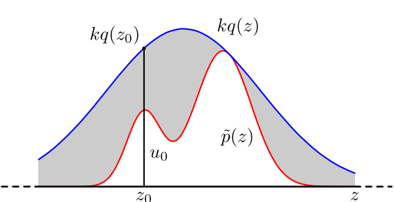
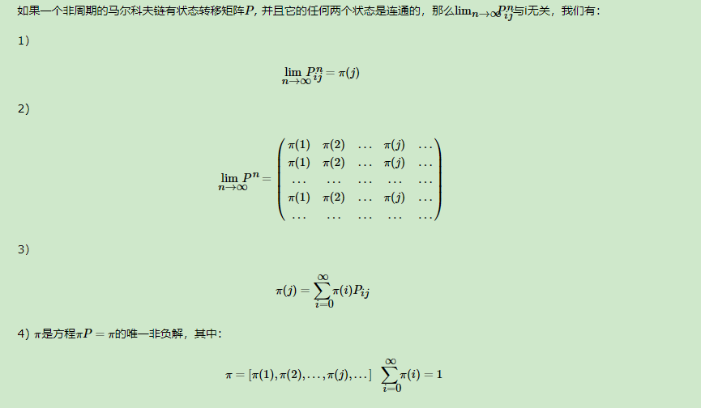
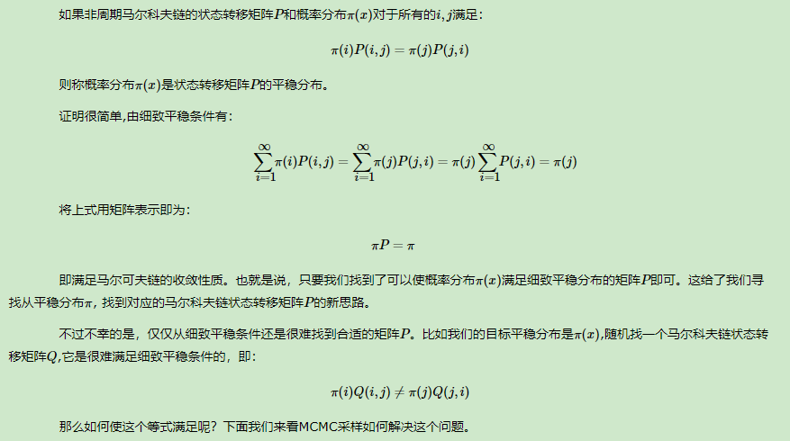
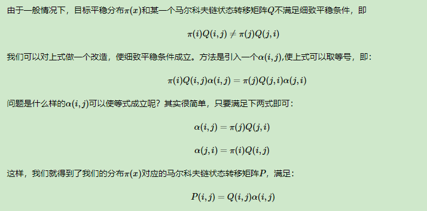
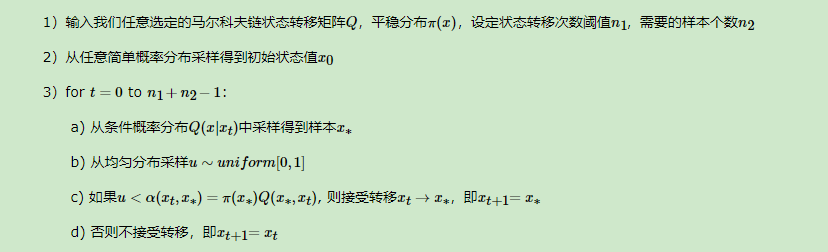
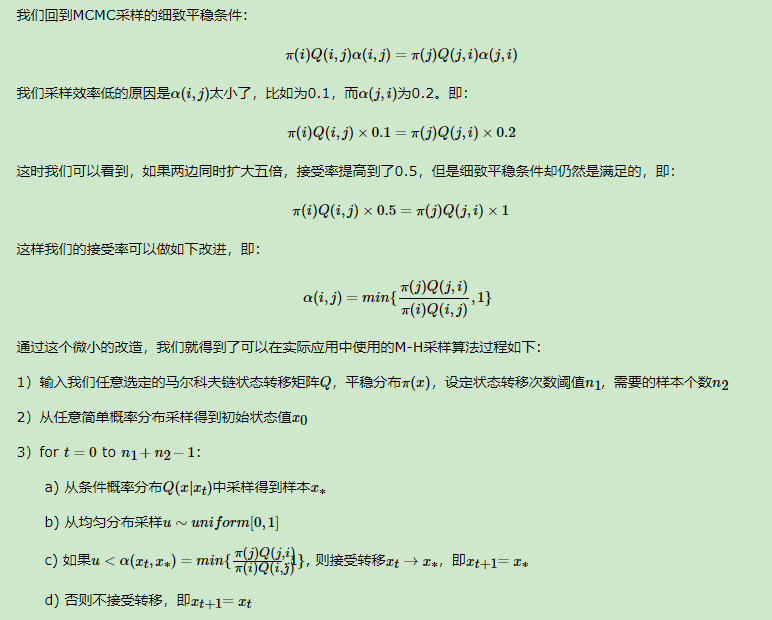
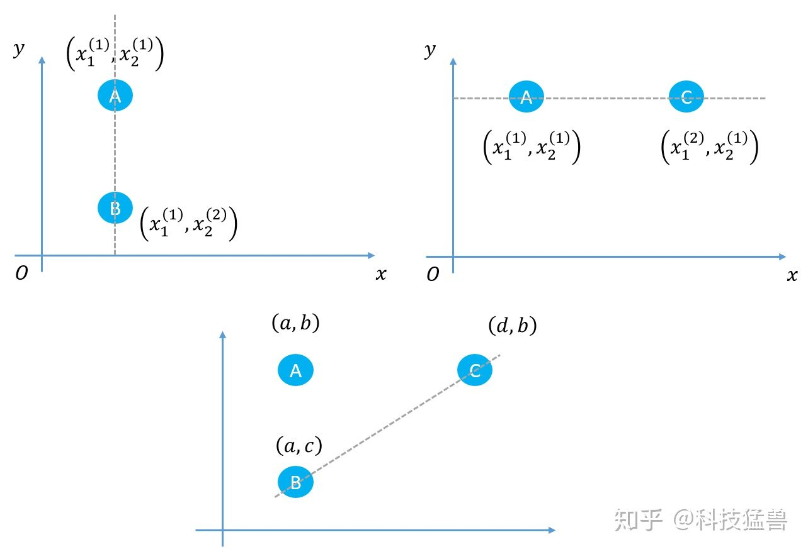
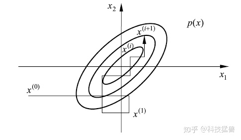

MCMC
-------

蒙特卡罗方法（Monte Carlo Simulation，简称MC）和马尔科夫链（Markov Chain ，也简称MC）

> 蒙特卡罗法(Monte Carlo method)，也称为统计模拟方法(statistical simulation
> method)，**是通过从概率模型的随机抽样进行近似数值计算的方法**。
> 马尔可夫链蒙特卡罗法**(Markov Chain Monte Carlo，MCMC)**，则是以马尔可夫链
> (Markovchain)为**概率模型**的**蒙特卡罗法**。马尔可夫链蒙特卡罗法构建一个马尔可夫链，**使**
> **其平稳分布就是要进行抽样的分布**，首先基于该马尔可夫链进行**随机游走**，产生样本的序
> 列，之后**使用该平稳分布的样本进行近似的数值计算**。
> Metropolis-Hastings 算法是最基本的马尔可夫链蒙特卡罗法，Metropolis 等人在
> 1953 年提出原始的算法，Hastings 在1970 年对之加以推广，形成了现在的形式。吉
> 布斯抽样(Gibbs sampling)是更简单、使用更广泛的马尔可夫链蒙特卡罗法，1984
> 年由S. Geman 和D. Geman 提出。
> 马尔可夫链蒙特卡罗法被应用于**概率分布的估计、定积分的近似计算、最优化问
> 题的近似求解**等问题，特别是被应用于统计学习中概率模型的学习与推理，是重要的
> 统计学习计算方法。

## 蒙特卡罗方法

蒙特卡洛：赌场名称，一种随机模拟的方法，很像赌场里面的扔骰子的过程。

比如我们很难求解出$f(x)​$的原函数，导致这个积分比较难求解，然后我们可以通过蒙特卡罗方法来模拟求解近似值。


方法一：假设$x$在[a,b]之间是均匀分布的

采样[a,b]区间的n个值：$x_0,x_1,...x_{n−1}$,用它们的均值来代表$[a,b]$区间上所有的$f(x)$的值

$\frac{b-a}{n}\sum\limits_{i=0}^{n-1}f(x_i)$

方法二：$x$在[a,b]之间不是均匀分布, $x$在[a,b]的概率分布服从函数$p(x)$

$\theta = \int_a^b f(x)dx =  \int_a^b p(x)\frac{f(x)}{p(x)}dx = E_{x \sim p}[\frac{f(x)}{p(x)}] \approx \frac{1}{n}\sum\limits_{i=0}^{n-1}\frac{f(x_i)}{p(x_i)}​$

上式变成了一个对 $\frac{f(x)}{p(x)}$ 的期望

根据大数定理，按照概率分布$p(x)$独立地抽取$n$个样本，就得到对应的期望值

$\frac{1}{n}\sum\limits_{i=0}^{n-1}\frac{f(x_i)}{p(x_i)} \approx E_{x \sim p}[\frac{f(x)}{p(x)}]$

> **通过分布$q(x)$ 近似模拟原分布$f(x)$ **

### 接受-拒绝采样

通常$p(x)$比较复杂，难以采样。假定一个采样分布$q(x)$(比如高斯分布)，按照一定的方法拒绝某些样本，以达到接近$p(x)$分布的目的。其中$q(x)​$称作 proposal distribution



首先，采样得到$q(x)$的一个样本$z0$。

从均匀分布$(0,kq(z0))$中采样得到一个值$u$。如果$u$落在了上图中的灰色区域，则拒绝这次抽样，否则接受这个样本$z_0$。

重复以上过程得到n个接受的样本$z0,z1,...zn−1$, 则最后的蒙特卡罗方法求解结果为：

$\frac{1}{n}\sum\limits_{i=0}^{n-1}\frac{f(x_i)}{p(x_i)}$

> 通过**可采样分布$q(x)$**的**接受拒绝采样**近似模拟**复杂分布$p(x)$**

## 马尔科夫链

马尔科夫链帮助我们找到这些复杂概率分布的对应的采样样本集。

### 稳定分布状态

$\pi_n(x) = \pi_{n+1}(x) = \pi_{n+2}(x) =... = \pi(x)$

``` python
import numpy as np


def markov_stable(pi_0):
    transmit = [[0.9,    0.075,  0.025],
                       [0.15,  0.8,      0.05],
                       [0.25,  0.25,    0.5]]

    pi_m = np.matrix(pi_0, dtype=float)
    transmit_m = np.matrix(transmit, dtype=float)
    for i in range(100):
        pi_m = pi_m*transmit_m
        # print("Current round:" , i+1)
        #print(pi_1_m)
        
    return pi_m 
        
pi_0 = [[0.3, 0.4, 0.3]]
stable = markov_stable(pi_0)
print(stable)

pi_0 = [[0.7, 0.1, 0.2]]
stable = markov_stable(pi_0)
print(stable)

# [[0.625  0.3125 0.0625]]
# [[0.625  0.3125 0.0625]]
```

$\pi_i(x) = \pi_{i-1}(x)P = \pi_{i-2}(x)P^2 = \pi_{0}(x)P^i$

``` python
transmit = [[0.9,    0.075,  0.025],
                       [0.15,  0.8,      0.05],
                       [0.25,  0.25,    0.5]]

matrix = np.matrix(transmit, dtype=float)
for i in range(10):
    matrix = matrix*matrix
    print("Current round:" , i+1)
    print(matrix)
    
# Current round: 10
#[[0.625  0.3125 0.0625]
# [0.625  0.3125 0.0625]
# [0.625  0.3125 0.0625]]
```

**马尔科夫链收敛性**




- **定理：不可约且非周期的有限状态马尔可夫链，有唯一平稳分布存在。**

> 1）**非周期**的马尔科夫链：这个主要是指马尔科夫链的**状态转化不是循环的**，如果是循环的则永远**不会收敛**。幸运的是我们遇到的马尔科夫链一般都是非周期性的。用数学方式表述则是：对于任意某一状态i，d为集合${n∣n≥1,Pnii>0}$的最大公约数，如果 d=1，则该状态为非周期的
>
> 2）**任何两个状态是连通的**：这个指的是从任意一个状态可以通过有限步到达其他的任意一个状态，不会出现条件概率一直为0导致不可达的情况。
>
> 3）马尔科夫链的状态数可以是有限的，也可以是无限的。因此可以用于连续概率分布和离散概率分布。
>
> 4）$π$通常称为马尔科夫链的**平稳分布**。

### 转移矩阵P

随意给定一个平稳分布$π$,如何得到它所对应的马尔科夫链状态转移矩阵$P$呢？



即满足马尔可夫链的收敛性质。也就是说，只要我们找到了可以使概率分布$π(x)$满足细致平稳分布的矩阵$P$即可。这给了我们寻找从平稳分布$π$, 找到对应的马尔科夫链状态转移矩阵$P$的新思路。

## MCMC 采样



我们的目标矩阵$P$可以通过任意一个马尔科夫链状态转移矩阵$Q$乘以$α(i,j)$得到。$α(i,j)$我们有一般称之为**接受率**。取值在[0,1]之间，可以理解为一个概率值。

目标矩阵$P$可以通过任意一个马尔科夫链状态转移矩阵$Q$以一定的接受率获得。

> **接受-拒绝采样**, 以一个**常用分布p(x)**通过一定的**接受-拒绝概率**得到一个**非常见分布f(x)**
>
> **MCMC**采样：以一个常见的**马尔科夫链状态转移矩阵Q**通过一定的**接受-拒绝概率**$α(i,j)​$, 得到**目标转移矩阵P**
>
> 两者的解决问题思路是类似的。

### 总结



样本集$(xn1,xn1+1,...,xn1+n2−1)​$即为我们需要的平稳分布对应的样本集。

**问题：**由于$α(xt,x∗)​$可能非常的小，比如0.1，导致我们大部分的采样值都被拒绝转移，采样效率很低

## M-H采样

M-H采样是Metropolis-Hastings采样的简称。



样本集$(x_{n1},x_{n1+1},...,x_{n1+n2−1})​$即为我们需要的平稳分布对应的样本集。

很多时候，我们选择的马尔科夫链状态转移矩阵$Q​$如果是对称的，即满足$Q(i,j)=Q(j,i)​$,这时我们的接受率可以进一步简化为：

$\alpha(i,j) = min\{ \frac{\pi(j)}{\pi(i)},1\}​$

> **MCMC采样**：从条件概率分布$Q(x|x_t)$中采样得到样本$x_*$，通过接受-拒绝概率$α(i,j) = min\{ \frac{\pi(j)}{\pi(i)},1\}$, 转移得到目标样本集$(x_{n1},x_{n1+1},...,x_{n1+n2−1})$。


## 吉布斯采样

吉布斯抽样解决的问题和M-H方法**解决的问题是一致的**，都是从给定一个已知的目标分布$p(x)​$中进行采样，并估计某个函数的期望值，区别只不过是此时， $p(x)​$是一个多维的随机分布，$p(x)​$的**联合分布复杂**，难以采样，但**条件分布较容易**，这样吉布斯抽样效果更好。

> 其基本做法是，**从联合概率分布定义条件概率分布，依次对条件概率分布进行抽样，得到样本的序列。可以证明这样的抽样过程是在一个马尔可夫链上的随机游走，每一个样本对应着马尔可夫链的状态，平稳分布就是目标的联合分布。**整体成为一个**马尔可夫链蒙特卡罗法**，**燃烧期**之后的样本就是联合分布的随机样本。



**A->B**: $\pi(x_1^{(1)},x_2^{(1)}) \pi(x_2^{(2)} | x_1^{(1)}) = \pi(x_1^{(1)})\pi(x_2^{(1)}|x_1^{(1)}) \pi(x_2^{(2)} | x_1^{(1)})​$

**B->A**: $\pi(x_1^{(1)},x_2^{(2)}) \pi(x_2^{(1)} | x_1^{(1)}) = \pi(x_1^{(1)}) \pi(x_2^{(2)} | x_1^{(1)})\pi(x_2^{(1)}|x_1^{(1)})​$

两式的右边相等，因此我们有：

$\pi(x_1^{(1)},x_2^{(1)}) \pi(x_2^{(2)} | x_1^{(1)})  = \pi(x_1^{(1)},x_2^{(2)}) \pi(x_2^{(1)} | x_1^{(1)})​$

也就是：

$\pi(A) \pi(x_2^{(2)} | x_1^{(1)})  = \pi(B) \pi(x_2^{(1)} | x_1^{(1)})​$

### 二维Gibs采样


用下图可以很直观的看出，采样是在两个坐标轴上不停的轮换的。




> **Gibbs采样**：马尔科夫链达到平稳后的一次**随机游走**等同于高维分布的**一次采样**， 采样是在两个坐标轴上不停的**轮换**的。

## 参考

1. [刘建平的博客](https://www.cnblogs.com/pinard/p/6625739.html)
2. [知乎：马尔科夫链蒙特卡罗方法(MCMC)解读(上)](https://zhuanlan.zhihu.com/p/250146007)
3. [知乎：马尔科夫链蒙特卡罗方法(MCMC)解读(下)](https://zhuanlan.zhihu.com/p/253784711)
4. [阮一峰的博客](<http://www.ruanyifeng.com/blog/2015/07/monte-carlo-method.html>)

