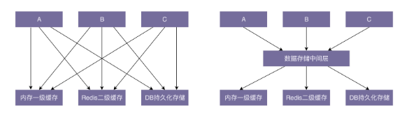

规范与重构
--------------

## 重构的本质

### 重构的目的：为什么要重构（why）？

> “重构是一种对软件内部结构的改善，目的是在不改变软件的可见行为的情况下，使其更易理解，修改成本更低。”                               - Martin Fowler
>
> 在保持功能不变的前提下，利用设计思想、原则、模式、编程规范等理论来优化代码，修改设计上的不足，提高代码质量。

首先，重构是时刻保证代码质量的一个极其有效的手段，不至于让代码腐化到无可救药的地步。项目在演进，代码不停地在堆砌。如果没有人为代码的质量负责任，代码总是会往越来越混乱的方向演进。当混乱到一定程度之后，量变引起质变，项目的维护成本已经高过重新开发一套新代码的成本，想要再去重构，已经没有人能做到了。

其次，优秀的代码或架构不是一开始就能完全设计好的，就像优秀的公司和产品也都是迭代出来的。我们无法 100% 遇见未来的需求，也没有足够的精力、时间、资源为遥远的未来买单，所以，随着系统的演进，重构代码也是不可避免的。

最后，重构是避免过度设计的有效手段。在我们维护代码的过程中，真正遇到问题的时候，再对代码进行重构，能有效避免前期投入太多时间做过度的设计，做到有的放矢。

> 初级工程师在维护代码，高级工程师在设计代码，资深工程师在重构代码

*对于项目来言，重构可以保持代码质量持续处于一个可控状态，不至于腐化到无可救药的地步。对于个人而言，重构非常锻炼一个人的代码能力，并且是一件非常有成就感的事情。它是我们学习的经典设计思想、原则、模式、编程规范等理论知识的练兵场。*

### 重构的对象：到底重构什么（what）？

根据重构的规模，我们可以笼统地分为大规模高层次重构（以下简称为“大型重构”）和小规模低层次的重构（以下简称为“小型重构”）。

大型重构指的是对**顶层代码设计的重构**，包括：**系统、模块、代码结构、类与类之间的关系等的重构**，重构的手段有：**分层、模块化、解耦、抽象可复用组件**等等。这部分工作利用的更多的是比较抽象、比较顶层的**设计思想、原则、模式**。这类重构涉及的代码改动会比较多，影响面会比较大，所以难度也较大，耗时会比较长，引入 bug 的风险也会相对比较大。

小型重构指的是对**代码细节的重构**，主要是针对**类、函数、变量**等代码级别的重构，比如**规范命名、规范注释、消除超大类或函数、提取重复代码**等等。小规模低层次的重构更多的是利用**编码规范**这一理论知识。

### 重构的时机：什么时候重构（when）？

**持续重构**

时刻具有持续重构意识，才能避免开发初期就过度设计，避免代码维护的过程中质量的下降。

### 重构的方法：又该如何重构（how）？

> 大规模高层次的重构难度比较大，需要组织、有计划地进行，分阶段地小步快跑，时刻让代码处于一个可运行的状态。
>
> 而小规模低层次的重构，因为影响范围小，改动耗时短，所以，只要你愿意并且有时间，随时随地都可以去做。

要提前做好完善的重构计划，有条不紊地分阶段来进行。每个阶段完成一小部分代码的重构，然后提交、测试、运行，发现没有问题之后，再继续进行下一阶段的重构，保证代码仓库中的代码一直处于可运行、逻辑正确的状态。每个阶段，我们都要控制好重构影响到的代码范围，考虑好如何兼容老的代码逻辑，必要的时候还需要写一些兼容过渡代码。只有这样，我们才能让每一阶段的重构都不至于耗时太长（最好一天就能完成），不至于与新的功能开发相冲突。

在进行大型重构的时候，我们要提前做好完善的重构计划，有条不紊地分阶段来进行。每个阶段完成一小部分代码的重构，然后提交、测试、运行，发现没有问题之后，再继续进行下一阶段的重构，保证代码仓库中的代码一直处于可运行、逻辑正确的状态。每个阶段，我们都要控制好重构影响到的代码范围，考虑好如何兼容老的代码逻辑，必要的时候还需要写一些兼容过渡代码。只有这样，我们才能让每一阶段的重构都不至于耗时太长（最好一天就能完成），不至于与新的功能开发相冲突。

除了人工去发现低层次的质量问题，我们还可以借助很多成熟的静态代码分析工具（比如 CheckStyle、FindBugs、PMD），来自动发现代码中的问题，然后针对性地进行重构优化。

一旦出现“破窗效应”，一个人往里堆了一些烂代码，之后就会有更多的人往里堆更烂的代码。毕竟往项目里堆砌烂代码的成本太低了。不过，保持代码质量最好的方法还是打造一种好的技术氛围，以此来驱动大家主动去关注代码质量，持续重构代码。

## 单元测试

集成测试的测试对象是整个系统或者某个功能模块，比如测试用户注册、登录功能是否正常，是一种端到端（end to end）的测试。

而单元测试的测试对象是类或者函数，用来测试一个类和函数是否都按照预期的逻辑执行。这是代码层级的测试,用于测试“自己”编写的代码的逻辑的正确性。单元测试顾名思义是测试一个“单元”，有别于集成测试，这个“单元”一般是类或函数，而不是模块或者系统。

### 为什么要写单元测试？

1. 单元测试能有效地帮你发现代码中的 bug

2. 写单元测试能帮你发现代码设计上的问题

    代码的可测试性是评判代码质量的一个重要标准。

3. 单元测试是对集成测试的有力补充

   程序运行的 bug 往往出现在一些边界条件、异常情况下，比如，除数未判空、网络超时。

4. 写单元测试的过程本身就是代码重构的过程

   编写单元测试就相当于对代码的一次自我 Code Review，在这个过程中，我们可以发现一些设计上的问题（比如代码设计的不可测试）以及代码编写方面的问题（比如一些边界条件处理不当）等，然后针对性的进行重构。

5. 阅读单元测试能帮助你快速熟悉代码

6. 单元测试是 TDD 可落地执行的改进方案

   测试驱动开发（Test-Driven Development，简称 TDD）

### 如何编写单元测试？

写单元测试就是针对代码设计各种测试用例，以覆盖各种输入、异常、边界情况，并将其翻译成代码。我们可以利用一些测试框架来简化单元测试的编写。除此之外，对于单元测试，我们需要建立以下正确的认知：

- 编写单元测试尽管繁琐，但并不是太耗时；
- 我们可以稍微放低对单元测试代码质量的要求；
- 覆盖率作为衡量单元测试质量的唯一标准是不合理的；
- 单元测试不要依赖被测代码的具体实现逻辑；
- 单元测试框架无法测试，多半是因为代码的可测试性不好。

## 解耦

### 高内聚、松耦合

> 如何来控制代码的复杂性呢？最关键的就是解耦，保证代码松耦合、高内聚。

如果说重构是保证代码质量不至于腐化到无可救药地步的有效手段，那么利用解耦的方法对代码重构，就是保证代码不至于复杂到无法控制的有效手段。

“高内聚、松耦合”是一个比较通用的设计思想，不仅可以指导细粒度的类和类之间关系的设计，还能指导粗粒度的系统、架构、模块的设计。相对于编码规范，它能够在更高层次上提高代码的可读性和可维护性。

过于复杂的代码往往在可读性、可维护性上都不友好。解耦保证代码松耦合、高内聚，是控制代码复杂度的有效手段。代码高内聚、松耦合，也就是意味着，代码结构清晰、分层模块化合理、依赖关系简单、模块或类之间的耦合小，那代码整体的质量就不会差。

### 代码是否需要“解耦”？

间接的衡量标准有很多，比如，看修改代码是否牵一发而动全身。直接的衡量标准是把**模块与模块、类与类之间的依赖关系**画出来，根据依赖关系图的复杂性来判断是否需要解耦重构。

如果依赖关系复杂、混乱，那从代码结构上来讲，可读性和可维护性肯定不是太好，那我们就需要考虑是否可以通过解耦的方法，让依赖关系变得清晰、简单。

### 如何给代码“解耦”？

方法：

- 封装与抽象

有效地隐藏实现的复杂性，隔离实现的易变性，给依赖的模块提供稳定且易用的抽象接口。

- 中间层

    * 第一阶段：引入一个中间层，包裹老的接口，提供新的接口定义。
    * 第二阶段：新开发的代码依赖中间层提供的新接口。
    * 第三阶段：将依赖老接口的代码改为调用新接口。
    * 第四阶段：确保所有的代码都调用新接口之后，删除掉老的接口。

- 模块化

模块化是构建复杂系统常用的手段。不仅在软件行业，在建筑、机械制造等行业，这个手段也非常有用。对于一个大型复杂系统来说，没有人能掌控所有的细节。之所以我们能搭建出如此复杂的系统，并且能维护得了，最主要的原因就是将系统划分成各个独立的模块，让不同的人负责不同的模块，这样即便在不了解全部细节的情况下，**管理者也能协调各个模块，让整个系统有效运转**。

聚焦到软件开发上面，很多大型软件（比如 Windows）之所以能做到几百、上千人有条不紊地协作开发，也归功于模块化做得好。不同的模块之间通过 API 来进行通信，每个模块之间耦合很小，每个小的团队聚焦于一个独立的高内聚模块来开发，最终像**搭积木一样将各个模块组装起来，构建成一个超级复杂的系统**。我们再聚焦到代码层面。合理地划分模块能**有效地解耦代码**，提高代码的可读性和可维护性。

所以，我们在开发代码的时候，一定要有模块化意识，将每个模块都当作一个独立的 lib 一样来开发，只提供封装了内部实现细节的接口给其他模块使用，这样可以减少不同模块之间的耦合度。实际上，从刚刚的讲解中我们也可以发现，模块化的思想无处不在，像 SOA、微服务、lib 库、系统内模块划分，甚至是类、函数的设计，都体现了**模块化思想**。如果追本溯源，模块化思想更加本质的东西就是**分而治之**。

设计思想与原则

- 单一职责原则
- 基于接口而非实现编程
- 依赖注入
- 多用组合少用继承
- 迪米特法则等

当然，还有一些设计模式，比如观察者模式。

