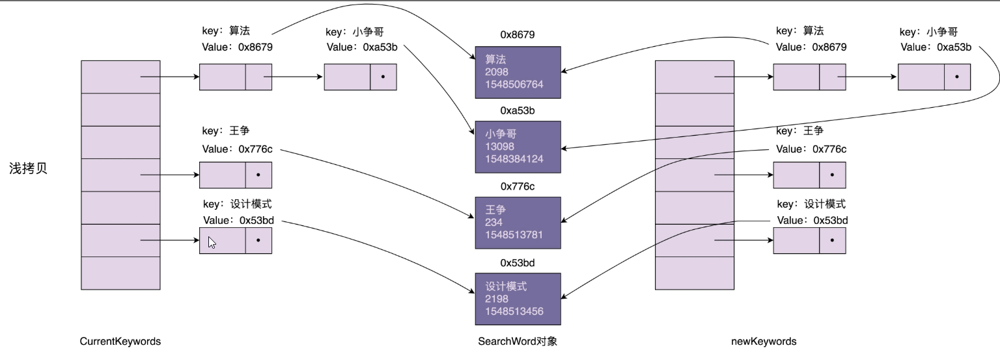
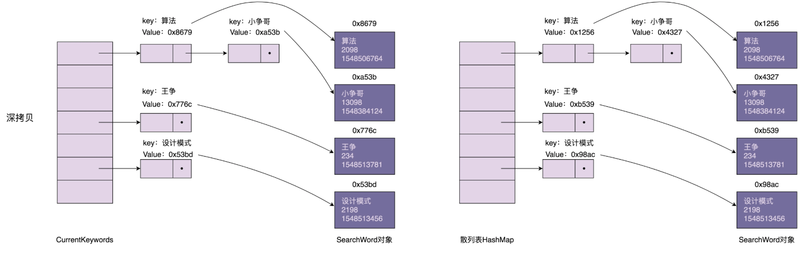

## 创建型模式

创建型模式主要解决对象的创建问题，封装复杂的创建过程，解耦对象的创建代码和使用代码。

- 单例模式用来创建全局唯一的对象。
- 工厂模式用来创建不同但是相关类型的对象（继承同一父类或者接口的一组子类），由给定的参数来决定创建哪种类型的对象。
- 建造者模式是用来创建复杂对象，可以通过设置不同的可选参数，“定制化”地创建不同的对象。
- 原型模式针对创建成本比较大的对象，利用对已有对象进行复制的方式进行创建，以达到节省创建时间的目的。

## 单例

>  单例设计模式（Singleton Design Pattern）理解起来非常简单。**一个类只允许创建一个对象（或者实例）**，那这个类就是一个单例类，这种设计模式就叫作单例设计模式，简称单例模式。

### 实例

### 处理资源访问冲突

``` java

public class Logger {
  private FileWriter writer;
  private static final Logger instance = new Logger();

  private Logger() {
    File file = new File("/Users/wangzheng/log.txt");
    writer = new FileWriter(file, true); //true表示追加写入
  }
  
  public static Logger getInstance() {
    return instance;
  }
  
  public void log(String message) {
    writer.write(mesasge);
  }
}

// Logger类的应用示例：
public class UserController {
  public void login(String username, String password) {
    // ...省略业务逻辑代码...
    Logger.getInstance().log(username + " logined!");
  }
}

public class OrderController {  
  public void create(OrderVo order) {
    // ...省略业务逻辑代码...
    Logger.getInstance().log("Created a order: " + order.toString());
  }
}
```

#### 全局唯一


- 构造函数需要是 private 访问权限的，这样才能避免外部通过 new 创建实例；
- 考虑对象创建时的线程安全问题；
- 考虑是否支持延迟加载；
- 考虑 getInstance() 性能是否高（是否加锁）。


## 工厂模式

### WHEN

- 封装变化：创建逻辑有可能变化，封装成工厂类之后，创建逻辑的变更对调用者透明。
- 代码复用：创建代码抽离到独立的工厂类之后可以复用。
- 隔离复杂性：封装复杂的创建逻辑，调用者无需了解如何创建对象。
- 控制复杂度：将创建代码抽离出来，让原本的函数或类职责更单一，代码更简洁。

### 应用场景

当创建逻辑比较复杂，是一个“大工程”的时候，我们就考虑使用工厂模式，封装对象的创建过程，**将对象的创建和使用相分离**。何为创建逻辑比较复杂呢？我总结了下面两种情况。

- **简单工厂**：类似规则配置解析的例子，代码中存在 if-else 分支判断，动态地根据不同的类型创建不同的对象。针对这种情况，我们就考虑使用工厂模式，将这**一大坨 if-else 创建对象的代码**抽离出来，放到工厂类中。
- **工厂模式**，尽管我们不需要根据不同的类型创建不同的对象，但是，**单个对象本身的创建过程比较复杂**，比如前面提到的要组合其他类对象，做各种初始化操作。在这种情况下，我们也可以考虑使用工厂模式，将对象的创建过程封装到工厂类中。

### DI 容器

DI 容器底层最基本的设计思路就是基于工厂模式的。DI 容器相当于一个**大的工厂类**，负责在程序启动的时候，**根据配置（要创建哪些类对象，每个类对象的创建需要依赖哪些其他类对象）事先创建好对象**。当应用程序需要使用某个类对象的时候，直接从容器中获取即可。正是因为它持有一堆对象，所以这个框架才被称为“容器”。

一个工厂类只负责某个类对象或者某一组相关类对象（继承自同一抽象类或者接口的子类）的创建，而 DI 容器负责的是整个应用中所有类对象的创建。

核心功能：

- 配置解析
- 对象创建
- 对象生命周期管理

> DI 容器的实现原理，其核心逻辑主要包括：配置文件解析，以及根据配置文件通过“反射”语法来创建对象。其中，创建对象的过程就应用到了我们在学的工厂模式。对象创建、组装、管理完全有 DI 容器来负责，跟具体业务代码解耦，让程序员聚焦在业务代码的开发上。

**配置文件beans.xml**

``` xml

<beans>
   <bean id="rateLimiter" class="com.xzg.RateLimiter">
      <constructor-arg ref="redisCounter"/>
   </bean>
 
   <bean id="redisCounter" class="com.xzg.redisCounter" scope="singleton" lazy-init="true">
     <constructor-arg type="String" value="127.0.0.1">
     <constructor-arg type="int" value=1234>
   </bean>
 </beans>
```


## 建造者模式

``` java
ResourcePoolConfig config = new ResourcePoolConfig.Builder() 
    .setName("dbconnectionpool") 
    .setMaxTotal(16) 
    .setMaxIdle(10) 
    .setMinIdle(12) 
    .build();
```

### 区别

实际上，工厂模式是用来创建**不同但是相关类型的对象**（继承同一父类或者接口的一组子类），由给定的参数来决定创建哪种类型的对象。建造者模式是用来创建**一种类型的复杂对象**，通过设置不同的可选参数，**“定制化”**地创建不同的对象。

顾客走进一家餐馆点餐，我们利用工厂模式，根据用户不同的选择，来制作不同的食物，比如披萨、汉堡、沙拉。对于披萨来说，用户又有各种配料可以定制，比如奶酪、西红柿、起司，我们通过建造者模式根据用户选择的不同配料来制作披萨。


## 原型模式

**prototype**

如果对象的创建成本比较大，而同一个类的不同对象之间差别不大（大部分字段都相同），在这种情况下，我们可以利用对已有对象（原型）进行复制（或者叫拷贝）的方式来创建新对象，以达到节省创建时间的目的。

浅拷贝和深拷贝的区别在于，浅拷贝只会复制图中的索引（散列表），不会复制数据（SearchWord 对象）本身。相反，深拷贝不仅仅会复制索引，还会复制数据本身。浅拷贝得到的对象（newKeywords）跟原始对象（currentKeywords）共享数据（SearchWord 对象），而深拷贝得到的是一份完完全全独立的对象。

#### 浅拷贝



### 深拷贝

