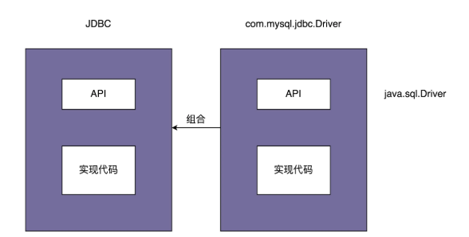

## 结构型

结构型模式主要总结了一些类或对象组合在一起的经典结构，这些经典的结构可以解决特定应用场景的问题。

结构型模式包括：

- 代理模式
- 桥接模式
- 装饰器模式
- 适配器模式
- 门面模式
- 组合模式
- 享元模式

## 代理模式

Proxy Design Pattern

**在不改变原始类（或叫被代理类）代码的情况下，通过引入代理类来给原始类附加功能。**

### 应用场景

#### 代理非功能性需求

在业务系统中开发一些非功能性需求，比如：监控、统计、鉴权、限流、事务、幂等、日志。我们将这些附加功能与业务功能解耦，放到代理类中统一处理。

#### RPC

RPC 框架也可以看作一种代理模式，GoF 的《设计模式》一书中把它称作远程代理。通过远程代理，将网络通信、数据编解码等细节隐藏起来。客户端在使用 RPC 服务的时候，就像使用本地函数一样，无需了解跟服务器交互的细节。除此之外，RPC 服务的开发者也只需要开发业务逻辑，就像开发本地使用的函数一样，不需要关注跟客户端的交互细节。

#### 缓存

假设我们要开发一个接口请求的缓存功能，对于某些接口请求，如果入参相同，在设定的过期时间内，直接返回缓存结果，而不用重新进行逻辑处理。比如，针对获取用户个人信息的需求，我们可以开发两个接口，一个支持缓存，一个支持实时查询。对于需要实时数据的需求，我们让其调用实时查询接口，对于不需要实时数据的需求，我们让其调用支持缓存的接口。

当请求到来的时候，我们在 AOP 切面中拦截请求，如果请求中带有支持缓存的字段（比如 http://…?..&cached=true），我们便从缓存（内存缓存或者 Redis 缓存等）中获取数据直接返回。

## 桥接模式

也叫作桥梁模式，英文是 Bridge Design Pattern

**桥接M类抽象和N类实现，以M+N的复杂度实现组合，替代M*N的继承方式**

> “Decouple an abstraction from its implementation so that the two can vary independently。”
>
> “将抽象和实现解耦，让它们可以独立变化。”
>
> “一个类存在两个（或多个）独立变化的维度，我们通过组合的方式，让这两个（或多个）维度可以独立进行扩展。”(”通过组合关系来替代继承关系，避免继承层次的指数级爆炸。这种理解方式非常类似于，我们之前讲过的**“组合优于继承”**设计原则)



**JDBC 本身相当于“抽象”**。注意，这里所说的“抽象”，指的并非“抽象类”或“接口”，而是跟具体的数据库无关的、被抽象出来的一套“类库”。

具体的**Driver（比如，com.mysql.jdbc.Driver）就相当于“实现”**。注意，这里所说的“实现”，也并非指“接口的实现类”，而是跟具体数据库相关的一套“类库”。JDBC 和 Driver 独立开发，通过对象之间的组合关系，组装在一起。JDBC 的所有逻辑操作，最终都委托给 Driver 来执行。

### 实例

Notification 类相当于抽象，MsgSender 类相当于实现，两者可以独立开发，通过组合关系（也就是桥梁）任意组合在一起。所谓任意组合的意思就是，不同紧急程度的消息和发送渠道之间的对应关系，不是在代码中固定写死的，我们可以动态地去指定（比如，通过读取配置来获取对应关系）。

**使用M+N个类描述所有类型，把M*N的继承类多对多关系简化成了M+N组合**

``` java

public interface MsgSender {
  void send(String message);
}

public class TelephoneMsgSender implements MsgSender {
  private List<String> telephones;

  public TelephoneMsgSender(List<String> telephones) {
    this.telephones = telephones;
  }

  @Override
  public void send(String message) {
    //...
  }

}

public class EmailMsgSender implements MsgSender {
  // 与TelephoneMsgSender代码结构类似，所以省略...
}

public class WechatMsgSender implements MsgSender {
  // 与TelephoneMsgSender代码结构类似，所以省略...
}

public abstract class Notification {
  protected MsgSender msgSender;

  public Notification(MsgSender msgSender) {
    this.msgSender = msgSender;
  }

  public abstract void notify(String message);
}

public class SevereNotification extends Notification {
  public SevereNotification(MsgSender msgSender) {
    super(msgSender);
  }

  @Override
  public void notify(String message) {
    msgSender.send(message);
  }
}

public class UrgencyNotification extends Notification {
  // 与SevereNotification代码结构类似，所以省略...
}
public class NormalNotification extends Notification {
  // 与SevereNotification代码结构类似，所以省略...
}
public class TrivialNotification extends Notification {
  // 与SevereNotification代码结构类似，所以省略...
}
```

## 装饰器

代理模式中，代理类附加的是**跟原始类无关**的功能，而在装饰器模式中，装饰器类附加的是跟**原始类相关的增强**功能。

装饰器模式主要解决继承关系过于复杂的问题，**通过组合来替代继承**。它主要的作用是**给原始类添加增强功能**。这也是判断是否该用装饰器模式的一个重要的依据。

除此之外，装饰器模式还有一个特点，那就是可以对原始类**嵌套使用多个装饰器**。为了满足这个应用场景，在设计的时候，装饰器类需要跟原始类继承相同的抽象类或者接口。

### 实例

``` java

// 代理模式的代码结构(下面的接口也可以替换成抽象类)
public interface IA {
  void f();
}
public class A impelements IA {
  public void f() { //... }
}
public class AProxy implements IA {
  private IA a;
  public AProxy(IA a) {
    this.a = a;
  }
  
  public void f() {
    // 新添加的代理逻辑
    a.f();
    // 新添加的代理逻辑
  }
}

// 装饰器模式的代码结构(下面的接口也可以替换成抽象类)
public interface IA {
  void f();
}
public class A implements IA {
  public void f() { //... }
}
public class ADecorator implements IA {
  private IA a;
  public ADecorator(IA a) {
    this.a = a;
  }
  
  public void f() {
    // 功能增强代码
    a.f();
    // 功能增强代码
  }
}
```

## 适配器模式

Adapter Design Pattern，**转接头：将不兼容的接口转换为可兼容的接口**

顾名思义，这个模式就是用来做适配的，它**将不兼容的接口转换为可兼容的接口**，让原本由于接口不兼容而不能一起工作的类可以一起工作。对于这个模式，有一个经常被拿来解释它的例子，就是 USB 转接头充当适配器，把两种不兼容的接口，通过转接变得可以一起工作。

### 类适配器和对象适配器

适配器模式有两种实现方式：类适配器和对象适配器

- 类适配器使用继承关系来实现
- 对象适配器使用组合关系来实现

``` java

// 类适配器: 基于继承
public interface ITarget {
  void f1();
  void f2();
  void fc();
}

public class Adaptee {
  public void fa() { //... }
  public void fb() { //... }
  public void fc() { //... }
}

public class Adaptor extends Adaptee implements ITarget {
  public void f1() {
    super.fa();
  }
  
  public void f2() {
    //...重新实现f2()...
  }
  
  // 这里fc()不需要实现，直接继承自Adaptee，这是跟对象适配器最大的不同点
}

// 对象适配器：基于组合
public interface ITarget {
  void f1();
  void f2();
  void fc();
}

public class Adaptee {
  public void fa() { //... }
  public void fb() { //... }
  public void fc() { //... }
}

public class Adaptor implements ITarget {
  private Adaptee adaptee;
  
  public Adaptor(Adaptee adaptee) {
    this.adaptee = adaptee;
  }
  
  public void f1() {
    adaptee.fa(); //委托给Adaptee
  }
  
  public void f2() {
    //...重新实现f2()...
  }
  
  public void fc() {
    adaptee.fc();
  }
}
```

### 应用场景

适配器模式可以看作一种“补偿模式”，用来补救设计上的缺陷。应用这种模式算是“无奈之举”

1. 装有缺陷的接口设计：为了隔离设计上的缺陷，我们希望对外部系统提供的接口进行二次封装，抽象出更好的接口设计。
2. 统一多个类的接口设计：某个功能的实现依赖多个外部系统（或者说类）。通过适配器模式，将它们的接口适配为统一的接口定义，然后我们就可以使用多态的特性来复用代码逻辑。
3. 替换依赖的外部系统：当我们把项目中依赖的一个外部系统替换为另一个外部系统的时候，利用适配器模式，可以减少对代码的改动
4. 兼容老版本接口：对于一些要废弃的接口，我们不直接将其删除，而是暂时保留，并且标注为 deprecated，并将内部实现逻辑委托为新的接口实现。
5. 适配不同格式的数据：适配器模式主要用于接口的适配，实际上，它还可以用在不同格式的数据之间的适配。

### 实例

假设我们的系统要对用户输入的文本内容做敏感词过滤，为了提高过滤的召回率，我们引入了多款第三方敏感词过滤系统，依次对用户输入的内容进行过滤，过滤掉尽可能多的敏感词。但是，每个系统提供的过滤接口都是不同的。这就意味着我们没法复用一套逻辑来调用各个系统。这个时候，我们就可以使用适配器模式，将所有系统的接口适配为统一的接口定义，这样我们可以复用调用敏感词过滤的代码。

``` java

public class ASensitiveWordsFilter { // A敏感词过滤系统提供的接口
  //text是原始文本，函数输出用***替换敏感词之后的文本
  public String filterSexyWords(String text) {
    // ...
  }
  
  public String filterPoliticalWords(String text) {
    // ...
  } 
}

public class BSensitiveWordsFilter  { // B敏感词过滤系统提供的接口
  public String filter(String text) {
    //...
  }
}

public class CSensitiveWordsFilter { // C敏感词过滤系统提供的接口
  public String filter(String text, String mask) {
    //...
  }
}

// 未使用适配器模式之前的代码：代码的可测试性、扩展性不好
public class RiskManagement {
  private ASensitiveWordsFilter aFilter = new ASensitiveWordsFilter();
  private BSensitiveWordsFilter bFilter = new BSensitiveWordsFilter();
  private CSensitiveWordsFilter cFilter = new CSensitiveWordsFilter();
  
  public String filterSensitiveWords(String text) {
    String maskedText = aFilter.filterSexyWords(text);
    maskedText = aFilter.filterPoliticalWords(maskedText);
    maskedText = bFilter.filter(maskedText);
    maskedText = cFilter.filter(maskedText, "***");
    return maskedText;
  }
}

// 使用适配器模式进行改造
public interface ISensitiveWordsFilter { // 统一接口定义
  String filter(String text);
}

public class ASensitiveWordsFilterAdaptor implements ISensitiveWordsFilter {
  private ASensitiveWordsFilter aFilter;
  public String filter(String text) {
    String maskedText = aFilter.filterSexyWords(text);
    maskedText = aFilter.filterPoliticalWords(maskedText);
    return maskedText;
  }
}
//...省略BSensitiveWordsFilterAdaptor、CSensitiveWordsFilterAdaptor...

// 扩展性更好，更加符合开闭原则，如果添加一个新的敏感词过滤系统，
// 这个类完全不需要改动；而且基于接口而非实现编程，代码的可测试性更好。
public class RiskManagement { 
  private List<ISensitiveWordsFilter> filters = new ArrayList<>();
 
  public void addSensitiveWordsFilter(ISensitiveWordsFilter filter) {
    filters.add(filter);
  }
  
  public String filterSensitiveWords(String text) {
    String maskedText = text;
    for (ISensitiveWordsFilter filter : filters) {
      maskedText = filter.filter(maskedText);
    }
    return maskedText;
  }
}
```

## 总结

代理、桥接、装饰器、适配器 4 种设计模式的区别

代理、桥接、装饰器、适配器，这 4 种模式是比较常用的结构型设计模式。它们的代码结构非常相似。笼统来说，它们都可以称为**Wrapper 模式**，也就是通过 Wrapper 类二次封装原始类。尽管代码结构相似，但这 4 种设计模式的用意完全不同，也就是说要解决的问题、应用场景不同，这也是它们的主要区别。

这里我就简单说一下它们之间的区别。

- **代理模式**：代理模式在不改变原始类接口的条件下，为原始类定义一个代理类，主要目的是增加**辅助功能**，而非加强功能，这是它跟装饰器模式最大的不同。
- **桥接模式**：桥接模式的目的是将**接口部分和实现部分分离**，从而让它们可以较为容易、也相对独立地加以改变。
- **装饰器模式**：装饰者模式在不改变原始类接口的情况下，对**原始类功能进行增强**，并且支持多个装饰器的嵌套使用。
- **适配器模式**：适配器模式是一种事后的补救策略，**将不兼容的接口转换为可兼容的接口**。适配器提供跟原始类不同的接口，而代理模式、装饰器模式提供的都是跟原始类相同的接口。

