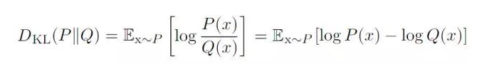

### 信息量

信息量是对事件发生概率的度量

$log\frac{1}{p}​$

一个事件发生的概率越低，则这个事件包含的信息量越大，比如说越稀奇新闻包含的信息量越大，因为这种新闻出现的概率低。

引用：一本五十万字的中文书平均有多少信息量？（$\log_2m$）  《数学之美 -  吴军》
我们知道常用的汉字（一级二级国标）大约有 7000 字。假如每个字等概率，那么我们大约需要 13 个比特（即 13 位二进制数）表示一个汉字［这里把汉字作为一个随机变量，那么汉字系统的熵就是约13bit］ 。但汉字的使用是不平衡的。实际上，前 10% 的汉字占文本的 95% 以上。因此，即使不考虑上下文的相关性，而只考虑每个汉字的独立的概率，那么，每个汉字的信息熵大约也只有 8-9 个比特。如果我们再考虑上下文相关性，每个汉字的信息熵［其实指的是汉字变量取特定汉字作为值时候具有的信息量］ 只有5比特左右。所以，一本五十万字的中文书，信息量大约是 250 万比特［这个时候的信息量就是每个汉字的信息量和数目相乘，指的都是汉字变量取具体值的信息量］ 。如果用一个好的算法压缩一下，整本书可以存成一个 320KB 的文件。如果我们直接用两字节的国标编码存储这本书，大约需要 1MB 大小，是压缩文件的三倍。这两个数量的差距，在信息论中称作“冗余度”（redundancy)。 需要指出的是我们这里讲的 250 万比特是个平均数，同样长度的书，所含的信息量可以差很多。如果一本书重复的内容很多，它的信息量就小，冗余度就大。

### 熵（Entropy）

**信息论中，熵是接收每条消息中包含的信息量($\log\frac{1}{p}$)的平均值。**

熵定义为**信息的期望值**（香农 shannon）：

$$\begin{align} H(X) & = E[I(X)] \\ & = E[log(\frac{1}{P(X)})]  \\ & = -\sum\limits_{i}^n P(x_i)logP(x_i)\end{align} $$

表示样本的不确定性量度。在信息世界，熵越高，则能传输越多的信息，熵越低，则意味着传输的信息越少。

单位：

熵的单位通常为比特, bit 或者sh(annon) (基于2)，但也用nat(基于自然对数)、Hart（基于10）计量，取决于定义用到对数的底。

- 离散均匀分布

$H(X)=log_2{m}$

例：抛掷三枚硬币

信息量：可以得到$2^3=8$种情况

不确定性：$log_2{8}=3\ bit$

- 离散分布

$H(X)=\sum\limits_{i}^nP(x_i)log\frac{1}{P(x_i)}$

例：选项ABCD

信息量：$H(X)=\sum\limits_{i}^n\frac{1}{4}log_2(\frac{1}{4})=2 bit$

给定A是错的，信息量变为：$H(X)=\sum\limits_{i}^n\frac{1}{3}log_2(\frac{1}{3})=1.585 bit$

“A是错的”，提供了$2-1.585=0.415bit​$的信息

例：编码

分布p=(1/2, 1/2, 0, 0)，即A和B出现的概率均为1/2，C和D出现的概率都为0。计算H(p)为1，即只需要1位编码即可识别A和B

分布q=(1/4, 1/4, 1/4, 1/4)来编码则得到H(q)=2，即需要2位编码来识别A和B，还有C和D

### [交叉熵](https://zh.wikipedia.org/wiki/%E4%BA%A4%E5%8F%89%E7%86%B5)

**使用分布 q 来预测真实分布 p 的平均编码长度**

$H(p,q)= E_p[\log  \frac{1}{q(i)}] = \sum\limits_{i}^{} p(i)*log\frac{1}{q(i)} $

交叉熵可以看作每个信息片段在错误分布 q 下的期望编码位长度，而信息实际分布为 p。

现有关于样本集的2个概率分布p和q，其中p为真实分布，q预测分布。

按照真实分布p来衡量识别一个样本的所需要的编码长度的期望(即平均编码长度)为：$H(p)=\sum\limits_{i}^{} p(i)*log\frac{1}{p(i)}$

使用预测分布q来表示来自真实分布p的平均编码长度，则应该是：$H(p,q)=\sum\limits_{i}^{} p(i)*log\frac{1}{q(i)} $

因为用q来编码的样本来自实际分布p，所以期望H(p,q)中概率是p(i)。H(p,q)我们称之为“交叉熵”。

比如含有4个字母(A,B,C,D)的数据集中，真实分布p=(1/2, 1/2, 0, 0)，即A和B出现的概率均为1/2，C和D出现的概率都为0，计算H(p)为1，即只需要1位编码即可识别A和B。如果使用分布Q=(1/4, 1/4, 1/4, 1/4)来编码则得到H(p,q)=2，即需要2位编码来识别A和B(C和D并不会出现)。

根据非真实分布q得到的平均编码长度H(p,q)大于根据真实分布p得到的平均编码长度H(p)。事实上，根据[Gibbs' inequality](https://link.zhihu.com/?target=https%3A//en.wikipedia.org/wiki/Gibbs%2527_inequality)可知，H(p,q)>=H(p)恒成立，当q为真实分布p时取等号。

### KL散度（相对熵）

**衡量分布 p 和 q 的差异，使用分布 q 来近似分布 p**　　$D_{KL}(p||q) \ge 0$



$D_{KL}(p||q)=E_{x ~ p}[\frac{\log p(i)}{\log q(i)}]=H(p,q)-H(p) = \sum\limits_{i}^{} p(i)*\log\frac{1}{q(i)} - \sum\limits_{i}^{} p(i) *\log\frac{1}{p(i)} = \sum\limits_{i}^{} p(i)*\log\frac{p(i)}{q(i)}$

我们将由q得到的平均编码长度比由p得到的平均编码长度多出的bit数称为“相对熵”，又被称为KL散度(Kullback–Leibler divergence，KLD) [Kullback–Leibler divergence](https://link.zhihu.com/?target=https%3A//en.wikipedia.org/wiki/Kullback%25E2%2580%2593Leibler_divergence)。它表示2个函数或概率分布的差异性：差异越大则相对熵越大，差异越小则相对熵越小，二者分布相同则相对熵为0。


可以得到，交叉熵 $H(p,q)= E_p[\log  \frac{1}{q(i)}] = H(p) + D_{KL}(p||q)$

其中 $H(p)$ 是 $p$ 的[熵](https://zh.wikipedia.org/wiki/%E4%BF%A1%E6%81%AF%E7%86%B5)，$D_{KL}(p\|q)$ 是从 $p$ 到 $q$ 的[KL散度](https://zh.wikipedia.org/w/index.php?title=KL%E6%95%A3%E5%BA%A6&action=edit&redlink=1)(也被称为*p*相对于*q*的*相对熵*)。

通常“相对熵”也可称为“交叉熵”，因为真实分布p是固定的，D(p||q)由H(p,q)决定。当然也有特殊情况，彼时2者须区别对待。

### 交叉熵作为损失函数

交叉熵可在神经网络(机器学习)中作为损失函数，p表示真实标记的分布，q则为训练后的模型的预测标记分布，交叉熵损失函数可以衡量p与q的相似性。

交叉熵和均方误差都可以作为神经网络的损失函数，他们的区别在于：

1. 交叉熵适用于分类问题，结果是离散的类别（如图片分类），而均方误差适用于回归问题，结果是一个连续的数值（如雨量预测）【实际上均方误差也可以用于分类问题】
2. 在使用 sigmod 激活函数时，如果使用均方误差作为损失函数，反向传播的导数（直接影响学习速度）会包含 sigmod函数的梯度，这个梯度随着变量的增大会趋向于0，导致学习速度迅速降低(梯度消失)；而如果使用交叉熵作为损失函数，就不存在这个问题，反向传播的导数包含 sigmod 函数，而不包含 sigmod 函数的导数。

``` python
# softmax_cross_entropy_with_logits计算后，矩阵的每一行数据计算出一个交叉熵，三行数据共计算出三个交叉熵
cross_entropy_lst = tf.nn.softmax_cross_entropy_with_logits(logits=logits, labels=y_)
# 通过reduce_sum进行累加，计算出一个batch的交叉熵
cross_entropy = tf.reduce_sum(tf.nn.softmax_cross_entropy_with_logits(logits=logits, labels=y_))
# 将batch里每条记录的交叉熵求均值，作为损失
cross_entropy_loss = tf.reduce_mean(tf.nn.softmax_cross_entropy_with_logits(logits=logits, labels=y_))

>>>
[ 0.40760595  0.40760595  0.40760595]
1.22282
0.407606
```


References:
- https://www.zhihu.com/question/41252833
- https://zh.wikipedia.org/wiki/%E4%BA%A4%E5%8F%89%E7%86%B5
- https://www.jianshu.com/p/92220ab37ea3