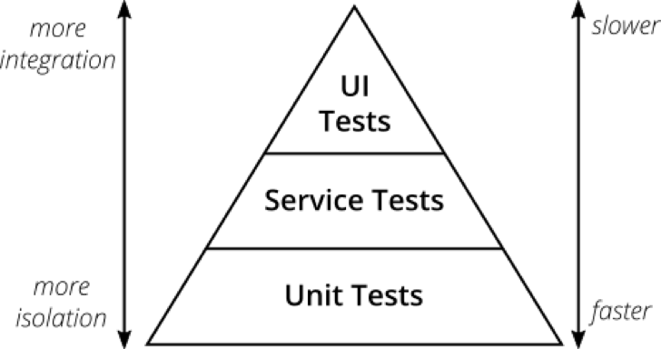
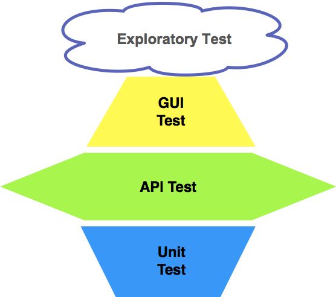

接口测试介绍
----------

- [接口测试介绍](#接口测试介绍)
- [WHAT](#what)
  - [什么是接口](#什么是接口)
  - [什么是接口测试](#什么是接口测试)
  - [接口测试的类型](#接口测试的类型)
- [WHY](#why)
  - [测试金字塔](#测试金字塔)
  - [菱形的测试策略](#菱形的测试策略)
  - [为什么要做接口测试](#为什么要做接口测试)
- [HOW](#how)
  - [测试思路](#测试思路)
    - [单接口](#单接口)
    - [多接口](#多接口)
    - [性能测试](#性能测试)
  - [接口测试如何设计测试用例？](#接口测试如何设计测试用例)
- [FAQ](#faq)
  - [接口测试都要掌握哪些知识？](#接口测试都要掌握哪些知识)
  - [如何获取接口相关信息？](#如何获取接口相关信息)
  - [HTTP状态码有哪些？](#http状态码有哪些)
  - [Cookie与Session的区别？](#cookie与session的区别)

## WHAT

### 什么是接口

接口一般分为两种：

- **程序内部的接口**: 前后端交互的API Gateway接口，微服务提供的接口，模块与模块之间的交互的接口，方法与方法之间的接口 ，程序内部抛出的接口 。
  * bbs系统，有登录模块、发帖模块等等，那你要发帖就必须先登录，那么这两个模块就得有交互，各模块都会提供对应接口，供内部系统调用。
  * JAVA类库就是提供的一整套接口，类库提供的各个方法/函数等类成员，就是类接口，平常写的类也会提供不同接口；其中类是整体，类的成员函数就是接口。
- **系统对外的接口**:
  * 在携程/艺龙等第三方网站上购买票，实际就是调用了12306提供的接口获取库存等信息。
  * 基于微信的小程序，就是调用微信向开发者提供的统一对外接口完成。

利用接口，可以对一个封装好的整体进行操作，包括获取、操作数据。

### 什么是接口测试

> 接口测试是测试系统组件间接口的一种测试。接口测试主要用于检测外部系统与系统之间以及内部各个子系统之间的交互点。测试的重点是要检查数据的交换，传递和控制管理过程，以及系统间的相互逻辑依赖关系等。                                                                                                                                                   - 百度百科

简单的理解就是通过 `GET/POST/PUT/DELETE` URL 等方式，请求、传输数据，然后得到一些相应的返回值，验证是否符合我们的预期值。

本质就是通过API模拟客户端向服务器发送报文请求，服务器接收请求报文后对相应的报文做处理，并向客户端返回应答，客户端接收应答的过程。通过API请求完成数据的传输与接收。

### 接口测试的类型

与常见测试分类一样，广义的接口测试也包括白盒测试和黑盒测试：

1. 代码内部接口调用，模块A与模块B在组合的时候，必然需要定义一些名称以及参数、类型，这种在测试中一般划分在**白盒测试**中，对内部逻辑进行测试 。
2. 系统与系统之间，通过网络数据的传递进行交互，这种在测试中一般划分在**黑盒测试**中。也就是看不到代码，但可以通过各种手段将网络数据发送到接口从而得到接口的响应信息，达到测试的目的。

我们通常所做的接口测试时黑盒层面上的功能测试，测试对象主要是服务端接口。 服务端的接口按照协议一般分为：

- **WebService接口**：走**soap协议**通过http传输，请求报文和返回报文都是**xml格式**的
- **HTTP API接口**：走**http协议**，通过路径(endpoints)来调用的各种接口，请求报文都是`key-value`形式定义，返回报文一般都是**JSON格式**，有`get/post/put/delete`等方法。具体可参考 [Restful API 规范](http://www.ruanyifeng.com/blog/2014/05/restful_api.html)。

## WHY

### 测试金字塔

首先我们先看一下经典金字塔，Mike Cohn 在他的着作《Succeeding with Agile》一书中提出了这个概念。

这个金字塔从底层到上层依次是单元测试(Unit Tests)、服务测试(Service Tests)、UI测试(UI Tests)。越接近接近底层，收益成本比越高。这里面服务测试(Service Tests)就是接口测试，也可以叫做API测试。

> Martin Flower关于测试金字塔有这样一段评论 :
>
> “GUI测试用例还很脆弱，如对系统的一些修正可能导致很多用例的失败，这时候你需要重新录制。你可以放弃录制的方法来解决这个问题，通过写GUI测试代码，但是这样效率非常低。就算你已经很精通了GUI测试代码的编写，端到端的GUI测试用例也很容易出现不可预期结果的问题，因此，基于GUI的自动化测试是脆弱、耗时（包括用例维护和执行）的。所以测试金字塔要表达的是：底层应当有更多的单元测试和接口测试和逻辑测试，**GUI测试用例能覆盖到主业务流程即可**。”

测试金字塔中每层中涉及的测试技术均有自己的优势和局限性，由于上层GUI测试的脆弱（不稳定性）、耗时（执行效率）问题，以及问题表现位置（UI）和问题根因位置（代码）距离太远的问题，测试金字塔由关注测试数量转向关注测试质量，推荐增加底层的测试投入。

- 层次越靠上，运行效率越低，延缓持续集成的构建-反馈循环。
- 层次越靠上，开发复杂度越高，如果团队能力受限，交付进度受影响。
- 端到端测试更容易遇到测试结果的不确定性。
- 层次越靠下，单元隔离性越强，定位分析问题越容易。

### 菱形的测试策略

由于产品开发迭代的快节奏，现在很多团队更加推崇菱形测试策略。这里做一个简单的介绍。

菱形的测试策略，遵循**“重量级 API 测试，轻量级 GUI 测试，轻量级单元测试”**的原则。

因为GUI自动化测试成本高。同时由于产品快速迭代的要求和频繁的迭代会让单元测试处于不断重写的状态 ，单元测试覆盖率也不会很高。所以由于投入产出比(ROI)的原因，测试重点放在 API 测试上，才是最明智的选择 。接口测试的自动化脚本的开发与调试效率、稳定性也比GUI自动化测试高得多，所以自动化测试应该重点放在接口测试上。

### 为什么要做接口测试

1. 越底层发现bug，它的修复**成本**是越低的。

2. 前端经常改变，后端接口变化较小，更**稳定**。

3. 检查系统的**安全性、稳定性**，前端传参不可信，比如京东购物，前端价格不可能传入-1元，但是通过接口可以传入-1元。

4. 如今的系统复杂度不断上升，传统的测试方法成本急剧增加且测试**效率**大幅下降，接口测试可以提供这种情况下的解决方案。

5. 接口测试相对容易实现**自动化持续集成**，且相对UI自动化也比较稳定，可以减少人工回归测试人力成本与时间，缩短测试周期，支持后端快速发版需求。接口持续集成是为什么能低成本高收益的根源。

6. 现在很多系统前后端架构是分离的，从**安全**层面来说：

　　1)  只依赖前端进行限制已经完全不能满足系统的安全要求（绕过前面实在太容易），需要后端同样进行控制，在这种情况下就需要从接口层面进行验证。

　　2)  前后端传输、日志打印等信息是否加密传输也是需要验证的，特别是涉及到用户的隐私信息，如身份证，银行卡等。

　7. 接口测试更容易和其他自动化测试方法、脚本相**结合**。

8. 相对于界面测试，接口测试可以更早开始，也可以测试一些界面测试无法测试的范围，因此它使测试更早的投入这句话变成现实(**测试左移**)。
9. 接口测试还可以保障系统的鲁棒性，使得被测系统更**健壮**。

## HOW

目前后端调用主要是基于HTTP协议的接口，测试时主要有两种方法：

-  工具模拟请求的发送与接收。工具有很多，比如：**Postman**、**JMeter**、SoupUI、LoadRunner、Curl等；
-  代码模拟请求的发送与接收。如：python库**Requests**，java自带的**HttpClient**等；

### 测试思路

#### 单接口

业务场景上无上下文依赖，一个接口的功能直接是一个测试模块。这种情况下，可直接测试该接口，步骤为：

- 构造参数
- 发请求
- 校验结果

单接口测试的重点，其实就是保证该接口的**正确性和健壮性**。也就是说，你既要保证这个接口可以按照需求，正确处理传入的参数，给出正确的返回；也可以按照需求，正确的拒绝传入非正确的参数，给出正确的拒绝性返回。

总结：需要有足够的用例保证接口能正确处理各种正常情况和异常情况

#### 多接口

通过多个接口的串联操作去完成产品**业务逻辑验证**，接口之间有数据依赖。比如：一个完整的交易流程，包含添加购物车->购物车结算->下单->支付->退款等步骤。针对这类型的接口可以考虑从业务场景上去覆盖（熟悉业务是自动化的基础）。

总结：重点在于业务流程是否能跑通

拓展：我们更需要关心业务流和数据流的关系，并不需要再过度关心如何用业务流的方法覆盖更多的代码逻辑异常

#### 性能测试

这里列举两个最简单和常见的性能测试思路：

- 单接口并发测试
- 多接口按逻辑组成业务，模拟大量用户并发请求

性能测试包扩非常多的概念和方法，这里就不展开说明。

### 接口测试如何设计测试用例？

接口测试一般考虑**入参形式**的变化和接口的**业务逻辑**，一般设计接口测试用例采用**等价类、边界值、场景法**居多！

接口测试设计测试用例的思路如下：

1. 接口业务逻辑测试?(**正例**)

接口逻辑测试是指根据业务逻辑、输入参数、输出值的描述，对正常输入情况下所得的输出值是否正确的测试，也就是测试对外提供的接口服务是否正常工作。

2. 模块接口测试?(**反例**)

模块接口测试是为了保证数据的安全，及程序在异常情况下的逻辑的正确性，而进行的测试。模块接口测试的思路和单元测试类似，可以看做单元测试的延伸，具体主要包括以下几个方面：

  1）鉴权码token异常(鉴权码为空<没有鉴权码>,错误的鉴权码,过期的鉴权码)

  2）其他参数异常

- 必填项检查
- 参数的长度、类型、格式异常：
  * 常规参数：(数字、字符串、日期)
  * 参数长度：6-18位。或身份证、电话的长度
  * 参数类型：数字(精度)，字母，中文，带空格的参数，特殊字符
  * 日期格式：日期：年月日，年月日时分秒，日期格式(包括/,-,:等)

　3）错误码异常覆盖

　4）接口测试其他的关注点

   * 接口有翻页时，页码与页数的异常值测试
   * 数据库的增删改查，比如一个POST接口操作完成后，通过列表页接口看下新的数据是否和刚才的post一致
   * 接口返回的图片地址能否打开，图片尺寸是否符合需求
   * 当输出参数有联动性时，需要校验返回两参数的实际结果是否都符合需求。
   * 所有列表页接口必须考虑排序值
   * 所有功能都要考虑兼容旧版本

## FAQ

### 接口测试都要掌握哪些知识？

　　1）了解系统及内部各个组件之间的业务逻辑交互；

　　2）了解接口的I/O（input/output：输入输出）；

　　3）了解HTTP协议的基本内容，包括：通信原理、三次握手、常用的协议类型、报文构成、数据传输方式、常见的状态码、URL构成等；

　　4）常用的接口测试工具，比如：jmeter、loadrunner、postman、soapUI等；

　　5）数据库基础操作命令（检查数据入库、提取测试数据等）；

　　6）常见的字符类型，比如：char、varchar、text、int、float、datatime、string等；

### 如何获取接口相关信息？

一般的公司，都会由开发或者对应的技术负责人员编写接口文档，里面会注明接口相关的地址、参数类型、方法、输入、输出等信息，如果没有，想办法获取或者督促开发完善。

通过Chrome devtool(network)或者Http抓包工具(Fiddler)抓取HTTP报文，也是一种获取接口请求信息的有用方式。

### HTTP状态码有哪些？

- **200**: 2开头的都表示这个请求发送成功，最常见的就是200，就代表这个请求是ok的，服务器也返回了。

- **300**: 3开头的代表重定向，最常见的是302，把这个请求重定向到别的地方了。

- **400**: 400代表客户端发送的请求有语法错误，401代表访问的页面没有授权，403表示没有权限访问这个页面，404代表没有这个页面。

- **500**: 5开头的代表服务器有异常，500代表服务器内部异常，504代表服务器端超时，没返回结果

### Cookie与Session的区别？

- cookie数据存放在客户的浏览器上，session数据放在服务器上。
- cookie不是很安全，别人可以分析存放在本地的cookie并进行cookie欺骗。考虑到安全应当使用session。
- session会在一定时间内保存在服务器上。当访问增多，会比较占用你服务器的性能。考虑到减轻服务器性能方面，应当使用cookie。
- 单个cookie保存的数据不能超过4K，很多浏览器都限制一个站点最多保存20个cookie。

所以建议：

- 将登陆信息等重要信息存放为session。
- 其他信息如果需要保留，可以放在cookie中。
