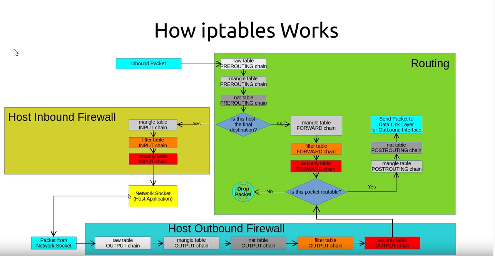
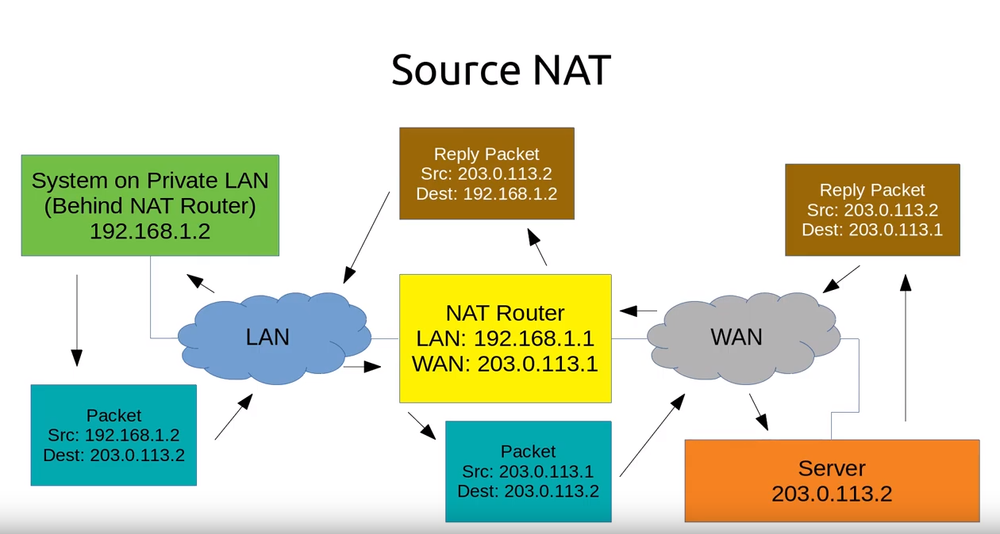
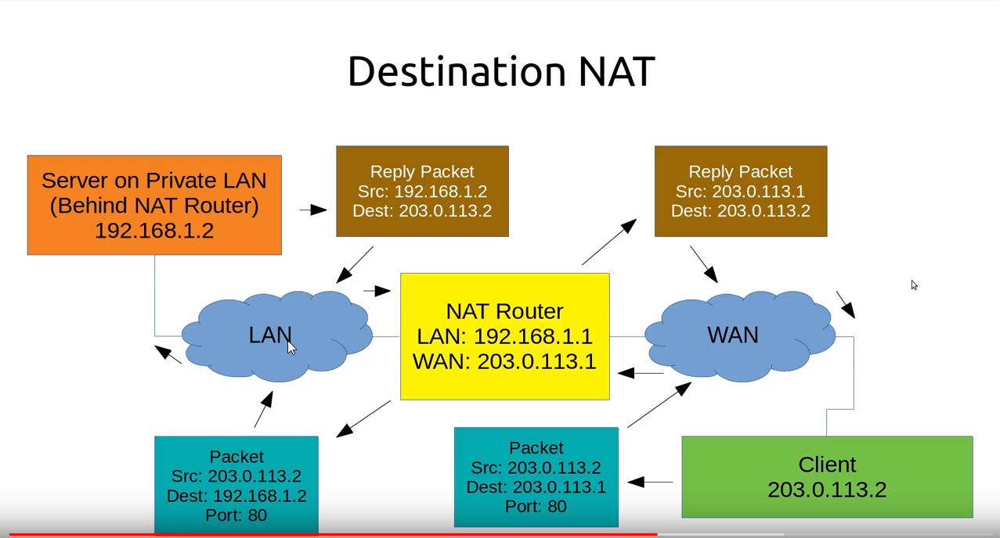

Iptables
------------

https://www.youtube.com/watch?v=iP8YWcvKDr0&list=PLRRzkFBzCR3v-UefO69M7snZVzSnVlJKZ&index=1




## NAT

1. SNAT, Source NAT

   - 改变 outgoing packet 的源 IP
   - 跟踪链接，改变 reply packet 的目的 IP
   - 可用作一组静态 IP addresses 的负载均衡

   

2. DNAT, Destination NAT
   - 改变 incoming packet 的目的 IP，转发到其他设备
   - 跟踪链接，改变 reply packet 的源 IP (由其他设备的源 IP 变为当前 DNAT 系统的源 IP)

   通常用在 inbound packets 的端口转发

   只能用在 nat table, 和 PREROUTING and OUTPUT chains

*DMZ, 隔离区，DNAT 系统隔离的区域*



3. IP Masquerading
- A NAT route masquerades a private network
- SNAT use outgoing intreface as the address for rewriting


*广泛用作 IPV4 的扩展*

- private LAN using private IP address behind a NAT router, 所有流量都被视作来自 NAT router
- 所有来自private LAN 的流量都 NAT 到 NAT router 为源 IP
- 所有来自公网的流量都 NAT 处理后返回 private LAN devices

## Iptables Command

``` sh
# -A append to `INPUT` chain
# -m match, match against packet `state`
# -j jump, jump to `ACCEPT` target
# Appends a rule to the INPUT chain that matches the state of RELATED or ESTABLISHED, jump to the ACCEPT target
-A INPUT -m state --state RELATED,ESTABLISHED -j ACCEPT
# -p protocol
-A INPUT -p ICMP -j ACCEPT
# -i interface
-A INPUT -i lo -j ACCEPT
# allow incoming SSH, any new coming tcp with dport 22
-A INPUT -p tcp -m state --state NEW -m tcp --dport 22 -j ACCEPT
# send and explicit rejection message of ICMP host-prohibited back to the sender, instead of quietly dropping a packet
-A INPUT -j REJECT --reject-with icmp-host-prohibited
-A FORWARD -j REJECT --reject-with icmp-host-prohibited
```

## A Basic Router

``` sh
A Router
LAN: enp0s8, 172.16.0.0/24, private addresses
WAN: enp0s3, , public address
```

``` sh
*nat  # nat table
# policies on PREROUTING, POSTROUTING, OUTPUT chains
:PREROUTING ACCEPT [0:0]
:POSTROUTING ACCEPT [0:0]
:OUTPUT ACCEPT [0:0]
# SNAT: WAN port
# all packets leaving this machine with enp0s3 to have the source IP address of interface enp0s3
-A POSTROUTING -o enp0s3 -j MASQUERADE
COMMIT
```

``` sh
*filter  # filter table
# default policies on INPUT, OUTPUT, FORWARD chains
:INPUT DROP [0:0]
:FORWARD DROP [0:0]
:OUTPUT ACCEPT [0:0]
# INPUT chains, incomming connections from LAN side
# -s source, match source ip address in private LAN side addr range
-A INPUT -m state --state RELATED,ESTABLISHED -j ACCEPT
-A INPUT -i lo -j ACCEPT
-A INPUT -s 172.16.0.0/24 -i enp0s8 -p icmp -j ACCEPT
-A INPUT -s 172.16.0.0/24 -i enp0s8 -p tcp -m state --state NEW -m tcp --dport 22 -j ACCEPT
-A INPUT -s 172.16.0.0/24 -i enp0s8 -p udp -m state --state NEW -m udp --dport 67 -j ACCEPT
# Condition Rejection
-A INPUT -s 172.16.0.0/24 -i enp0s8 -j REJECT --reject-with icmp-host-prohibited
# if all above INPUT rules are not true, fall to the last rule: Drop all
-A INPUT -j DROP

# FORWARD chains, FORWARD packets between LAN port and WAN port
# packets from LAN to LAN go directly, do not need route
-A FORWARD -d 172.16.0.0/24 -i enp0s8 -j DROP
# ACCEPT all packets from LAN to WAN with source IP in the LAN,
#                and from WAN to LAN with detination IP in the LAN
-A FORWARD -s 172.16.0.0/24 -i enp0s8 -j ACCEPT
-A FORWARD -d 172.16.0.0/24 -i enp0s3 -j ACCEPT
-A FORWARD -j DROP
# OUTPU chains, output packets
-A OUTPUT -j ACCEPT
COMMIT
```

## Packets Processing

Netfilter component of Linux kernel recognizes and grouped packets into **streams or flows**

NAT rules are only determined for the 1st packet in a stream, the all subsequent packets receive the same processing

## Tables and Chains

#### Tables

- filter
- NAT
- mangle
- raw
- security

#### Chains

- PREROUTING
- INPUT
- FORWARD
- OUTPUT
- POSTROUTING
- User-defined Chains

### Tables and built-in chains

#### Filter:  Access Controls

Built-in chains

- INPUT: handles packets **destined for local sockets**
- FORWARD: handles packets **routed through** this host to another destination
- OUTPUT: handles **locally generated** packets

#### NAT: Consulted whenever a packet create a new connection

Built-in chains

- PREROUTING: alters packets **arrive from** the network interface
- OUTPUT: alters **locally-generated** packets **before routing** them
- POSTROUTING: alters packets about to be **sent out** from host

#### Mangle: specialized packet alteration

Built-in chains

- PREROUTING: mangling packets **before routing**
- OUTPUT: mangling packets **before sending**
- INPUT: mangling packets **destined** for this host
- FORWARD: mangling packets **routed through** the host
- POSTROUTING: mangling packets about **to be sent**

#### Security: Consulted after the filter table to implement Mandatory Access Control network rules

Built-in chains

- INPUT: packets **destined** for the host
- OUTPUT: packets **originating** from the host
- FORWARD: packets **forwarded through** the host

#### Raw: rarely used

Built-in chains

- PREROUTING: processes all incoming packets
- OUTPUT: processes outgoing packets generated by the host
