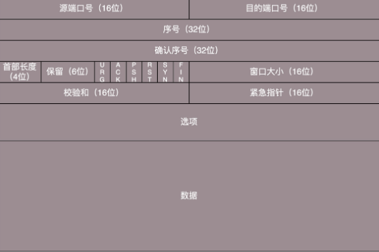
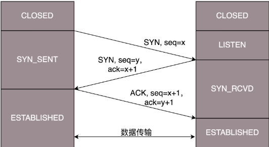
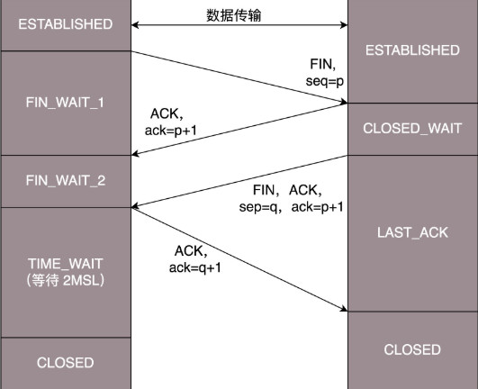
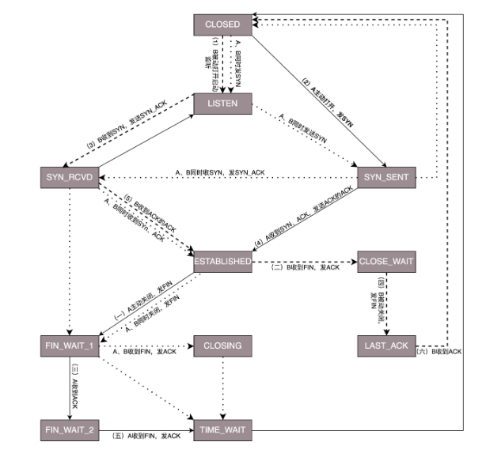

## TCP



TCP 是面向连接的，因而双方要维护连接的状态

**端口号**： 对应到 service/app

**序号**：包的编号

**确认序号**：发送出去的包

**状态位**：维护连接的状态

- SYN 发起一个连接
- ACK 回复
- RST 重新连接
- FIN 是结束连接

### 建立连接：三次握手

```text
S: start LISTEN ...
C: hello, 我是C  (SYN seq x            )  请求
S: hello C,我是S (SYN seq y  , ack x+1)   应答
C: hello S      (SYN seq x+1, ack y+1)    应答之应答
```



### 结束连接，四次挥手

```
C: 我不想玩了, S    (FIN seq=p     )
S: 我知道了         (ACK ack=p+1   )
S: Bye, C         (FIN, seq=q, ACK, ack=p+1)
C: OK, Bye        (ACK, ack=q+1)
```




### TCP 状态机




1. 顺序问题与丢包问题： 确认与重发的机制
**超时重试**：自适应重传算法，超时间隔加倍。每当遇到一次超时重传的时候，都会将下一次超时时间间隔设为先前值的两倍。两次超时，就说明网络环境差，不宜频繁反复发送。

2. 流量控制：滑动窗口

3. 拥塞控制

 TCP 的拥塞控制主要来避免两种现象，

- **包丢失**
- **超时重传**

**慢启动**：通过漏斗往瓶子里灌水，我们就知道，不能一桶水一下子倒进去，肯定会溅出来，要一开始慢慢的倒，然后发现总能够倒进去，就可以越倒越快。

**快速重传算法**：

丢包后需要超时重传，重新开始慢启动，这样一夜回到解放前。可以乐观地认为只丢了一部分而不是所有。cwnd 减半为 cwnd/2。


拥塞控制主要避免两个现象：

第一个问题是丢包并不代表着通道满了，带宽不满也会**丢包**，这个时候就认为拥塞了，退缩了，其实是不对的。

第二个问题是 TCP 的拥塞控制要等到将中间设备都填充满了，才发生丢包，从而降低速度，这时候已经晚了。其实 TCP 只要填满管道就可以了，不应该接着填填满缓存。

**TCP BBR 拥塞算法**： 充分利用带宽


假如经过设备的包都不需要进入缓存，那么得到的速度是最快的。进入缓存且等待，等待的时间就是额外的延时。

